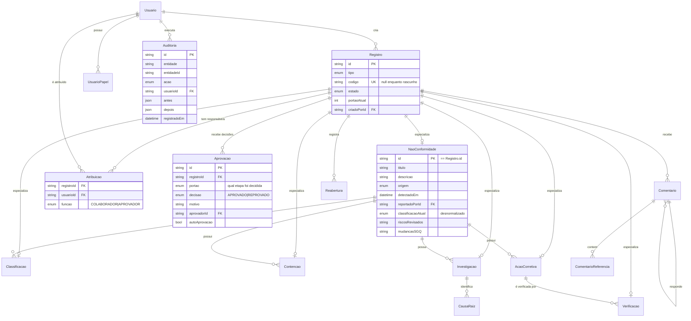
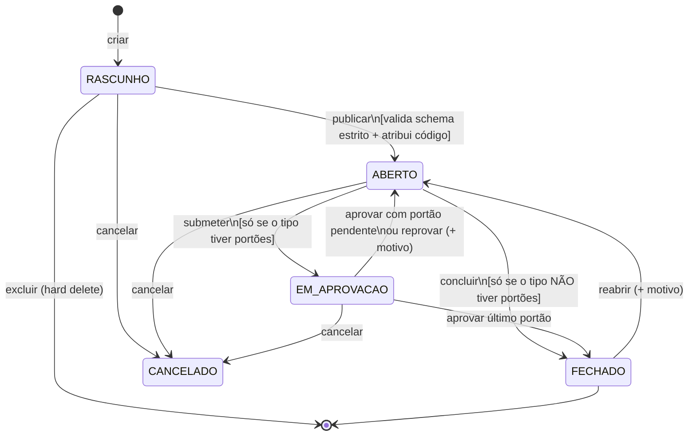
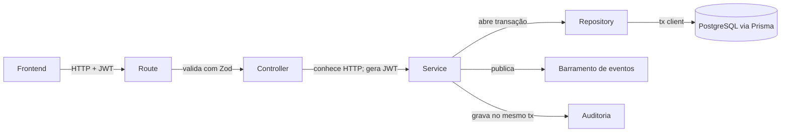

# QualityHub — Definição de Arquitetura

### Sistema de Gestão de Não Conformidades · ISO 9001:2015, cláusula 10.2

**Versão consolidada.** Este documento substitui integralmente a v1 e os adendos v2 e v3. Nada além dele precisa ser consultado.

**Escopo:** MVP do módulo de Não Conformidades com fundação explícita para módulos futuros de QMS · stack completa (backend, frontend, deploy) · single-tenant.

**Como ler:** foi escrito no fluxo _learning-first_ — eu especifico contratos, assinaturas, estrutura e comportamento; você escreve o código. Trechos curtos de código aparecem só quando são a forma mais clara de expressar um contrato. Termos técnicos são explicados em linha, na primeira aparição.

---

## Índice

1. Visão geral do produto
2. Requisitos
3. Modelo de domínio
4. Ciclo de vida, estados e portões de aprovação
5. Papéis, atribuições e permissões
6. Regras de negócio
7. Arquitetura técnica
8. Estrutura completa dos módulos
9. Contrato de API
10. Stack completa justificada
11. Gates de Design UI/UX
12. Roadmap de implementação
13. Registro de decisões arquiteturais (ADRs)
14. Riscos e armadilhas
15. Pontos em aberto

---

## 1. Visão geral do produto

O **QualityHub** é uma aplicação web interna e **single-tenant** (uma única empresa; sem separação de dados entre clientes) para gestão de **Não Conformidades (NCs)** conforme a ISO 9001:2015, cláusula 10.2. Substitui o processo atual de planilha + e-mail. Inspirado na experiência com o ETQ Reliance.

**O que o sistema faz que planilha + e-mail não faz:** mantém a _conversa_ sobre o registro junto do registro (feed com comentários e menções), garante que nada fecha sem verificação de eficácia, e produz trilha de auditoria que um auditor externo aceita como evidência.

### Escopo do MVP

Registro → classificação → contenção → investigação de causa raiz → ação corretiva → verificação de eficácia → fechamento → reabertura. Tudo com rascunho, atribuição de responsáveis, aprovação, feed de atividades e trilha de auditoria imutável.

### Fora do MVP (com fundação preparada)

Auditorias internas · controle de documentos · indicadores/KPIs · treinamentos · fornecedores/SCAR · ações preventivas autônomas · notificações por e-mail · anexos de arquivo · SSO. A §7.7 detalha o que existe hoje para que esses módulos entrem sem quebrar nada.

---

## 2. Requisitos

### 2.1 ISO 9001:2015, cláusula 10.2 — a fonte de verdade

**10.2.1** — _"Quando uma não conformidade ocorrer, incluindo as originadas de reclamações, a organização deve:"_

- **a)** reagir à não conformidade e, conforme aplicável: **1)** tomar ação para controlá-la e corrigi-la; **2)** lidar com as consequências;
- **b)** avaliar a necessidade de ação para eliminar a(s) causa(s), a fim de que não se repita nem ocorra em outro lugar, por meio de: **1)** análise crítica da não conformidade; **2)** determinação das causas; **3)** determinação de se NCs similares existem ou poderiam ocorrer;
- **c)** implementar qualquer ação necessária;
- **d)** analisar criticamente a eficácia de qualquer ação corretiva tomada;
- **e)** atualizar riscos e oportunidades determinados durante o planejamento, se necessário;
- **f)** realizar mudanças no sistema de gestão da qualidade, se necessário.

**10.2.2** — _"A organização deve reter informação documentada como evidência de:"_ **a)** a natureza das não conformidades e quaisquer ações subsequentes tomadas; **b)** os resultados de qualquer ação corretiva.

> **Distinção que a arquitetura respeita.** A ISO 9000:2015 define **correção** (3.12.2) como _"ação para eliminar uma não conformidade detectada"_, que _"pode ser feita antes, junto com, ou depois da ação corretiva"_; e **ação corretiva** (3.12.3) como _"ação para eliminar a causa de uma não conformidade e prevenir recorrência"_. Concretamente: retrabalhar a peça é **correção** (nossa `Contencao`); investigar por que ela saiu errada e mudar o processo é **ação corretiva** (nossa `AcaoCorretiva`). São entidades diferentes, e é por isso que podem correr em paralelo.

### 2.2 Requisitos funcionais

| ID        | Requisito                                                                                                | ISO 10.2      |
| --------- | -------------------------------------------------------------------------------------------------------- | ------------- |
| **RF-01** | Registrar NC com descrição, origem, data de detecção, **quem detectou**, processo afetado                | a); 10.2.2 a) |
| **RF-02** | Gerar código legível único por ano (`NC-2026-0042`) sem colisão e sem buracos                            | 10.2.2        |
| **RF-03** | Classificar NC (Maior/Menor) com justificativa, sujeita a aprovação e reclassificável                    | b)1           |
| **RF-04** | Registrar contenção/correção imediata e disposição do material                                           | a)1, a)2      |
| **RF-05** | Registrar investigação de causa raiz (5 Porquês / Ishikawa / 8D) com causas identificadas                | b)1, b)2, b)3 |
| **RF-06** | Registrar plano de ação corretiva, **aprová-lo antes da execução**, executar e aprovar a execução        | c)            |
| **RF-07** | Registrar verificação de eficácia, concluída pelo responsável atribuído                                  | d)            |
| **RF-08** | Fechar NC apenas com verificação eficaz; reabrir quando necessário                                       | d)            |
| **RF-09** | Manter rascunhos visíveis e editáveis apenas pelos colaboradores atribuídos                              | —             |
| **RF-10** | Atribuir um grupo de colaboradores e um único aprovador por item                                         | —             |
| **RF-11** | Feed de atividades por item: eventos do sistema + comentários, com respostas e menções a pessoas e itens | 10.2.2 a)     |
| **RF-12** | Trilha de auditoria imutável de todas as ações e transições                                              | 10.2.2 a), b) |
| **RF-13** | Autenticação e definição segura de senha por convite com token de uso único                              | —             |
| **RF-14** | Registrar revisão de riscos/oportunidades e mudanças no SGQ na NC                                        | e), f)        |

### 2.3 Requisitos não funcionais

| ID         | Requisito                                                                                                               |
| ---------- | ----------------------------------------------------------------------------------------------------------------------- |
| **RNF-01** | Trilha de auditoria _append-only_: só insere; a API interna não expõe update nem delete                                 |
| **RNF-02** | Rastreabilidade total: todo registro e toda ação têm autor e timestamp                                                  |
| **RNF-03** | Autorização em dois eixos: papel (o que pode) + atribuição (em quais itens)                                             |
| **RNF-04** | Validação de entrada com Zod em toda rota                                                                               |
| **RNF-05** | Migrations versionadas; backup automático do PostgreSQL com teste de restauração                                        |
| **RNF-06** | Senha mínima de 12 caracteres na criação; convite com token de uso único e validade de 72 h                             |
| **RNF-07** | Extensibilidade: novo módulo herda estados, códigos, comentários, atribuições e aprovações sem alterar tabela existente |
| **RNF-08** | Toda operação que escreve em mais de uma tabela ocorre em transação única                                               |

---

## 3. Modelo de domínio

### 3.1 O supertipo `Registro`

Toda entidade que tem ciclo de vida, código, responsáveis, aprovação e conversa é um **`Registro`**. As entidades específicas são especializações dele.

```prisma
model Registro {
  id           String         @id @default(uuid(7))
  tipo         TipoRegistro
  codigo       String?        @unique          // null enquanto RASCUNHO
  estado       EstadoRegistro @default(RASCUNHO)
  portaoAtual  Int            @default(0)      // índice na sequência de aprovações
  criadoPorId  String
  criadoEm     DateTime       @default(now())
  atualizadoEm DateTime       @updatedAt

  criadoPor    Usuario      @relation(fields: [criadoPorId], references: [id])
  atribuicoes  Atribuicao[]
  aprovacoes   Aprovacao[]
  comentarios  Comentario[]
  reaberturas  Reabertura[]
  mencoes      ComentarioReferencia[]

  naoConformidade NaoConformidade?
  classificacao   Classificacao?
  contencao       Contencao?
  investigacao    Investigacao?
  acaoCorretiva   AcaoCorretiva?
  verificacao     Verificacao?

  @@index([tipo, estado])
}

enum TipoRegistro {
  NAO_CONFORMIDADE  CLASSIFICACAO  CONTENCAO
  INVESTIGACAO      ACAO_CORRETIVA VERIFICACAO
}
```

As especializações usam **chave primária compartilhada** — o `id` da tabela filha _é_ o `id` do `Registro`:

```prisma
model Contencao {
  id       String   @id
  registro Registro @relation(fields: [id], references: [id], onDelete: Cascade)
  naoConformidadeId String
  descricao   String
  executadaEm DateTime
  disposicao  Disposicao?
}
```

> **Chave primária compartilhada** é herança em banco relacional: a tabela filha não cria id próprio, reusa o do pai. `Contencao.id` e `Registro.id` são a mesma coisa — nenhuma coluna `registroId` extra, integridade garantida pelo banco.

**O que o supertipo centralizou:** estado e transições, código sequencial, comentários, atribuições, aprovações e menções — cada um com **uma** implementação em vez de seis. Um módulo futuro cria sua tabela com chave compartilhada, acrescenta um valor a `TipoRegistro`, e herda tudo isso de graça.

**O custo, honestamente:** toda criação insere duas linhas (obrigatoriamente na mesma transação — senão sobra `Registro` órfão); toda leitura faz um JOIN; `Registro` é uma tabela quente que recebe escrita de todos os módulos. No volume interno da empresa, irrelevante.

### 3.2 Diagrama ER



### 3.3 Enums de domínio desacoplados do Prisma

Os enums de negócio vivem em `compartilhado/entidades/`, não são importados de `@prisma/client`. Services e controllers falam a língua do domínio; a tradução para o enum gerado acontece no repository.

```ts
// compartilhado/entidades/estados.ts
export const EstadoRegistro = {
  RASCUNHO: "RASCUNHO",
  ABERTO: "ABERTO",
  EM_APROVACAO: "EM_APROVACAO",
  FECHADO: "FECHADO",
  CANCELADO: "CANCELADO",
} as const;
export type EstadoRegistro =
  (typeof EstadoRegistro)[keyof typeof EstadoRegistro];
```

**Por quê:** é o mesmo princípio da decisão que você já tinha tomado (_"o service não conhece HTTP"_). Aqui: _"o service não conhece Prisma"_. Trocar de ORM ou renomear um enum no banco não deve quebrar regra de negócio.

---

## 4. Ciclo de vida, estados e portões de aprovação

### 4.1 Um único enum para todas as entidades

```
EstadoRegistro = RASCUNHO | ABERTO | EM_APROVACAO | FECHADO | CANCELADO
```

| Estado         | Significado                                      | Tem código? | É evidência ISO? | Pode ser apagado? |
| -------------- | ------------------------------------------------ | ----------- | ---------------- | ----------------- |
| `RASCUNHO`     | Sendo escrito; ainda não é registro oficial      | Não         | Não              | **Sim**           |
| `ABERTO`       | Registro oficial; trabalho em andamento          | Sim         | Sim              | Não               |
| `EM_APROVACAO` | Submetido; aguardando o aprovador atribuído      | Sim         | Sim              | Não               |
| `FECHADO`      | Aprovado e concluído                             | Sim         | Sim              | Não               |
| `CANCELADO`    | Abandonado após oficialização; permanece visível | Sim         | Sim              | Não               |



**Duas transições iniciais distintas:**

- **`publicar`** (RASCUNHO → ABERTO): o rascunho vira registro oficial; a validação estrita roda e o **código é atribuído aqui**.
- **`submeter`** (ABERTO → EM_APROVACAO): pede a decisão do aprovador.

A interface pode encadear as duas num clique quando fizer sentido; separadas no backend porque significam coisas diferentes e são auditadas separadamente.

**`REPROVADO` não é estado.** Um item reprovado não fica parado nesse estado — volta a `ABERTO` para ser trabalhado. A informação vive em `Aprovacao` (com motivo obrigatório e autor) e aparece no feed, o que responde melhor à pergunta _"quantas vezes isto foi reprovado?"_ do que um estado jamais responderia.

### 4.2 Portões de aprovação — configuração, não condicional

Cada tipo declara **quantas aprovações precisa e para quê**. Isso é uma tabela de configuração, não uma cadeia de `if`:

```ts
// compartilhado/registro/portoes.ts
export const portoesPorTipo: Record<TipoRegistro, PortaoAprovacao[]> = {
  NAO_CONFORMIDADE: ["FECHAMENTO"],
  CLASSIFICACAO: ["UNICA"],
  CONTENCAO: ["UNICA"],
  INVESTIGACAO: ["UNICA"],
  ACAO_CORRETIVA: ["PLANO", "EXECUCAO"], // ← duas
  VERIFICACAO: [], // ← nenhuma
};
```

**Como o ciclo de vida usa isso:**

- `submeter` só existe se o tipo tem portões; senão a operação é `concluir` (ABERTO → FECHADO direto).
- Ao aprovar: se `portaoAtual + 1 < portões.length`, volta a `ABERTO` com `portaoAtual` incrementado; se era o último, vai a `FECHADO`.
- Ao reprovar: volta a `ABERTO` **sem** incrementar — o mesmo portão será tentado de novo.

**Ação Corretiva tem dois portões** porque você definiu, com razão, que _não faz sentido executar o plano se o QA não concordar_:

1. **`PLANO`** — submete o plano (descrição, responsável, prazo). Aprovado, volta a `ABERTO` e **autoriza a execução**.
2. **`EXECUCAO`** — submete com `executadoEm` e `evidencia` preenchidos. Aprovado, fecha.

Isso mapeia direto a ISO 10.2.1 c): o sistema consegue responder _"a ação foi aprovada antes de executar?"_ e _"ela foi de fato implementada?"_ separadamente.

**Verificação não tem portão.** Vai de `ABERTO` a `FECHADO` por `concluir`, executado pelo colaborador atribuído. Consequência: Verificação **não exige aprovador atribuído** — a exigência de aprovador é condicional a ter portões.

> **Por que configuração e não `if (tipo === ACAO_CORRETIVA)`:** o primeiro `if` por tipo dentro da máquina de estados seria o primeiro de muitos, e a máquina de estados é justamente o que todo módulo futuro vai reusar. Como tabela, adicionar um módulo com três aprovações é uma linha.

### 4.3 A etapa do processo da NC é calculada, não armazenada

A NC usa o mesmo `EstadoRegistro` de todo mundo. O andamento do processo é expresso por **quais filhos existem e em que estado estão**:

```ts
// compartilhado/registro/etapa.ts
export function etapaAtual(nc: NCComFilhos): EtapaNC;
// 'AGUARDANDO_CLASSIFICACAO' | 'EM_CONTENCAO' | 'EM_INVESTIGACAO'
// | 'EM_ACAO' | 'EM_VERIFICACAO' | 'AGUARDANDO_FECHAMENTO' | 'CONCLUIDA'
```

**Por que calcular e não guardar:** um campo `etapa` armazenado precisaria ser atualizado por outro módulo, em outra transação, toda vez que um filho mudasse de estado — acoplamento que gera bug silencioso. Calculado, ele nunca dessincroniza.

---

## 5. Papéis, atribuições e permissões

### 5.1 Dois eixos

> **Papel responde "o que você pode fazer no sistema". Atribuição responde "em quais itens".**

Um QA com papéis `[EDITOR, APROVADOR]` continua não podendo aprovar uma contenção onde ele não é o aprovador atribuído. É isso que impede que acumular papéis vire "todo mundo faz tudo".

> Tecnicamente, é uma pitada de **ABAC** (_Attribute-Based Access Control_ — decisão baseada em atributos da situação) sobre o **RBAC** (_Role-Based Access Control_ — permissões atribuídas a papéis, papéis a pessoas). Você não adota ABAC inteiro; só este atributo.

### 5.2 Papéis (acumuláveis)

| Papel            | Permissões                                                                                 |
| ---------------- | ------------------------------------------------------------------------------------------ |
| **VISUALIZADOR** | Ler NCs, itens filhos e feed. Nenhuma escrita                                              |
| **EDITOR**       | Visualizador + criar, editar, publicar e submeter itens; comentar; concluir verificações   |
| **APROVADOR**    | Visualizador + criar classificações; aprovar/reprovar; fechar e **reabrir** NCs            |
| **GERENTE**      | Aprovador + relatórios e indicadores; reatribuir responsáveis; cancelar registros          |
| **ADMIN**        | Gestão de usuários, papéis e convites. **Não recebe permissão de negócio automaticamente** |

**Mapeamento para as pessoas reais:**

| Pessoa                     | Papéis                         |
| -------------------------- | ------------------------------ |
| Colaborador de área        | `[EDITOR]`                     |
| **QA**                     | `[EDITOR, APROVADOR]`          |
| Gestor da qualidade        | `[EDITOR, APROVADOR, GERENTE]` |
| Auditor externo, diretoria | `[VISUALIZADOR]`               |
| TI                         | `[ADMIN]`                      |

**Composição: união aditiva.** As permissões são a soma dos papéis, sem precedência e sem subtração. Qualquer modelo com "papel X anula papel Y" fica impossível de depurar — você olha a tela e não sabe dizer por que o botão sumiu. Soma simples sempre responde: _"pode porque o papel EDITOR permite."_

**ADMIN não é superusuário de negócio.** Quem administra contas não deveria aprovar NCs silenciosamente. Se o TI precisar, recebe também `[APROVADOR]` e fica registrado.

```prisma
model UsuarioPapel {
  usuarioId      String
  papel          Papel
  concedidoPorId String
  concedidoEm    DateTime @default(now())
  @@id([usuarioId, papel])
}
enum Papel { VISUALIZADOR EDITOR APROVADOR GERENTE ADMIN }
```

> **Tabela de ligação e não array de enums** (`papeis Papel[]`, que o Postgres suporta): a tabela guarda **quem concedeu e quando**. Concessão de permissão é exatamente o que um auditor pergunta.

### 5.3 Atribuições

```prisma
generator client {
  provider        = "prisma-client"
  previewFeatures = ["partialIndexes"]
}

model Atribuicao {
  registroId     String
  usuarioId      String
  funcao         FuncaoAtribuicao
  atribuidoPorId String
  atribuidoEm    DateTime @default(now())

  registro Registro @relation(fields: [registroId], references: [id], onDelete: Cascade)
  usuario  Usuario  @relation(fields: [usuarioId], references: [id])

  @@id([registroId, usuarioId, funcao])
  @@index([usuarioId, funcao])                                   // "meus itens"
  @@unique([registroId], where: { funcao: "APROVADOR" },
           map: "atribuicao_um_aprovador")                       // ← um aprovador só
}

enum FuncaoAtribuicao { COLABORADOR  APROVADOR }
```

O **índice único parcial** ("único apenas entre as linhas que atendem esta condição") é o que garante um aprovador por registro **no banco**, não na esperança de o código nunca errar. Requer o Preview feature `partialIndexes`; funciona em PostgreSQL. Em campos de enum, o valor no objeto literal é escrito como string.

**Troca de aprovador é hard delete + insert**, dentro de uma transação. O histórico de quem era antes vive na `Auditoria` — ver o princípio em §7.4.

### 5.4 Matriz de permissões

| Ação                                   | VISUALIZADOR | EDITOR | APROVADOR | GERENTE | ADMIN | Exige atribuição?            |
| -------------------------------------- | ------------ | ------ | --------- | ------- | ----- | ---------------------------- |
| Ver itens (inclusive rascunhos)        | ✅           | ✅     | ✅        | ✅      | —     | Não                          |
| Criar/editar rascunho                  | —            | ✅     | —         | ✅      | —     | Colaborador                  |
| Publicar / submeter                    | —            | ✅     | —         | ✅      | —     | Colaborador                  |
| Excluir rascunho                       | —            | ✅     | —         | ✅      | —     | Colaborador                  |
| Criar classificação                    | —            | —      | ✅        | ✅      | —     | —                            |
| Concluir verificação                   | —            | ✅     | ✅        | ✅      | —     | Colaborador                  |
| Aprovar / reprovar                     | —            | —      | ✅        | ✅      | —     | **Ser o aprovador**          |
| Reabrir NC                             | —            | —      | ✅        | ✅      | —     | **Não** (qualquer aprovador) |
| Cancelar registro                      | —            | —      | ✅        | ✅      | —     | Ser o aprovador, ou GERENTE  |
| Alterar atribuições                    | —            | —      | ✅        | ✅      | —     | Ser o aprovador, ou GERENTE  |
| Comentar / editar o próprio comentário | —            | ✅     | ✅        | ✅      | —     | Não                          |
| Relatórios e indicadores               | —            | —      | —         | ✅      | —     | —                            |
| Gerir usuários e papéis                | —            | —      | —         | —       | ✅    | —                            |

### 5.5 A checagem

```ts
podeExecutar(ator, acao, contexto): boolean
// contexto = { tipoRegistro, estadoAtual, portaoAtual, criadoPorId, atribuicoes }
```

Três camadas, sempre nesta ordem:

1. **Papel** — algum papel do ator concede `acao` no catálogo central?
2. **Estado** — a ação é válida a partir de `contexto.estadoAtual`?
3. **Atribuição** — edição exige ser colaborador; aprovação exige ser _o_ aprovador.

Retorna booleano. Quem lança `NaoAutorizadoError` é o service chamador — assim a mesma função serve para decidir se um botão aparece na tela.

---

## 6. Regras de negócio

### Ciclo de vida

| ID        | Regra                                                                                                            |
| --------- | ---------------------------------------------------------------------------------------------------------------- |
| **RN-01** | Toda transição é válida apenas a partir dos estados declarados na §4.1; caso contrário, `TransicaoInvalidaError` |
| **RN-02** | O código sequencial é atribuído em `publicar` (RASCUNHO → ABERTO). Rascunho **não consome número**               |
| **RN-03** | O código é imutável e único após atribuído                                                                       |
| **RN-04** | Reprovar exige motivo não vazio e devolve o item a `ABERTO` no mesmo portão                                      |
| **RN-05** | Reabrir exige motivo não vazio e cria um registro de `Reabertura`                                                |
| **RN-06** | Cancelar exige motivo; nunca apaga; indisponível para itens `FECHADO`                                            |
| **RN-07** | Toda transição de estado e toda escrita gera registro de auditoria **na mesma transação**                        |

### Rascunho e exclusão

| ID        | Regra                                                                                                                                                                                               |
| --------- | --------------------------------------------------------------------------------------------------------------------------------------------------------------------------------------------------- |
| **RN-08** | Rascunhos são **visíveis** a quem pode ver a NC. O que a autoria restringe é a **edição**, não a leitura                                                                                            |
| **RN-09** | Rascunhos podem ser **excluídos fisicamente** por um colaborador atribuído. A exclusão cascateia especialização, comentários e atribuições; a auditoria retém `CRIAR_RASCUNHO` e `EXCLUIR_RASCUNHO` |
| **RN-10** | Rascunho não é evidência ISO: excluído por padrão de relatórios e indicadores, e não conta para as guardas de transição da NC                                                                       |
| **RN-11** | Rascunho não é mencionável por `#` — não tem código estável                                                                                                                                         |

### Atribuições

| ID        | Regra                                                                                                                                       |
| --------- | ------------------------------------------------------------------------------------------------------------------------------------------- |
| **RN-12** | Todo registro em `ABERTO` ou além tem **um ou mais** colaboradores                                                                          |
| **RN-13** | Registros de tipos **com portões** exigem **exatamente um** aprovador para poder ser publicados. Tipos sem portões (Verificação) não exigem |
| **RN-14** | Quem publica é automaticamente incluído como colaborador                                                                                    |
| **RN-15** | Editar exige papel `EDITOR` **e** atribuição de colaborador naquele item                                                                    |
| **RN-16** | Aprovar/reprovar exige papel `APROVADOR` **e** ser o aprovador atribuído                                                                    |
| **RN-17** | Reabrir exige apenas papel `APROVADOR` — qualquer aprovador, sem atribuição                                                                 |
| **RN-18** | Alterar atribuições exige ser o aprovador do item ou ter papel `GERENTE`; toda alteração é auditada                                         |

### Fluxo da NC

| ID        | Regra                                                                                                                                                                                       |
| --------- | ------------------------------------------------------------------------------------------------------------------------------------------------------------------------------------------- |
| **RN-19** | Contenção e investigação correm **em paralelo**; a máquina de estados governa apenas o portão de fechamento                                                                                 |
| **RN-20** | Classificar é exclusivo do papel `APROVADOR`                                                                                                                                                |
| **RN-21** | Fechar a NC exige: ≥1 `Classificacao` FECHADA; ≥1 `Investigacao` FECHADA; ≥1 `AcaoCorretiva` FECHADA; ≥1 `Verificacao` FECHADA com `eficaz = true`                                          |
| **RN-22** | **Contenção não é obrigatória** para fechar. Se existir alguma, precisa estar FECHADA ou CANCELADA — nada pendente                                                                          |
| **RN-23** | Uma verificação com `eficaz = false` bloqueia o fechamento e exige nova ação corretiva                                                                                                      |
| **RN-24** | Investigação só é submetida com conclusão preenchida e **≥1 causa raiz** identificada                                                                                                       |
| **RN-25** | Ação corretiva só é submetida ao portão `EXECUCAO` com `executadoEm` e `evidencia` preenchidos                                                                                              |
| **RN-26** | Reclassificar é criar nova `Classificacao`; a anterior permanece FECHADA no histórico. `NaoConformidade.classificacaoAtual` é atualizado quando uma classificação fecha, na mesma transação |

### Aprovação

| ID        | Regra                                                                                                                                              |
| --------- | -------------------------------------------------------------------------------------------------------------------------------------------------- |
| **RN-27** | Auto-aprovação é **permitida**; o service grava `autoAprovacao = (aprovadorId === criadoPorId)`                                                    |
| **RN-28** | O feed exibe explicitamente _"Aprovado pelo próprio autor"_ quando `autoAprovacao = true`                                                          |
| **RN-29** | Existe a configuração `PERMITIR_AUTO_APROVACAO` (padrão `true`). Exigir segregação de funções no futuro é mudança de configuração, não refatoração |

### Feed e comentários

| ID        | Regra                                                                                                                              |
| --------- | ---------------------------------------------------------------------------------------------------------------------------------- |
| **RN-30** | A visibilidade de um comentário é a mesma do item ao qual pertence                                                                 |
| **RN-31** | Comentários podem ser **editados pelo próprio autor**, sem limite de tempo; exibem marcador "editado"                              |
| **RN-32** | Comentários podem ser **excluídos fisicamente** pelo autor ou por `GERENTE`                                                        |
| **RN-33** | Um comentário que tem respostas **não pode ser excluído** — apagar as palavras dos outros não é uma opção                          |
| **RN-34** | Respostas têm **um nível** de profundidade: responder a uma resposta entra na mesma thread                                         |
| **RN-35** | Editar recalcula as referências na mesma transação; menções **novas** disparam `UsuarioMencionado`, as removidas não disparam nada |
| **RN-36** | Editar não altera `criadoEm` nem reordena o feed                                                                                   |
| **RN-37** | **Apenas comentários são editáveis.** Campos de registros FECHADOS são imutáveis; correção exige reabertura                        |

### Autenticação

| ID        | Regra                                                                                                                                 |
| --------- | ------------------------------------------------------------------------------------------------------------------------------------- |
| **RN-38** | Mensagens de erro de login **idênticas** para usuário inexistente, sem senha definida e senha errada (previne enumeração de usuários) |
| **RN-39** | O token de convite é armazenado como **hash**; validade 72 h; uso único                                                               |
| **RN-40** | `min(12)` na definição de senha; `min(1)` no login                                                                                    |

---

## 7. Arquitetura técnica

### 7.1 Camadas



| Camada         | Faz                                                                             | Não faz                 |
| -------------- | ------------------------------------------------------------------------------- | ----------------------- |
| **Route**      | Declara método/path; aplica schema Zod                                          | Regra de negócio        |
| **Controller** | Traduz HTTP ↔ domínio; gera o JWT; monta status e resposta                      | Falar com o banco       |
| **Service**    | Regra de negócio; **abre a transação**; orquestra repositories; publica eventos | Conhecer HTTP ou Prisma |
| **Repository** | Fala com o banco; **recebe o cliente por parâmetro**                            | Regra de negócio        |

### 7.2 Política de transações

Foi a divergência entre arquitetura documentada e código real que causou o retrabalho da "Prisma Transaction". A regra, sem exceção:

**Quem abre a transação é o service. Ele passa o `tx` para cada repository. Repositories nunca abrem transação e nunca importam o cliente global.**

```ts
type ClientePrisma = PrismaClient | Prisma.TransactionClient;
export function criarContencao(
  cliente: ClientePrisma,
  dados: DadosContencao,
): Promise<Contencao>;
```

```ts
async function publicarContencao(input: PublicarInput) {
  return prisma.$transaction(async (tx) => {
    const registro = await registroRepository.buscar(tx, input.id);
    // guardas + validação
    const codigo = await sequenciaService.proximoCodigo(tx, "CT", anoAtual);
    await registroRepository.publicar(tx, input.id, codigo);
    await auditoriaRepository.registrar(tx, {
      /* ... */
    });
    return registro;
  });
}
```

> **Atomicidade** significa "tudo ou nada": se a auditoria falha, a publicação não acontece. Sem a transação abrangendo as duas, você poderia publicar sem registrar quem publicou — inconsistência que a norma não perdoa.
>
> **Alternativa não adotada:** `AsyncLocalStorage`, um recurso do Node que carrega um contexto invisível pela cadeia de chamadas, evitando passar `tx`. Elegante, mas é mágica implícita; passar explicitamente é mais legível e mais fácil de depurar.

### 7.3 Código sequencial sem _race condition_

> **Race condition** (condição de corrida): duas requisições chegam quase juntas, ambas leem "último = 41", ambas geram "0042". Uma "corrida" entre processos pelo mesmo recurso.

```prisma
model ContadorSequencia {
  prefixo      String
  ano          Int
  ultimoNumero Int    @default(0)
  @@id([prefixo, ano])
}
```

Prefixos: `NC`, `CL`, `CT`, `IV`, `AC`, `VE`.

`proximoCodigo(tx, prefixo, ano)`:

1. Exige `tx` — fora de transação a trava não protege nada.
2. `SELECT ... FOR UPDATE` na linha `(prefixo, ano)`: **trava a linha**; outra transação pedindo o mesmo prefixo/ano espera.
3. Insere com `0` se não existir.
4. Incrementa e formata (`NC-2026-0042`).
5. A trava é liberada quando a transação da chamadora comita.

**Alternativas descartadas:** `SEQUENCE` nativa (deixa buracos em rollback e não reinicia por ano); _advisory lock_ (só funciona se todo código respeitar a convenção — frágil); unique + retry (desperdiça tentativas). Serializar a criação é irrelevante neste volume.

### 7.4 O princípio de retenção

> **A `Auditoria` é o histórico. As tabelas de negócio guardam o presente. O que não é evidência ISO pode ser apagado.**

Este princípio único resolve todas as perguntas de "apagar ou marcar como removido":

| Objeto               | Tratamento                               | Por quê                           |
| -------------------- | ---------------------------------------- | --------------------------------- |
| Rascunho             | **Hard delete**                          | Não é evidência ISO (RN-09/RN-10) |
| Comentário           | **Hard delete** (salvo se tem respostas) | Conversa, não registro formal     |
| Edição de comentário | **Sobrescreve**, marca "editado"         | Idem; sem tabela de versões       |
| Atribuição alterada  | **Hard delete + insert**                 | O histórico está na auditoria     |
| Registro publicado   | **Nunca apaga** — só `CANCELADO`         | É evidência ISO                   |
| Linha de auditoria   | **Nunca**                                | É a própria evidência             |

A ausência de uma tabela de versões de comentário e de colunas `removidoEm` espalhadas é consequência direta disso — menos código, menos regra para lembrar.

### 7.5 Trilha de auditoria

```prisma
model Auditoria {
  id           String   @id @default(uuid(7))
  entidade     String
  entidadeId   String
  acao         String
  usuarioId    String
  antes        Json?
  depois       Json?
  registradoEm DateTime @default(now())
  @@index([entidade, entidadeId, registradoEm])
}
```

Tabela genérica, escrita **explicitamente pelo service dentro da mesma transação** da operação. O repository **não expõe** update nem delete — a imutabilidade vira propriedade da API interna, não uma promessa.

**Ela permanece genérica** (`entidade` + `entidadeId`) e **não** aponta para `Registro`, porque também audita coisas que não são registros: criação de usuário, definição de senha, concessão de papel, login. Assimetria deliberada.

**Alternativas descartadas:** middleware `$use` do Prisma (**removido no v7**); triggers no PostgreSQL (fora da visão do TypeScript, difícil de testar).

> Para contexto de rigor: sistemas regulados seguem 21 CFR Part 11 / ALCOA+ (_Attributable, Legible, Contemporaneous, Original, Accurate_, mais Completo, Consistente, Duradouro, Disponível). Não é obrigatório aqui; o princípio herdado é apenas a imutabilidade. Se um dia surgir esse requisito, o passo seguinte é encadear hashes entre registros.

### 7.6 Estrutura de pastas

**Monólito modular** = uma aplicação única, organizada por módulos de domínio com fronteiras claras — não por camada técnica. A analogia: um prédio único, dividido em apartamentos isolados.

```
src/
  modulos/
    nc/       nc.* · classificacao.* · contencao.* · investigacao.*
              acaoCorretiva.* · verificacao.* · reabertura.repository.ts
    auth/     auth.routes|controller|service|schema.ts · convite.repository.ts
    usuario/  usuario.* · papel.repository.ts
    feed/     feed.routes|controller|service.ts · comentario.* · referencia.repository.ts
  compartilhado/
    prisma/      cliente.ts · tipos.ts
    entidades/   estados.ts · tipos-registro.ts · papeis.ts · funcoes-atribuicao.ts
    errors/      errors.ts · handler.ts
    acoes/       acoes.ts
    permissoes/  catalogo.ts · pode-executar.ts
    sequencia/   sequencia.repository.ts · sequencia.service.ts
    registro/    registro.repository.ts · ciclo-vida.service.ts · portoes.ts · etapa.ts
    atribuicao/  atribuicao.repository.ts · atribuicao.service.ts
    aprovacao/   aprovacao.repository.ts
    auditoria/   auditoria.repository.ts
    eventos/     barramento.ts · tipos.ts
  app.ts      monta o Fastify — exportado separado do listen()
  server.ts   chama listen()
```

Convenção: `<recurso>.<camada>.ts`.

**Regra de fronteira:** um módulo **não importa** o service ou o repository interno de outro. Conversam por contrato público explícito ou por **evento**. Exemplo: o módulo de NC reage ao fechamento de uma Classificação assinando `RegistroFechado`, não importando `classificacao.service`.

> `app.ts` separado de `server.ts` não é estética: é o que permite testar com `app.inject()` sem abrir porta de rede (§10.5).

### 7.7 Pontos de extensão para módulos futuros

| Fundação               | O que existe hoje                                             | O que isso habilita                                               |
| ---------------------- | ------------------------------------------------------------- | ----------------------------------------------------------------- |
| Supertipo `Registro`   | Estado, código, atribuições, aprovações, comentários, menções | Módulo novo herda tudo criando uma tabela com chave compartilhada |
| Portões por tipo       | Tabela de configuração                                        | Módulo com 0, 1 ou 3 aprovações: uma linha                        |
| Auditoria genérica     | Chamada por todos os services                                 | Nada a construir                                                  |
| Barramento de eventos  | Em processo, tipado                                           | Módulos reagem uns aos outros sem se importar                     |
| Catálogo de permissões | Papéis × ações centralizados                                  | Módulo novo só acrescenta ações                                   |
| Contador genérico      | Por prefixo e ano                                             | Códigos legíveis de graça                                         |
| Enums desacoplados     | `compartilhado/entidades/`                                    | Troca de ORM não quebra regra                                     |

**Como cada módulo-alvo entraria:** _Auditorias internas_ geram NCs publicando um evento · _Documentos_ são referenciados pela NC como procedimento violado · _Indicadores_ consomem eventos de fechamento para calcular tempo de ciclo · _CAPA autônomo_ extrai `AcaoCorretiva` para módulo próprio que a NC aciona por contrato · _Fornecedores/SCAR_ reagem a NCs de origem externa.

### 7.8 Multi-tenant: o que custaria depois

O sistema é single-tenant. Tornar-se multi-tenant custaria, em ordem: (1) adicionar `empresaId` a `Registro`, `Usuario` e ao contador, e a todos os índices únicos — `codigo` passaria a ser único _por empresa_; (2) propagar `empresaId` em toda consulta via contexto de requisição, que é onde mora o risco de vazamento entre empresas; (3) autorização considerando o tenant.

**Não vale antecipar** — é esforço transversal e arriscado. Mas duas decisões já tomadas reduzem o custo: o supertipo concentra o filtro num lugar em vez de seis, e o acesso ao Prisma está centralizado nos repositories.

---

## 8. Estrutura completa dos módulos

Notação: `nome(cliente, args, ator)`, onde `ator` é `{ id, papeis }` e `cliente` é `PrismaClient` ou `tx`.

### 8.1 `compartilhado/registro/` — ciclo de vida genérico

**`ciclo-vida.service.ts` é o coração do sistema. Nenhuma função abaixo tem `if` por tipo de registro.**

**`criarRascunho(tx, { tipo, criadoPorId }): Registro`**

1. Insere `Registro` com `estado = RASCUNHO`, `codigo = null`, `portaoAtual = 0`.
2. Auditoria `CRIAR_RASCUNHO`.
3. A tabela especializada é inserida pela chamadora, na mesma transação.

**`publicar(tx, registroId, ator, validador): Registro`**

1. Carrega; exige `estado = RASCUNHO`.
2. `podeExecutar(ator, 'EDITAR', ctx)` — papel `EDITOR` **e** colaborador atribuído (RN-15).
3. Se `portoesPorTipo[tipo].length > 0`, exige aprovador atribuído (RN-13).
4. Executa `validador(dadosCompletos)` — o schema Zod estrito da entidade. **Este é o único ponto do sistema com validação condicional.**
5. `proximoCodigo(tx, prefixo, ano)` → grava em `codigo`.
6. `estado = ABERTO`.
7. Auditoria `PUBLICAR` + evento `RegistroPublicado`.

**`excluirRascunho(tx, registroId, ator): void`**

1. Exige `estado = RASCUNHO` e colaborador atribuído.
2. Delete no `Registro`; o `onDelete: Cascade` leva especialização, atribuições e comentários.
3. Auditoria `EXCLUIR_RASCUNHO` com o conteúdo em `antes` — o que existia fica registrado mesmo com a linha apagada.

**`submeter(tx, registroId, ator, validador): Registro`**

1. Exige `estado = ABERTO` e que o tipo tenha portões.
2. `podeExecutar(ator, 'EDITAR', ctx)`.
3. Executa o validador do **portão atual** (Ação Corretiva: `PLANO` valida uma coisa, `EXECUCAO` outra).
4. `estado = EM_APROVACAO`.
5. Auditoria + evento `RegistroSubmetido` (gancho para notificar o aprovador).

**`decidir(tx, registroId, { decisao, motivo }, ator): Registro`**

1. Exige `estado = EM_APROVACAO`.
2. `podeExecutar(ator, 'APROVAR', ctx)` — papel `APROVADOR` **e** ser o aprovador atribuído (RN-16).
3. Se `REPROVADO`, exige `motivo`.
4. Insere `Aprovacao` com `portao = portoesPorTipo[tipo][portaoAtual]` e `autoAprovacao = (ator.id === registro.criadoPorId)`.
5. Se `REPROVADO` → `estado = ABERTO`, `portaoAtual` inalterado.
   Se `APROVADO` e há próximo portão → `estado = ABERTO`, `portaoAtual++`.
   Se `APROVADO` e era o último → `estado = FECHADO`.
6. Dispara `RegistroFechado` quando fecha — é o gancho que a Classificação usa para atualizar `classificacaoAtual`.
7. Auditoria.

**`concluir(tx, registroId, ator, validador): Registro`** — para tipos sem portões (Verificação).

1. Exige `estado = ABERTO` e `portoesPorTipo[tipo].length === 0`.
2. Exige colaborador atribuído.
3. Valida e vai direto a `FECHADO`. Auditoria + `RegistroFechado`.

**`reabrir(tx, registroId, motivo, ator)`** — exige `FECHADO`, motivo não vazio e papel `APROVADOR` (RN-17, sem atribuição). `estado = ABERTO`, `portaoAtual = 0`, insere `Reabertura`.

**`cancelar(tx, registroId, motivo, ator)`** — exige estado ≠ `FECHADO`/`CANCELADO`; papel `GERENTE` ou ser o aprovador. Nunca apaga.

### 8.2 `compartilhado/` — demais serviços

**`sequencia.service.proximoCodigo(tx, prefixo, ano)`** — §7.3.

**`atribuicao.service`**

- `definirAprovador(tx, registroId, usuarioId, ator)` — valida que o alvo tem papel `APROVADOR`; hard delete do vigente + insert; o índice único parcial garante unicidade sob concorrência; auditoria com anterior e novo.
- `adicionarColaboradores(tx, registroId, usuarioIds[], ator)` / `removerColaborador(...)` — auditados individualmente.
- `ehColaborador(cliente, registroId, usuarioId)` / `ehAprovador(...)` — usados por `podeExecutar`.

**`permissoes.podeExecutar(ator, acao, contexto)`** — §5.5.

**`auditoria.registrar(tx, {...})`** — exige `tx`; só insere.

**`eventos.barramento`** — `publicar(evento)` / `assinar(tipo, manipulador)`. Em processo, síncrono, tipado. Eventos do MVP: `RegistroPublicado`, `RegistroSubmetido`, `RegistroFechado`, `RegistroReaberto`, `UsuarioMencionado`.

### 8.3 `auth/`

```prisma
model ConviteSenha {
  id        String    @id @default(uuid(7))
  usuarioId String
  tokenHash String    @unique      // hash do token, nunca o token
  expiraEm  DateTime
  usadoEm   DateTime?
}
```

```ts
loginSchema = { email: z.email(), senha: z.string().min(1) };
definirSenhaSchema = { token: z.string().min(32), senha: z.string().min(12) };
```

**`fazerLogin(cliente, { email, senha }): Usuario`**

1. Busca por e-mail.
2. Se não existe **ou** `senhaHash` é nulo **ou** o bcrypt falha → `CredenciaisInvalidasError` com **a mesma mensagem nos três casos** (RN-38).
3. Retorna o usuário com papéis. **Não gera token** — isso é do controller.

_Controller:_ chama `reply.jwtSign({ sub, papeis })`, responde `200 { token }`.

**`definirSenha(tx, { token, senha })`**

1. Calcula o hash do token recebido e busca por `tokenHash`. **É esta busca que estabelece a identidade** — o endpoint não recebe e-mail nem id, fechando o buraco de segurança do endpoint público.
2. Rejeita se não achou, se `usadoEm` não é nulo, ou se expirou.
3. `bcrypt.hash(senha)` → `Usuario.senhaHash`.
4. Marca `usadoEm`. Auditoria `DEFINIR_SENHA` na mesma transação.

> Guardamos o **hash** do token pelo mesmo motivo que guardamos hash de senha: quem ler o banco não consegue usar convites pendentes.

### 8.4 `usuario/`

`Usuario` tem `senhaHash String?` — opcional por causa do pré-cadastro por convite.

**`criarUsuario(tx, { nome, email, papeis[] }, ator): { usuario, token }`**

1. `podeExecutar(ator, 'GERIR_USUARIOS')` — papel `ADMIN`.
2. Verifica e-mail livre; senão `EmailEmUsoError`.
3. Insere `Usuario` com `senhaHash = null`.
4. Insere uma `UsuarioPapel` por papel, com `concedidoPorId`.
5. Gera token de 32+ bytes; grava o **hash** em `ConviteSenha` com validade de **72 h**.
6. Auditoria `CRIAR_USUARIO` + `CONCEDER_PAPEL` por papel.
7. Retorna o token em claro **uma única vez**, para o convite.

**`concederPapel` / `revogarPapel`** — `ADMIN`; auditados individualmente.
**`buscarMencionaveis(cliente, termo)`** — autocomplete do `@`; prefixo de nome/e-mail, limite 10.

### 8.5 `nc/` — o módulo do MVP

**O padrão que se repete nas cinco entidades filhas.** Cada uma tem as mesmas operações, e quase todas são delegação pura:

| Operação                  | O que a entidade faz de próprio                     |
| ------------------------- | --------------------------------------------------- |
| `criar…Rascunho`          | insere sua linha especializada após `criarRascunho` |
| `salvar…Rascunho`         | valida com o schema parcial; atualiza seus campos   |
| `publicar…`               | passa **seu** validador estrito                     |
| `submeter…` / `concluir…` | passa **seu** validador do portão atual             |
| `decidir…`                | nada — chama `decidir()` direto                     |

> É por isso que centralizar valeu a pena: cada entidade nova custa um schema e uma tabela, não uma máquina de estados.

#### Não Conformidade

```prisma
model NaoConformidade {
  id       String   @id
  registro Registro @relation(fields: [id], references: [id], onDelete: Cascade)

  titulo             String
  descricao          String
  origem             OrigemNC          // INTERNA|CLIENTE|AUDITORIA|FORNECEDOR|OUTRA
  detectadoEm        DateTime
  reportadoPorId     String            // ← lacuna crítica corrigida
  processoAfetado    String?
  classificacaoAtual ClassificacaoNC?  // desnormalizado
  riscosRevisados    String?           // ISO 10.2.1 e)
  mudancasSGQ        String?           // ISO 10.2.1 f)
}
```

```ts
ncBaseSchema = {
  titulo: z.string().min(5).max(200),
  descricao: z.string().min(20),
  origem: z.enum(OrigemNC),
  detectadoEm: z.coerce.date().max(new Date()), // não se detecta no futuro
  processoAfetado: z.string().optional(),
};
ncRascunhoSchema = ncBaseSchema.partial();
ncPublicacaoSchema = ncBaseSchema;
ncFechamentoSchema = ncBaseSchema.extend({
  riscosRevisados: z.string().min(1),
});
```

**`criarRascunhoNC(tx, dados, ator)`** — `criarRascunho` → insere `NaoConformidade` com `reportadoPorId = ator.id` → atribui `ator` como colaborador (RN-14). Uma transação; sem ela, `Registro` órfão.

**`submeterNCParaFechamento(tx, id, ator)`** — a guarda mais importante do sistema:

1. Carrega os filhos.
2. Exige ≥1 `Classificacao` FECHADA, ≥1 `Investigacao` FECHADA, ≥1 `AcaoCorretiva` FECHADA, ≥1 `Verificacao` FECHADA com `eficaz = true` (RN-21).
3. Contenção não é exigida; se existir, nenhuma pode estar pendente (RN-22).
4. Se alguma verificação fechou com `eficaz = false`, bloqueia e exige nova ação corretiva (RN-23). _É este passo que faz o sistema cumprir 10.2.1 d) de verdade._
5. `submeter()`.

**`listarNCs(cliente, filtros, ator)`** — por estado, classificação, origem, período, "minhas atribuições". Paginação por cursor. Rascunhos aparecem, marcados (RN-08).
**`buscarNCPorId`** — NC + filhos com estados + atribuições + `etapaAtual` calculada.
**`reabrirNC(tx, id, motivo, ator)`** — `reabrir()` genérico + `Reabertura`.

#### Classificação — portão `['UNICA']`

```prisma
model Classificacao {
  id String @id
  registro Registro @relation(fields: [id], references: [id], onDelete: Cascade)
  naoConformidadeId String
  valor         ClassificacaoNC   // MAIOR | MENOR
  justificativa String
}
```

Criar exige papel `APROVADOR` (RN-20) — única filha cuja criação não é do `EDITOR`.
**Assinante de `RegistroFechado`:** atualiza `NaoConformidade.classificacaoAtual` na mesma transação.

> **Por que Classificação virou entidade e não campo:** precisa de aprovação, logo precisa de estado, aprovador e histórico. Ganho colateral: reclassificar (Menor → Maior após a investigação) deixa rastro, em vez de sobrescrever um campo silenciosamente. O campo desnormalizado permanece porque filtrar "todas as NCs Maiores" sem ele exigiria subconsulta correlacionada em toda listagem.

#### Contenção — portão `['UNICA']`

```prisma
model Contencao {
  id String @id
  registro Registro @relation(fields: [id], references: [id], onDelete: Cascade)
  naoConformidadeId String
  descricao   String
  executadaEm DateTime
  disposicao  Disposicao?   // USAR_COMO_ESTA|RETRABALHO|REPARO|REFUGO|SEGREGACAO
}
```

Publicação exige `descricao` (mín. 20) e `executadaEm` no passado. A função `registrarContencao` que já existe no seu código vira `publicarContencao` e **finalmente ganha controller e rota**.

#### Investigação — portão `['UNICA']`

```prisma
model Investigacao {
  id String @id
  registro Registro @relation(fields: [id], references: [id], onDelete: Cascade)
  naoConformidadeId String
  metodo    MetodoInvestigacao   // CINCO_PORQUES|ISHIKAWA|OITO_D
  conteudo  Json
  conclusao String
  causas    CausaRaiz[]
}
```

> `conteudo` como JSON é deliberado: os 5 Porquês são uma lista encadeada, o Ishikawa é uma árvore de 6 categorias, o 8D tem oito seções. Modelar cada um em tabelas seriam três esquemas para algo que ninguém consulta relacionalmente. As **causas raiz** saem do JSON e viram linhas em `CausaRaiz`, porque _essas_ serão consultadas ("quais causas mais se repetem?").

Submissão exige `conclusao` e ≥1 `CausaRaiz` (RN-24).

#### Ação Corretiva — portões `['PLANO', 'EXECUCAO']`

```prisma
model AcaoCorretiva {
  id String @id
  registro Registro @relation(fields: [id], references: [id], onDelete: Cascade)
  naoConformidadeId String
  causaRaizId String?
  descricao   String
  prazo       DateTime
  executadoEm DateTime?     // ISO 10.2.1 c)
  evidencia   String?
  verificacoes Verificacao[]
}
```

- Portão `PLANO`: valida `descricao` e `prazo`. Aprovado → volta a `ABERTO`, execução autorizada.
- Portão `EXECUCAO`: valida `executadoEm` e `evidencia` (RN-25). Aprovado → `FECHADO`.

#### Verificação — **sem portões**

```prisma
model Verificacao {
  id String @id
  registro Registro @relation(fields: [id], references: [id], onDelete: Cascade)
  acaoCorretivaId String
  eficaz       Boolean
  evidencia    String
  verificadoEm DateTime
}
```

`ABERTO → FECHADO` por `concluir()`, executado pelo colaborador atribuído. Não exige aprovador (RN-13).
`eficaz` é **conteúdo, não estado**: uma verificação que conclui "não foi eficaz" fecha normalmente, e é justamente ela que bloqueia o fechamento da NC.

### 8.6 `feed/`

```prisma
model Comentario {
  id         String   @id @default(uuid(7))
  registroId String
  autorId    String
  texto      String                    // com tokens @{{usuario:id}} / #{{registro:id}}
  criadoEm   DateTime @default(now())
  editadoEm  DateTime?

  respostaAComentarioId String?
  respostaAEventoId     String?

  respostaAComentario Comentario?  @relation("Thread", fields: [respostaAComentarioId], references: [id])
  respostas           Comentario[] @relation("Thread")
  registro            Registro     @relation(fields: [registroId], references: [id], onDelete: Cascade)
  referencias         ComentarioReferencia[]

  @@index([registroId, criadoEm])
}

model ComentarioReferencia {
  comentarioId String
  tipoAlvo     TipoReferencia   // USUARIO | REGISTRO
  alvoId       String
  @@id([comentarioId, tipoAlvo, alvoId])
  @@index([tipoAlvo, alvoId])          // "onde este item foi mencionado"
}
```

**Duas colunas nuláveis em vez de uma polimórfica:** você pode responder a um comentário **ou** a um evento do sistema ("Maria classificou como Maior" → "Discordo, o impacto no cliente foi maior"). Como os dois alvos são tabelas conhecidas e fixas, duas FKs reais preservam integridade; uma `CHECK` garante no máximo uma preenchida.

**Tokens no texto + tabela de referências.** Os tokens preservam a posição e sobrevivem a mudanças de nome (o usuário renomeia, a menção continua correta). A tabela responde "onde esta NC foi mencionada?" com consulta indexada, em vez de varrer o texto de todos os comentários com expressão regular. É o mesmo raciocínio de guardar `Reabertura` apesar de derivável: o custo de varredura justifica.

**Profundidade: um nível** (RN-34). Aninhamento arbitrário exigiria consulta recursiva e uma UI que degrada em tela estreita; um nível cobre o valor real (agrupar uma discussão) com consulta simples.

**Operações:**

**`obterFeed(cliente, registroId, { cursor, limite }, ator)`**

1. Verifica visibilidade do registro.
2. Busca eventos em `Auditoria` e comentários raiz em `Comentario`.
3. Une, ordena por data, aplica cursor.
4. Carrega respostas de cada raiz (um nível).
5. Resolve tokens: devolve os dados de usuários e registros mencionados para o frontend renderizar sem chamadas extras.

> **Paginação por cursor**, não por número de página: o feed recebe inserções no topo, o que faz itens pularem entre páginas numeradas. O cursor ("me dê o que vem depois deste ponto") é estável.
>
> **União em tempo de consulta**, sem materializar numa terceira tabela. Reavalie apenas se passar de ~200 ms num item com centenas de eventos — improvável no volume interno.

**`comentar(tx, registroId, { texto, referencias, respostaA… }, ator)`**

1. Verifica visibilidade.
2. Se há resposta, valida que o alvo pertence ao **mesmo** registro e não é ele próprio uma resposta.
3. Insere `Comentario` e as `ComentarioReferencia`, validando que cada alvo existe.
4. Dispara `UsuarioMencionado` por menção.

**`editarComentario(tx, comentarioId, { texto, referencias }, ator)`**

1. Exige `ator.id === comentario.autorId` — nem `GERENTE` edita comentário alheio.
2. Sobrescreve `texto`; marca `editadoEm`; não mexe em `criadoEm` (RN-36).
3. Recalcula referências; dispara evento só para menções novas (RN-35).

**`excluirComentario(tx, comentarioId, ator)`** — autor ou `GERENTE`; **bloqueia se houver respostas** (RN-33); hard delete com auditoria.

**`buscarMencionaveis(cliente, termo, tipo?)`** — usuários (`@`) e registros por código ou título (`#`). Rascunhos não aparecem: não têm código, e menção sem identificador estável quebra (RN-11).

---

## 9. Contrato de API

Envelope de erro: `{ "erro": "CODIGO", "mensagem": "texto", "detalhes"?: {...} }`.

### Autenticação e usuários

| Método | Path                          | Payload                     | Resposta                                                |
| ------ | ----------------------------- | --------------------------- | ------------------------------------------------------- |
| GET    | `/health`                     | —                           | `200 { status }`                                        |
| POST   | `/auth/login`                 | `{ email, senha }`          | `200 { token }` · `401 CREDENCIAIS_INVALIDAS`           |
| POST   | `/auth/definir-senha`         | `{ token, senha }`          | `204` · `400 TOKEN_INVALIDO` · `410 TOKEN_EXPIRADO`     |
| POST   | `/usuarios`                   | `{ nome, email, papeis[] }` | `201 { id, tokenConvite }` · `403` · `409 EMAIL_EM_USO` |
| POST   | `/usuarios/:id/papeis`        | `{ papel }`                 | `204` · `403`                                           |
| DELETE | `/usuarios/:id/papeis/:papel` | —                           | `204` · `403`                                           |

### Não Conformidade

| Método | Path               | Payload                                             |
| ------ | ------------------ | --------------------------------------------------- |
| POST   | `/nc`              | `{ ...parcial }` → cria rascunho                    |
| PATCH  | `/nc/:id`          | `{ ...parcial }` → salva rascunho                   |
| DELETE | `/nc/:id`          | — → hard delete (só RASCUNHO)                       |
| POST   | `/nc/:id/publicar` | — → valida, atribui `NC-2026-0042`                  |
| POST   | `/nc/:id/submeter` | — → guarda de fechamento (RN-21..23)                |
| POST   | `/nc/:id/decidir`  | `{ decisao, motivo? }`                              |
| POST   | `/nc/:id/reabrir`  | `{ motivo }`                                        |
| POST   | `/nc/:id/cancelar` | `{ motivo }`                                        |
| GET    | `/nc`              | `?estado&classificacao&origem&de&ate&minhas&cursor` |
| GET    | `/nc/:id`          | → NC + filhos + atribuições + `etapaAtual`          |

### Filhos — mesma forma para os cinco

| Método | Path                                                                                |
| ------ | ----------------------------------------------------------------------------------- |
| POST   | `/nc/:ncId/classificacoes` · `/contencoes` · `/investigacoes` · `/acoes-corretivas` |
| POST   | `/acoes-corretivas/:acId/verificacoes`                                              |
| PATCH  | `/{recurso}/:id`                                                                    |
| DELETE | `/{recurso}/:id` (só RASCUNHO)                                                      |
| POST   | `/{recurso}/:id/publicar` · `/submeter` · `/decidir` · `/cancelar`                  |
| POST   | `/verificacoes/:id/concluir` ← em vez de `submeter`/`decidir`                       |

### Atribuições e feed

| Método | Path                                      | Payload                                                                |
| ------ | ----------------------------------------- | ---------------------------------------------------------------------- |
| PUT    | `/registros/:id/aprovador`                | `{ usuarioId }`                                                        |
| POST   | `/registros/:id/colaboradores`            | `{ usuarioIds[] }`                                                     |
| DELETE | `/registros/:id/colaboradores/:usuarioId` | —                                                                      |
| GET    | `/registros/:id/feed`                     | `?cursor&limite`                                                       |
| POST   | `/registros/:id/comentarios`              | `{ texto, referencias[], respostaAComentarioId?, respostaAEventoId? }` |
| PATCH  | `/comentarios/:id`                        | `{ texto, referencias[] }`                                             |
| DELETE | `/comentarios/:id`                        | — · `409 COMENTARIO_TEM_RESPOSTAS`                                     |
| GET    | `/registros/:id/mencoes`                  | —                                                                      |
| GET    | `/mencionaveis`                           | `?q&tipo`                                                              |

Códigos comuns: `400 VALIDACAO` · `401 NAO_AUTENTICADO` · `403 NAO_AUTORIZADO` · `404 NAO_ENCONTRADO` · `409 TRANSICAO_INVALIDA`.

---

## 10. Stack completa justificada

### 10.1 Backend

Node.js 24 LTS · TypeScript · **Fastify 5** · **Prisma 7** com `@prisma/adapter-pg` · **PostgreSQL 17** · **Zod** · bcrypt · `@fastify/jwt`. Escolha validada. Acréscimos:

- **`fastify-type-provider-zod`** — liga os schemas Zod ao Fastify, de modo que o tipo do handler é inferido do schema **e** o OpenAPI é gerado. Elimina a duplicação "schema + tipo".
- **`@fastify/swagger` + `@fastify/swagger-ui`** — documentação viva da API. Custo quase zero, valor alto.

### 10.2 Frontend: React + Vite + TypeScript

Como o backend é uma API separada, um framework full-stack (Next.js, Remix) traria renderização no servidor e rotas de API próprias — peso que duplicaria o papel do Fastify. React + Vite é uma SPA que consome a API: ecossistema maior, mais material de aprendizado, e reversível (trocar o front não toca no backend).

**Biblioteca de componentes: Mantine.**

São coleções de peças de interface prontas — botão, campo, tabela, modal. A diferença entre as duas candidatas é o **modelo de propriedade**:

- **Mantine** é uma biblioteca tradicional: você instala, importa e usa. Mais de 100 componentes, incluindo os trabalhosos (tabela com ordenação, seletor de data, notificações). O código vive em `node_modules` — você usa, não edita. _Analogia:_ móvel comprado montado.
- **shadcn/ui** é um catálogo que você **copia para dentro do projeto**: o arquivo do botão aparece em `src/components/ui/button.tsx` e a partir dali o código é seu. Usa Radix (acessibilidade) e Tailwind (estilo). _Analogia:_ móvel em peças com bom manual.

|                         | Mantine      | shadcn/ui                       |
| ----------------------- | ------------ | ------------------------------- |
| Velocidade inicial      | **Maior**    | Menor                           |
| Controle sobre o código | Menor        | **Total**                       |
| Quanto ensina           | Menos        | **Mais**                        |
| Atualização             | `npm update` | Manual, componente a componente |
| Exige Tailwind          | Não          | **Sim**                         |

**Recomendação: Mantine.** O QualityHub é formulários, tabelas, badges de estado e filtros — exatamente o que ela entrega pronto. Você já está aprendendo backend, Prisma, React, Figma e deploy simultaneamente; somar Tailwind e manutenção manual de componentes é carga que não ensina sobre o seu domínio. Trocar depois afeta só o frontend.

**Isto é opinião fundamentada, não consenso** — há quem recomende o contrário justamente pelo argumento de que se aprende mais.

**Demais bibliotecas:** **TanStack Query** para estado de servidor (cache, loading, revalidação dos dados vindos da API) · **React Hook Form + Zod** para formulários, reaproveitando os schemas do backend.

### 10.3 Compartilhar tipos entre back e front

**MVP: OpenAPI + Orval.** O Fastify gera o spec a partir dos schemas Zod; o Orval gera um cliente TypeScript tipado com hooks do TanStack Query. Não exige monorepo, e o contrato é o spec.

**Depois:** promova a **monorepo pnpm** com um pacote de schemas Zod compartilhado, quando o frontend amadurecer. _Monorepo_ = um repositório com vários projetos relacionados (`apps/api`, `apps/web`, `packages/schemas`); mudar um schema propaga para os dois lados.

**tRPC fica de fora** — é type-safe ponta a ponta sem geração de código, mas substituiria o modelo REST/Fastify inteiro.

### 10.4 Deploy: Docker Compose on-premise

Sistema interno com dados sensíveis. O fator decisivo não é escala nem custo de nuvem, é **soberania do dado e simplicidade**.

| Opção                                        | Adequação                                                                |
| -------------------------------------------- | ------------------------------------------------------------------------ |
| **Docker Compose em VM da empresa** ✅       | Dado nunca sai do perímetro; reaproveita o Docker que você já usa no dev |
| Railway (~US$ 20/mês) · Render (~US$ 25/mês) | Ótimos para protótipo; dado em nuvem de terceiro                         |
| Fly.io                                       | Overkill para app interno regional                                       |
| Vercel (front) + provedor (back)             | Fragmenta o dado                                                         |

Três serviços: **app (Fastify)**, **Postgres 17**, **backup**. O frontend, sendo SPA estática, é servido pelo Nginx do mesmo compose.

**Obrigatórios em produção:** `prisma migrate deploy` (nunca `dev`, nunca alteração manual de schema) · `.env` fora do versionamento, carregado explicitamente com `dotenv` (no Prisma 7 não é mais automático) · backup com `pg_dump -Fc` via cron, rotação (7 diários + 4 semanais) e **teste de restauração periódico** — um backup nunca restaurado não é um backup.

_Preços são de comparativos de 2026 e variam; confirme na fonte antes de decidir._

### 10.5 Testes, CI e tooling

| Área           | Escolha                       | Por quê                                                                                                                      |
| -------------- | ----------------------------- | ---------------------------------------------------------------------------------------------------------------------------- |
| Test runner    | **Vitest**                    | Rápido, TypeScript/ESM nativo, mesma config do Vite no front                                                                 |
| Testes de API  | **`app.inject()` do Fastify** | Injeta requisições em memória, sem abrir porta — mais rápido e sem instabilidade. Exige `app.ts` separado de `server.ts`     |
| Banco de teste | **Testcontainers**            | Postgres real descartável por execução; dialeto e transações idênticos à produção. Isolamento por `TRUNCATE` no `beforeEach` |
| CI             | **GitHub Actions**            | lint + typecheck + testes em cada push/PR                                                                                    |
| Lint/format    | **Biome**                     | Um binário, rápido, faz os dois; menos config para um dev solo                                                               |

**Prioridade de cobertura:** máquina de estados e portões, guarda de fechamento da NC, `podeExecutar` (as três camadas), geração de código sob concorrência, e o fluxo de convite/definição de senha.

---

## 11. Gates de Design UI/UX

Um **gate** é um checkpoint com critério de saída explícito: não se avança sem satisfazê-lo. Não é burocracia — é o que impede o retrabalho mais caro em produto: descobrir na hora de codar que a tela não comporta o fluxo.

| Gate                                            | Pergunta                               | Critério de saída                                                                                                                                                               |
| ----------------------------------------------- | -------------------------------------- | ------------------------------------------------------------------------------------------------------------------------------------------------------------------------------- |
| **G0 — Jornadas**                               | Quem usa, para quê, em que ordem?      | Todo RF do MVP aparece em alguma jornada. **Você é usuário-alvo: valide contra o seu processo real de segunda-feira**                                                           |
| **G1 — Arquitetura de informação + wireframes** | Onde cada coisa mora?                  | Toda ação da matriz §5.4 é executável a partir de alguma tela. Telas núcleo: lista de NCs, detalhe da NC, formulário de item, fila de aprovação, feed                           |
| **G2 — Fundações visuais**                      | Qual é a linguagem visual?             | Tokens (cor, tipografia, espaçamento) + componentes base. ① o badge de estado cobre os 5 estados de todas as 6 entidades; ② contraste ≥ 4,5:1; ③ **nada comunicado só por cor** |
| **G3 — Protótipo navegável**                    | O fluxo funciona com gente de verdade? | **3 colegas do seu trabalho** completam sem ajuda: registrar NC com rascunho, aprovar item, comentar com menção                                                                 |
| **G4 — Handoff**                                | A tela está pronta para virar código?  | Cada tela tem definidos os estados **vazio**, **carregando**, **erro** e **permissão negada**                                                                                   |
| **G5 — Revisão pós-implementação**              | O construído é o desenhado?            | Jornadas do G3 navegáveis **só pelo teclado**; foco visível; rótulos presentes                                                                                                  |

**Encaixe no roadmap:** G0 e G1 rodam em paralelo à Fase 1 · G2 em paralelo à Fase 2 (precisa terminar antes da Fase 3) · G3 é portão de entrada da Fase 3 · G4 é critério **por tela**, contínuo durante a Fase 3 · G5 é portão de entrada da Fase 4.

**Dois avisos honestos.** **G4 é o gate que mais evita retrabalho e o que todo mundo pula** — "o que a tela mostra quando não há nenhuma NC?", "e enquanto carrega?", "quando o EDITOR abre um item que não pode aprovar, o botão some ou aparece desabilitado com explicação?". Definir no Figma custa minutos; descobrir no código custa uma tarde. E **não faça gold-plating**: G1 pode ser papel fotografado, G3 pode ser um protótipo tosco. O critério de saída importa; a fidelidade do artefato, não.

**Sobre a exibição de estados**, que você preferiu definir junto dos wireframes: três princípios ficam decididos desde já porque são arquiteturais, não visuais.

1. **O backend devolve o enum cru** (`"estado": "EM_APROVACAO"`), nunca cor ou rótulo. Se devolvesse, mudar um tom exigiria deploy do backend.
2. **Um único mapa tipado** `Record<EstadoRegistro, ConfigEstado>` no frontend. Tipado assim, o TypeScript **obriga** a preencher a configuração ao adicionar um estado — erro de compilação em vez de badge cinza em produção.
3. **Nunca só cor** (WCAG 1.4.1): sempre cor + rótulo. Não é preciosismo — 8% dos homens têm alguma deficiência de visão de cores, e o app será usado impresso e em telas de chão de fábrica.

**Dica de Figma que economiza muito:** use Figma Variables para os tokens e **nomeie as variantes do badge exatamente com os valores do enum** (`RASCUNHO`, `EM_APROVACAO`, …). O handoff vira mecânico — o nome no Figma é a chave no mapa.

---

## 12. Roadmap de implementação

**Fase 0 — Integridade, segurança e modelo de acesso**
Supertipo `Registro` com chave compartilhada · `ContadorSequencia` genérico · `UsuarioPapel` (migração do `papel` único) · `Atribuicao` com índice único parcial (`partialIndexes`) · `reportadoPorId` em `NaoConformidade` · `ConviteSenha` com token hasheado · consolidação da política de transações.

_Corrige de uma vez: lacuna de rastreabilidade, race condition, endpoint público inseguro, divergência arquitetura↔código._

**Fase 1 — Fundações transversais**
`ciclo-vida.service` com portões configuráveis · `podeExecutar` de três camadas · auditoria chamada em todas as transações · barramento de eventos · enums desacoplados do Prisma.
_Em paralelo: G0, G1._

**Fase 2 — Módulo de NC completo + Feed**
As seis entidades sobre o ciclo de vida genérico · guarda de fechamento · módulo Feed (comentários, respostas, edição, exclusão, menções) · OpenAPI exposto.
_Em paralelo: G2. Portão de saída: G3._

**Fase 3 — Frontend**
React + Vite + Mantine · cliente Orval · TanStack Query · React Hook Form + Zod · editor de comentário com autocomplete de `@`/`#`.
_G4 como critério de entrada de cada tela._

**Fase 4 — Qualidade e deploy**
Vitest + `app.inject()` + Testcontainers · GitHub Actions · Biome · docker-compose de produção · backup com teste de restauração.
_Portão de entrada: G5._

**Fase 5 — Validar as fundações**
Extrair `AcaoCorretiva` como módulo CAPA autônomo, comunicando-se por evento. Se for fácil, a arquitetura funcionou. Se for difícil, descobrimos cedo e barato.

---

## 13. Registro de decisões arquiteturais

Um **ADR** registra uma decisão, seu contexto e sua consequência, para que meses depois ninguém reabra a discussão sem saber o que já foi pesado.

### Decisões preservadas do código atual

- **ADR-01 — Token JWT gerado no controller.** O service não conhece HTTP; permanece testável sem HTTP.
- **ADR-02 — Mensagens de erro idênticas no login.** Previne enumeração de usuários.
- **ADR-03 — `senhaHash` opcional.** Viabiliza pré-cadastro por convite; a segurança vem do token de uso único.
- **ADR-04 — `Reabertura` armazenada apesar de derivável.** Trilha explícita; o custo de varredura justifica.
- **ADR-05 — `min(12)` só na criação de senha.** Validar tamanho no login não protege nada.

### Estrutura

- **ADR-06 — Monólito modular por feature**, com regra de fronteira entre módulos. _Rejeitado:_ organização por camada técnica (dificulta extrair módulos).
- **ADR-07 — Transação sempre no service; `tx` passado ao repository.** _Rejeitado:_ `AsyncLocalStorage` (implícito demais para o momento).
- **ADR-08 — Supertipo `Registro` com chave primária compartilhada.** Estado, código, atribuições, aprovações, comentários e menções num lugar; módulo novo herda tudo. _Rejeitado:_ tabelas genéricas sem FK (perde integridade); FK explícita por entidade (exigiria ALTER TABLE no núcleo a cada módulo).
- **ADR-09 — Enums de domínio desacoplados do Prisma.**

### Estados e fluxo

- **ADR-10 — `EstadoRegistro` único para todas as entidades.** Uma máquina de estados, zero condicionais por tipo. _Rejeitado:_ enums por entidade (seis vocabulários, seis implementações).
- **ADR-11 — `REPROVADO` não é estado.** Reprovação é evento; o item volta a `ABERTO`.
- **ADR-12 — Portões de aprovação declarados em tabela de configuração por tipo.** Ação Corretiva com dois (`PLANO`, `EXECUCAO`), Verificação com zero. _Rejeitado:_ `if` por tipo na máquina de estados.
- **ADR-13 — Fluxo paralelo (contenção ∥ investigação).** Alinhado à ISO (correção ≠ ação corretiva) e ao ETQ Reliance; a máquina de estados governa só o portão de fechamento.
- **ADR-14 — Etapa do processo é calculada, não armazenada.** Deriva dos estados dos filhos; não pode dessincronizar.
- **ADR-15 — Classificação é entidade, não campo.** Permite aprovação e histórico de reclassificação; campo desnormalizado na NC por desempenho de listagem.

### Dados e retenção

- **ADR-16 — Código sequencial atribuído em `publicar`, nunca em rascunho.** Preserva numeração sem buracos.
- **ADR-17 — Contador genérico por prefixo e ano, com `SELECT FOR UPDATE`.** _Rejeitado:_ SEQUENCE (buracos), advisory lock (frágil por convenção).
- **ADR-18 — Auditoria genérica, append-only, escrita pelo service na transação.** _Rejeitado:_ `$use` do Prisma (removido no v7), triggers (fora do TypeScript).
- **ADR-19 — Auditoria é o histórico; tabelas de negócio guardam o presente.** O que não é evidência ISO pode ser hard-deletado: rascunhos, comentários, atribuições substituídas. Elimina tabelas de versão e colunas `removidoEm`.

### Acesso

- **ADR-20 — Papéis múltiplos e aditivos por usuário.** _Rejeitado:_ papel único (não modela o QA acumulando funções); hierarquia com anulação (indepurável).
- **ADR-21 — Autorização em dois eixos: papel + atribuição.**
- **ADR-22 — Um aprovador por registro, garantido por índice único parcial no banco.**
- **ADR-23 — Auto-aprovação permitida, marcada e configurável.** Atende à necessidade do negócio preservando a evidência de objetividade.
- **ADR-24 — Rascunho é visível, mas editável só por colaboradores atribuídos.**

### Feed

- **ADR-25 — Comentários editáveis e excluíveis pelo autor; nenhum outro conteúdo é.** Sem tabela de versões (consequência do ADR-19); exclusão bloqueada se houver respostas.
- **ADR-26 — Respostas com um nível de profundidade.**
- **ADR-27 — Referências em tabela estruturada + tokens estáveis no texto.**

### Stack

- **ADR-28 — React + Vite; Mantine como biblioteca de componentes.** Velocidade sobre controle, dado o número de tecnologias sendo aprendidas em paralelo.
- **ADR-29 — OpenAPI + Orval no MVP; monorepo depois; tRPC fora.**
- **ADR-30 — Deploy on-premise via Docker Compose.** Dados sensíveis dentro do perímetro.
- **ADR-31 — Estado é dado; apresentação é do frontend.**
- **ADR-32 — Gates de design como critérios de saída, não como fases.**

---

## 14. Riscos e armadilhas

| Risco                                           | Detalhe                                                                                                                                               | Mitigação                                                                               |
| ----------------------------------------------- | ----------------------------------------------------------------------------------------------------------------------------------------------------- | --------------------------------------------------------------------------------------- |
| **Prisma 7 é ESM-only**                         | Exige Node 20.19+ e TypeScript 5.4+; o provider `prisma-client-js` foi substituído por `prisma-client` (sem engine Rust); MongoDB ainda não suportado | `"type": "module"`; `dotenv` explícito; novo `prisma.config.ts`                         |
| **`$use` removido no Prisma 7**                 | Não dá para automatizar auditoria por middleware                                                                                                      | Client Extensions, ou (adotado) auditoria explícita no service                          |
| **`partialIndexes` é Preview feature**          | Precisa constar em `previewFeatures`; não funciona em MySQL; no CockroachDB o predicado não é introspectável                                          | Declarar o flag; estamos em PostgreSQL, com suporte completo a migration e introspecção |
| **Deprecação `ignoreTrailingSlash` no Fastify** | Aviso FSTDEP022 desde a v5.5.0; será removido no Fastify 6                                                                                            | Migrar para `options.routerOptions` na próxima atualização                              |
| **`Registro` órfão**                            | Criação insere duas linhas; falha no meio deixaria supertipo sem especialização                                                                       | Transação obrigatória na criação — nunca opcional                                       |
| **Divergência arquitetura↔código reaparecer**   | Services voltarem a furar repositories                                                                                                                | ADR-07 documentado; teste de arquitetura; revisão                                       |
| **Guarda de fechamento contornável**            | Se alguma rota fechar a NC sem passar por `submeterNCParaFechamento`                                                                                  | Fechamento **só** pelo ciclo de vida genérico; nenhuma rota altera `estado` diretamente |

---

## 15. Pontos em aberto

Nada bloqueia o início da Fase 0. Estes surgem depois:

| #   | Questão                                                                                                                                   | Quando decidir                      |
| --- | ----------------------------------------------------------------------------------------------------------------------------------------- | ----------------------------------- |
| 1   | Ação Corretiva com dois portões adiciona um clique por ação — validar na prática se o portão `PLANO` está sendo usado ou apenas carimbado | Após 2–3 semanas de uso real        |
| 2   | Notificações por e-mail: o evento `UsuarioMencionado` e `RegistroSubmetido` já são os ganchos; falta decidir canal e frequência           | Fase 3 ou depois                    |
| 3   | Anexos de arquivo (fotos da peça não conforme) — provavelmente o primeiro pedido dos usuários                                             | Após o MVP em uso                   |
| 4   | Mantine vs. shadcn/ui — recomendação registrada, decisão sua                                                                              | Gate G2                             |
| 5   | Rigor de imutabilidade da auditoria (encadeamento de hashes)                                                                              | Só se surgir requisito tipo Part 11 |

---

## Caveats

- **Não tive acesso direto ao repositório** `github.com/fellipemnds/qualityhub`. A leitura do estado atual veio da sua descrição, tratada como autoritativa. **Onde a especificação divergir do código real, o código vence** — valide nomes de arquivos e assinaturas.
- **Opinião vs. consenso.** É consenso: separar correção de ação corretiva, auditoria imutável, transação no service com `tx` explícito, `inject` do Fastify, Postgres real via Testcontainers, índice único parcial para invariantes. É opinião fundamentada: Mantine, portões da Ação Corretiva, deploy on-premise, OpenAPI antes de monorepo, um nível de profundidade em respostas.
- **A ISO 9001 não prescreve formato.** Ela exige que a informação documentada exista, não como modelá-la. O modelo aqui é uma forma robusta de satisfazê-la, não a única correta.
- **Detalhes de versão mudam.** Preview features do Prisma, depreciações do Fastify e preços de hospedagem citados aqui refletem o estado em 2026 — confirme na documentação antes de implementar, como você fez com o `where` no `@unique`.
