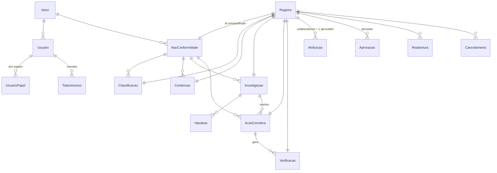
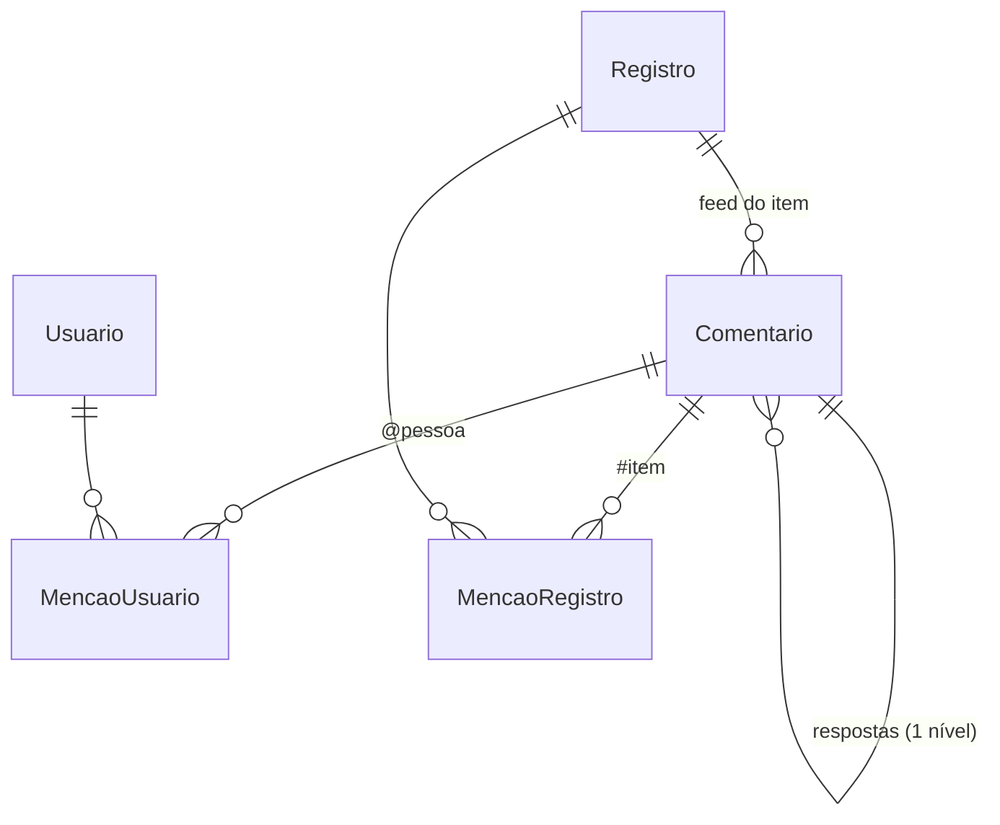

# QualityHub — Esquema Backend

> **O que é este documento:** o modelo de dados (tabelas, relações, o
> que o banco garante), os valores **calculados** a partir dele, o
> contrato da API (rotas atuais e novas) e as correções de
> comportamento encontradas. Requisitos em `docs/prd.md`; telas em
> `docs/fluxo-app.md`; decisões técnicas em `docs/trd.md`.
>
> **Fonte de verdade do banco é o `prisma/schema.prisma`.** Este
> documento explica o porquê e lista o que muda; não repete cada campo.
>
> **Status:** v1 (2026-09-24). Decisões na §9.

---

## 1. Visão geral do modelo

Todo item de negócio é um **`Registro`** (o supertipo) mais uma tabela
de especialização que **usa o mesmo `id`** (chave primária
compartilhada, ADR-08). Estado, código, atribuições, aprovações,
reaberturas e cancelamentos moram no `Registro`, iguais para os seis
tipos.



`Auditoria` e `ContadorSequencia` ficam de fora do diagrama de
propósito: não têm chave estrangeira para `Registro` (a auditoria também
registra coisas que não são registros, como login e criação de usuário).

---

## 2. Tabelas atuais

### 2.1 Núcleo (genérico, serve qualquer módulo futuro)

| Tabela | Para quê | O que o banco garante |
|---|---|---|
| `Registro` | Supertipo: `tipo`, `estado`, `codigo`, `portaoAtual`, autor e datas | `codigo` único; estado padrão `RASCUNHO` |
| `Atribuicao` | Colaboradores e aprovador de cada item | **Um aprovador por item** (índice único parcial `atribuicao_um_aprovador`); a mesma pessoa não é atribuída duas vezes na mesma função |
| `Aprovacao` | Cada decisão: portão, aprovado/reprovado, motivo, quem, se foi auto-aprovação | — (append-only por convenção do código) |
| `Reabertura` / `Cancelamento` | Evento + motivo + autor + data | — |
| `ContadorSequencia` | Último número por prefixo e ano | Chave `(prefixo, ano)`; lido com `SELECT FOR UPDATE` para não repetir número (ADR-17) |
| `Auditoria` | Histórico de toda escrita: entidade, ação, antes/depois, quem, quando | Índice por `(entidade, entidadeId, registradoEm)` — é o que o feed vai ler |

### 2.2 NC e filhos

| Tabela | Relação | Observações |
|---|---|---|
| `NaoConformidade` | 1:1 com `Registro` | Campos **anuláveis** de propósito: o rascunho pode estar incompleto; a obrigatoriedade é dos schemas Zod de publicação/fechamento |
| `Classificacao` | N por NC | Reclassificar = nova linha (RN-26) |
| `Contencao` | N por NC | — |
| `Investigacao` | N por NC | `conteudo` (JSON livre) guarda as etapas do A3; `causaDireta` e `causaRaiz` são texto consultável |
| `Hipotese` | N por Investigação | **Não** é `Registro`: sem ciclo de vida próprio |
| `AcaoCorretiva` | N por NC, ligada a uma Investigação | `investigacaoId` anulável no banco, mas preenchido pelo fluxo |
| `Verificacao` | N por Ação Corretiva | Nasce só por `finalizarExecucaoAcaoCorretiva` |

### 2.3 Usuários

| Tabela | Observações |
|---|---|
| `Usuario` | `senhaHash` anulável: o usuário existe antes de definir a senha pelo convite (ADR-03) |
| `UsuarioPapel` | Um papel por linha, com **quem concedeu e quando** (ADR-20) |
| `TokenAcesso` | Convite (e, no futuro, recuperação de senha); guarda só o **hash** do token |
| `Setor` | Lista de setores; nome único |

### 2.4 Exclusão em cascata

Apagar um `Registro` (só acontece com rascunho, RN-09) apaga junto a
especialização, as atribuições e — com as tabelas novas — comentários e
anexos. `Aprovacao`, `Reabertura` e `Cancelamento` **não** cascateiam:
rascunho nunca tem nenhum deles, e item publicado nunca é apagado.

### 2.5 Índices

O volume é pequeno (54 NCs no total, TRD §10). **Não** se acrescenta
índice por desempenho; só os que garantem regra (unicidade, um aprovador
por item). Se algum dia uma consulta ficar lenta, mede-se primeiro.

---

## 3. Mudanças no schema

Cada linha vira uma migration. Nomes de campo seguindo o padrão atual
(português, camelCase).

### M1 — `Usuario`: inativação, sessão e preferência

| Campo | Tipo | Para quê |
|---|---|---|
| `desativadoEm` | `DateTime?` | `null` = ativo. Guarda o fato **e** quando (RN-43) |
| `sessaoValidaDesde` | `DateTime @default(now())` | Sessões emitidas antes disso são recusadas — "sair de todos os aparelhos" (TRD §4.1) |
| `telaInicial` | `TelaInicial?` (enum novo) | Preferência (fluxo F1). `null` = padrão do papel |

`enum TelaInicial { PENDENCIAS NCS RELATORIOS USUARIOS }`

**Revogar papel** não precisa de campo: apaga a linha de `UsuarioPapel`
e a auditoria guarda quem revogou e quando (ADR-19).

### M2 — `Setor`: desativação

| Campo | Tipo | Para quê |
|---|---|---|
| `desativadoEm` | `DateTime?` | Setor em uso não é apagado, só some das opções (RN-44) |

### M3 — `Anexo` (nova)

| Campo | Tipo | Observações |
|---|---|---|
| `id` | `String @id @default(uuid(7))` | |
| `registroId` | `String` → `Registro` (cascade) | Anexo pertence a qualquer tipo de item |
| `nomeOriginal` | `String` | Só para exibir e para o nome do download |
| `tipoMime` | `String` | O tipo **detectado pelo conteúdo**, não o declarado (TRD §8.2) |
| `tamanhoBytes` | `Int` | |
| `chave` | `String @unique` | UUID usado no armazenamento — nunca o nome original |
| `enviadoPorId` | `String` → `Usuario` | |
| `enviadoEm` | `DateTime @default(now())` | |

Quando um rascunho é excluído, o banco apaga as linhas de `Anexo` em
cascata, mas **não** os arquivos: o service apaga os arquivos antes, e a
rotina de limpeza de órfãos (TRD §10.4) cobre o que escapar.

### M4 — Feed: `Comentario`, `MencaoUsuario`, `MencaoRegistro` (novas)



| Tabela | Campos | Observações |
|---|---|---|
| `Comentario` | `id`, `registroId` (cascade), `autorId`, `texto`, `respostaAId String?` (auto-relação), `criadoEm`, `editadoEm DateTime?` | Resposta de resposta aponta para o comentário **raiz** — um nível só (RN-34). `editadoEm` preenchido = marcador "editado" (RN-31) |
| `MencaoUsuario` | `comentarioId` (cascade), `usuarioId`, `vistaEm DateTime?` | Chave `(comentarioId, usuarioId)`. `vistaEm` nulo = pendência "Você foi mencionado" (fluxo T-03) |
| `MencaoRegistro` | `comentarioId` (cascade), `registroId` (cascade) | Chave `(comentarioId, registroId)`. Permite "onde este item foi citado?" |

**No texto do comentário**, as menções ficam como **tokens estáveis**:
`@[<usuarioId>]` e `#[<registroId>]` (ADR-27). O nome da pessoa ou o
código do item é resolvido na hora de exibir — renomear alguém não
quebra comentários antigos. Ao salvar, o service extrai os tokens e
reescreve as tabelas de menção **na mesma transação** (RN-35).

**Eventos do feed não têm tabela nova:** vêm da `Auditoria` (e de
`Aprovacao`, para o "Aprovado pelo próprio autor", RN-28), mesclados com
os comentários por data.

### M5 — Limpeza

Apagar os modelos antigos `Anexo` e `Comentario` que estão **comentados**
no fim do `schema.prisma` (referenciam campos `Int` e tabelas que não
existem mais).

### O que **não** muda no schema

| Necessidade | Por que não precisa de campo |
|---|---|
| "Plano aprovado" da Ação Corretiva (lacuna L3) | Derivado de `Aprovacao` (§4.2) |
| Etapa da NC | Calculada (§4.1, ADR-14) |
| Data de fechamento da NC (relatórios) | Última `Aprovacao` aprovada no portão `FECHAMENTO` |
| Pendências | Consulta (§4.4) |
| Catálogo de ações de auditoria tipado | Enum no **código**; a coluna continua `String`, porque a auditoria serve módulos futuros |
| Tentativas de login com falha | Vão para o **log da aplicação**, não para a auditoria (E1) — `Auditoria.usuarioId` continua obrigatório |

---

## 4. Valores calculados

Não são armazenados: calculados a cada leitura, a partir do banco. Cada
um vira **uma função**, usada por todas as rotas que precisam dele —
nunca reescrita em dois lugares.

### 4.1 Etapa da NC

Regras em `fluxo-app.md` §4 (11 etapas + indicadores). Função pura
`calcularEtapa(nc, filhos)` — **testável sem banco**.

### 4.2 Plano aprovado (Ação Corretiva)

```
planoAprovado = existe Aprovacao com
                registroId = a ação, portao = PLANO, decisao = APROVADO
```

A ação nunca é reaberta (RN-42), então uma aprovação do plano vale para
sempre. Usado em: finalizar execução (§7, B1), bloqueio de edição do
plano (B2), etapa da NC, guarda de fechamento (RN-21), pendência
"Executar ação".

### 4.3 Guarda de fechamento da NC (RN-21)

Função que devolve a **lista do que falta** (TRD §5), com um item por
requisito:

1. ≥1 Classificação `FECHADA`
2. ≥1 Investigação `FECHADA`
3. ≥1 Ação Corretiva **com plano aprovado**, e **toda** Ação Corretiva
   não cancelada com plano aprovado
4. Nenhuma Contenção fora de `FECHADA`/`CANCELADA`
5. `riscosRevisados` e `mudancasSGQ` preenchidos

Lista vazia → pode submeter.

### 4.4 Pendências (fluxo T-03)

| Tipo | Regra |
|---|---|
| Aprovar | Registro `EM_APROVACAO` em que a pessoa é o `APROVADOR` |
| Corrigir | Registro `ABERTO`, pessoa colaboradora, e a **última** `Aprovacao` do item é `REPROVADO` |
| Continuar rascunho | Registro `RASCUNHO`, pessoa colaboradora |
| Triagem | NC `ABERTA` sem aprovador — para quem tem `APROVADOR` ou `GERENTE` |
| Executar ação | Ação Corretiva `ABERTA`, plano aprovado, pessoa colaboradora |
| Verificar | Verificação `ABERTA`, pessoa colaboradora |
| Submeter para fechamento | NC `ABERTA`, guarda (§4.3) sem pendências, pessoa colaboradora |
| Mencionado | `MencaoUsuario` da pessoa com `vistaEm` nulo |

**Prazo:** Ação Corretiva sem `executadoEm` e Verificação `ABERTA` com
`prazo` — vencido (`prazo < hoje`) ou vencendo (até 7 dias, fluxo F3).

### 4.5 Último motivo de reprovação (lacuna L7)

`motivo` da última `Aprovacao` do item, se ela for `REPROVADO` — vai
junto no detalhe de todo item.

---

## 5. API — convenções

Resumo do TRD §7: prefixo **`/api`**, JSON, datas ISO 8601 em UTC, IDs
UUID v7, paginação por cursor, erros `{ mensagem, error? }`, **schema
declarado na entrada e na resposta** de toda rota (é o que alimenta o
OpenAPI e o cliente gerado).

Legenda: **=** mantém · **Δ** muda · **＋** nova · **✕** remove.

Os caminhos abaixo são mostrados **sem** o prefixo `/api`.

---

## 6. API — rotas

### 6.1 Autenticação e sessão

| | Método e caminho | Quem | O que faz |
|---|---|---|---|
| Δ | `POST /auth/login` | Público | + `manterConectado`; responde com **cookie**, não com token no corpo; limite de tentativas |
| = | `POST /auth/definir-senha` | Público (token) | Define a senha pelo convite; passa a atualizar `sessaoValidaDesde` |
| ＋ | `POST /auth/logout` | Logado | Apaga o cookie deste navegador |
| ＋ | `POST /auth/sair-de-todos` | Logado | Atualiza `sessaoValidaDesde` |
| ＋ | `GET /auth/eu` | Logado | id, nome, setor, papéis, `telaInicial` |
| ＋ | `PATCH /auth/eu` | Logado | Altera a própria `telaInicial` |

### 6.2 Usuários e setores

| | Método e caminho | Quem | O que faz |
|---|---|---|---|
| = | `POST /usuarios` | `ADMIN` | Cria e devolve o token do convite (já é assim); o frontend monta o link |
| ＋ | `GET /usuarios` | `ADMIN` | Lista com busca (nome/e-mail) e filtro ativo/inativo |
| ＋ | `GET /usuarios/:id` | `ADMIN` | Detalhe com papéis |
| ＋ | `PATCH /usuarios/:id` | `ADMIN` | Nome, setor |
| ＋ | `POST /usuarios/:id/papeis` | `ADMIN` | Concede um papel |
| ＋ | `DELETE /usuarios/:id/papeis/:papel` | `ADMIN` | Revoga — **recusa** se a pessoa for aprovadora de item aberto e o papel for `APROVADOR`, listando os itens (RN-43) |
| ＋ | `POST /usuarios/:id/inativar` | `ADMIN` | Mesma trava; preenche `desativadoEm` e `sessaoValidaDesde` |
| ＋ | `POST /usuarios/:id/reativar` | `ADMIN` | Limpa `desativadoEm` (E2) |
| ＋ | `POST /usuarios/:id/convite` | `ADMIN` | Gera novo link (o anterior expirou ou se perdeu) |
| ＋ | `GET /pessoas` | Papéis de negócio | Busca leve (id, nome, setor — E3) de usuários **ativos**, com filtro `?papel=APROVADOR` — alimenta o painel de atribuições e o `@` do feed |
| ＋ | `GET /setores` | Logado | Setores ativos (o `ADMIN` pode pedir os inativos também) |
| ＋ | `POST /setores` · `PATCH /setores/:id` | `ADMIN` | Criar, renomear |
| ＋ | `POST /setores/:id/desativar` · `/reativar` | `ADMIN` | RN-44 |

`GET /pessoas` separado de `GET /usuarios` porque devolve **menos
dados** e é aberto a todos os papéis de negócio — o e-mail e os papéis
de todo mundo não precisam ir para qualquer tela.

### 6.3 Não Conformidade

| | Método e caminho | O que muda |
|---|---|---|
| Δ | `POST /nc` | Aceita `colaboradores: id[]` opcional (PRD Q10), na mesma transação |
| Δ | `GET /nc` | Filtros novos: `etapa`, `setorId`, `prazoVencido`, `semAprovador`, `busca` (código ou título). Cada item volta com **etapa** e **indicadores** |
| Δ | `GET /nc/:id` | + etapa, indicadores, último motivo de reprovação |
| ＋ | `GET /nc/:id/checklist-fechamento` | A lista do que falta (§4.3) |
| Δ | `POST /nc/:id/submeter` | Guarda nova (RN-21) |
| = | `PATCH`, `DELETE`, `/publicar`, `/decidir`, `/reabrir`, `/cancelar` | — |

### 6.4 Filhos

Mesma forma para os cinco tipos: `POST /nc/:ncId/<tipo>` para criar;
`GET`, `PATCH`, `DELETE /<tipo>/:id`; ações `/publicar`, `/submeter`,
`/decidir`, `/cancelar`; `GET /<tipo>?naoConformidadeId=`.

| | Rota | O que muda |
|---|---|---|
| Δ | Todos os `GET /<tipo>/:id` | + último motivo de reprovação |
| ＋ | `POST /investigacoes/:id/hipoteses` | Cria hipótese (lacuna L1) — só colaborador, investigação editável |
| ＋ | `PATCH /hipoteses/:id` · `DELETE /hipoteses/:id` | Edita / apaga — mesmas regras |
| Δ | `GET /investigacoes/:id` | + lista de hipóteses e de ações corretivas vinculadas |
| Δ | `GET /acoes-corretivas/:id` | + `planoAprovado` |
| Δ | `PATCH /acoes-corretivas/:id` | Com plano aprovado, só aceita os campos de **execução** (B2) |
| Δ | `POST /acoes-corretivas/:id/finalizar-execucao` | Exige plano aprovado (B1) |
| Δ | `POST /verificacoes/:id/concluir` | Reações corrigidas (B4, B5, B6) |
| ✕ | `DELETE /verificacoes/:id` | Verificação nunca é rascunho — a rota sempre falha (B8) |

### 6.5 Genéricas de item (valem para qualquer `Registro`)

| | Método e caminho | O que faz |
|---|---|---|
| ＋ | `GET /registros/:id/atribuicoes` | Colaboradores e aprovador (painel de atribuições) |
| = | `PUT /registros/:id/aprovador` · `POST`/`DELETE /registros/:id/colaboradores` | — |
| ＋ | `GET /registros/:id/feed?cursor=` | Eventos + comentários, em ordem cronológica, paginado |
| ＋ | `POST /registros/:id/comentarios` | Comenta (ou responde, com `respostaAId`) |
| ＋ | `PATCH /comentarios/:id` · `DELETE /comentarios/:id` | RN-31 a RN-33 |
| ＋ | `POST /registros/:id/mencoes/vistas` | Marca as menções à pessoa neste item como vistas (ao abrir o item) |
| ＋ | `GET /registros/:id/anexos` · `POST /registros/:id/anexos` | Lista / envia (multipart) |
| ＋ | `GET /anexos/:id` · `DELETE /anexos/:id` | Baixa / remove (TRD §8.3) |
| ＋ | `GET /registros/busca?q=` | Busca por código — alimenta o `#` do feed. Só itens publicados (RN-11) |

### 6.6 Pendências, relatórios, sistema

| | Método e caminho | Quem | O que faz |
|---|---|---|---|
| ＋ | `GET /pendencias` | `EDITOR`/`APROVADOR`/`GERENTE` | Todas as pendências da pessoa (§4.4), com prazo; o contador do menu é o tamanho da lista |
| ＋ | `GET /relatorios/ncs-abertas` | `GERENTE` | Por setor e por origem |
| ＋ | `GET /relatorios/tempo-fechamento` | `GERENTE` | Média detecção → fechamento, por período e classificação |
| ＋ | `GET /relatorios/atrasados` | `GERENTE` | Ações e verificações vencidas, com responsáveis |
| ＋ | `GET /relatorios/eficacia` | `GERENTE` | Resultados de verificação, NCs reabertas, causas-raiz recorrentes |
| Δ | `GET /` → `GET /saude` | Público | Confere banco e armazenamento |
| ＋ | `GET /docs` | Só em desenvolvimento | OpenAPI navegável |

Relatórios aceitam `?de=&ate=` e devolvem, junto de cada número, os
**filtros** que levam à lista de NCs correspondente (fluxo J12).

---

## 7. Correções de comportamento

Encontradas ao cruzar o código com o PRD e o Fluxo do App. Cada uma
começa com um **teste que falha** (TRD §9.4).

| # | Problema | Onde | Correção |
|---|---|---|---|
| **B1** | **Dá para executar uma Ação Corretiva sem aprovação do plano.** A checagem é `estado === ABERTO && portaoAtual === 0`, mas o `portaoAtual` nunca sai de 0 — uma ação recém-publicada, nunca submetida, passa | `finalizarExecucaoAcaoCorretiva` | Exigir plano aprovado (§4.2) |
| **B2** | **O plano continua editável depois de aprovado** (o estado volta a `ABERTO`, que é editável) | `atualizarAcaoCorretiva` | Com plano aprovado, recusar mudança em `descricao`, `prazo`, `instrucoesVerificacao`, `investigacaoId` |
| **B3** | **Autor errado na auditoria** da Ação Corretiva criada por `PARCIALMENTE_EFICAZ`: registra quem criou a ação anterior, não o QA que concluiu | `concluirVerificacao` | `criadoPorId` = o ator |
| **B4** | `NAO_EFICAZ` **falha** se a NC ou a Investigação estiverem abertas (PRD Q2) | `concluirVerificacao` | Reabrir só o que estiver `FECHADO` |
| **B5** | Guarda de fechamento não exige planos de ação aprovados (PRD Q1) | `submeterNC` | Nova guarda (§4.3) |
| **B6** | Nova ação de `PARCIALMENTE_EFICAZ` recebe só um colaborador (PRD Q3) | `concluirVerificacao` | Copiar **todos** os colaboradores |
| **B7** | Papéis dentro do JWT: revogar só vale quando o token expira | `auth.controller`, `autenticar` | Sessão nova (TRD §4) |
| **B8** | Rota `DELETE /verificacoes/:id` que nunca funciona | `verificacao.routes` | Remover |

B1 e B2 são os mais graves: juntos, permitem que a ação corretiva seja
feita sem o QA concordar com o plano — exatamente o que o RF-06 existe
para impedir.

---

## 8. Ordem sugerida (para o Plano de Implementação)

1. Testes sobre o comportamento **atual** (rede de proteção)
2. B1–B8, cada um com seu teste
3. Sessão nova (M1 parcial + rotas de auth)
4. Schema de resposta em todas as rotas + prefixo `/api` + OpenAPI
5. Usuários, setores, pessoas (M1, M2)
6. Hipóteses, etapa, checklist, pendências
7. Feed (M4)
8. Anexos (M3) — depois da hospedagem decidida
9. Relatórios

O Plano de Implementação detalha fases, critérios de pronto e o que é
aprendizado.

---

## 9. Decisões tomadas

Com Matthew, em 2026-09-24.

| # | Pergunta | Decisão |
|---|---|---|
| **E1** | Onde ficam as tentativas de login com falha? | **Só no log da aplicação** (e-mail e IP, nível de aviso). Login com sucesso vai para a auditoria. Sem mudança em `Auditoria` |
| **E2** | Reativar usuário e setor? | **Sim** — limpa `desativadoEm`, auditado |
| **E3** | `GET /pessoas` mostra o setor? | **Sim**, nome + setor; e-mail e papéis só para o `ADMIN` |

---

## Histórico

| Data | Mudança |
|---|---|
| 2026-09-24 | v1 — modelo, mudanças M1–M5, valores calculados, API, correções B1–B8; E1–E3 |
