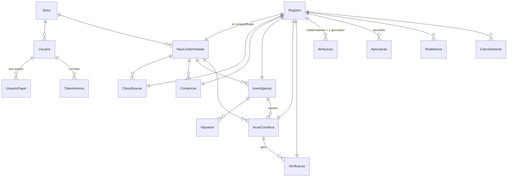
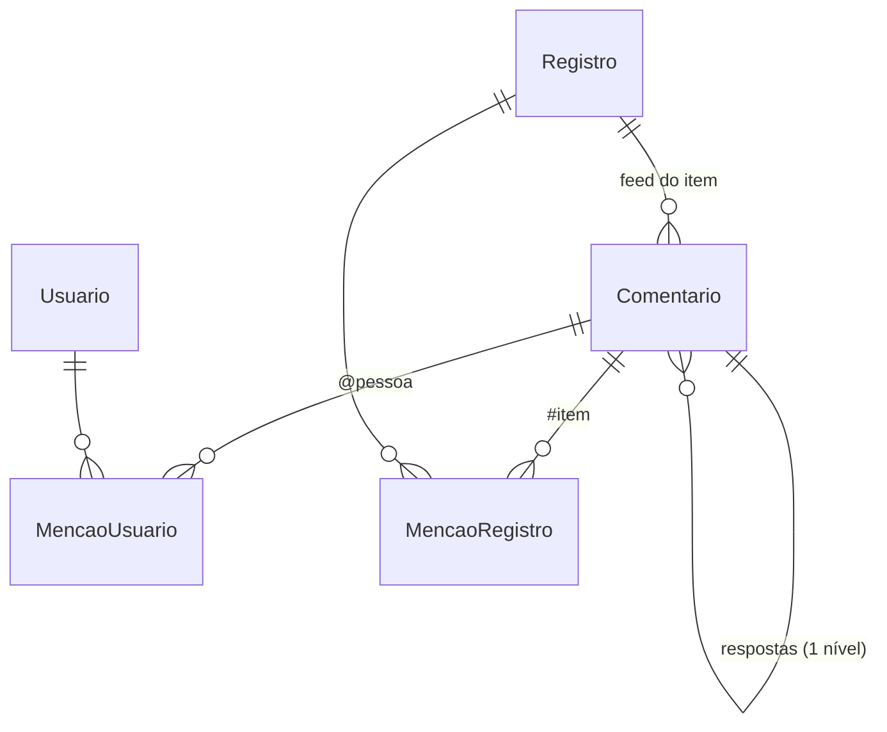

# QualityHub — Esquema Backend

> **O que é este documento:** o modelo de dados (tabelas, relações, o
> que o banco garante), os valores **calculados** a partir dele, o
> contrato da API (rotas atuais e novas) e as correções de
> comportamento encontradas. Requisitos em `docs/prd.md`; telas em
> `docs/fluxo-app.md`; decisões técnicas em `docs/trd.md`.
>
> **Fonte de verdade do banco é o `prisma/schema.prisma`.** Este
> documento explica o porquê e lista o que muda; não repete cada campo.
>
> **Status:** v1.32 (2026-10-02). Decisões na §9.

---

## 1. Visão geral do modelo

Todo item de negócio é um **`Registro`** (o supertipo) mais uma tabela
de especialização que **usa o mesmo `id`** (chave primária
compartilhada, ADR-08). Estado, código, atribuições, aprovações,
reaberturas e cancelamentos moram no `Registro`, iguais para os seis
tipos.


```mermaid
erDiagram
    Usuario ||--o{ UsuarioPapel : "tem papéis"
    Setor ||--o{ Usuario : ""
    Setor ||--o{ NaoConformidade : ""
    Usuario ||--o{ TokenAcesso : "convites"

    Registro ||--|| NaoConformidade : "id compartilhado"
    Registro ||--|| Classificacao : ""
    Registro ||--|| Contencao : ""
    Registro ||--|| Investigacao : ""
    Registro ||--|| AcaoCorretiva : ""
    Registro ||--|| Verificacao : ""

    Registro ||--o{ Atribuicao : "colaboradores + 1 aprovador"
    Registro ||--o{ Aprovacao : "decisões"
    Registro ||--o{ Reabertura : ""
    Registro ||--o{ Cancelamento : ""

    NaoConformidade ||--o{ Classificacao : ""
    NaoConformidade ||--o{ Contencao : ""
    NaoConformidade ||--o{ Investigacao : ""
    NaoConformidade ||--o{ AcaoCorretiva : ""
    Investigacao ||--o{ Hipotese : ""
    Investigacao ||--o{ AcaoCorretiva : "resolve"
    AcaoCorretiva ||--o{ Verificacao : "gera"
```

`Auditoria` e `ContadorSequencia` ficam de fora do diagrama de
propósito: não têm chave estrangeira para `Registro` (a auditoria também
registra coisas que não são registros, como login e criação de usuário).

---

## 2. Tabelas atuais

### 2.1 Núcleo (genérico, serve qualquer módulo futuro)

| Tabela | Para quê | O que o banco garante |
|---|---|---|
| `Registro` | Supertipo: `tipo`, `estado`, `codigo`, `portaoAtual`, autor e datas | `codigo` único; estado padrão `RASCUNHO` |
| `Atribuicao` | Colaboradores e aprovador de cada item | **Um aprovador por item** (índice único parcial `atribuicao_um_aprovador`); a mesma pessoa não é atribuída duas vezes na mesma função |
| `Aprovacao` | Cada decisão: portão, aprovado/reprovado, motivo, quem, se foi auto-aprovação | — (append-only por convenção do código) |
| `Reabertura` / `Cancelamento` | Evento + motivo + autor + data | — |
| `ContadorSequencia` | Último número por prefixo e ano | Chave `(prefixo, ano)`; criado ou incrementado num comando só (`INSERT ... ON CONFLICT ... RETURNING`), para não repetir nem pular número sob concorrência (ADR-17, B15) |
| `Auditoria` | Histórico de toda escrita: entidade, ação, antes/depois, quem, quando | Índice por `(entidade, entidadeId, registradoEm)` — é o que o feed vai ler |

### 2.2 NC e filhos

| Tabela | Relação | Observações |
|---|---|---|
| `NaoConformidade` | 1:1 com `Registro` | Campos **anuláveis** de propósito: o rascunho pode estar incompleto; a obrigatoriedade é dos schemas Zod de publicação/fechamento |
| `Classificacao` | N por NC | Reclassificar = nova linha (RN-26) |
| `Contencao` | N por NC | — |
| `Investigacao` | N por NC | `conteudo` (JSON livre) guarda as etapas do A3; `causaDireta` e `causaRaiz` são texto consultável |
| `Hipotese` | N por Investigação | **Não** é `Registro`: sem ciclo de vida próprio |
| `AcaoCorretiva` | N por NC, ligada a uma Investigação | `investigacaoId` obrigatório (`NOT NULL`, chave estrangeira em `RESTRICT`) desde a A3 (RN-49) |
| `Verificacao` | N por Ação Corretiva | Nasce só por `finalizarExecucaoAcaoCorretiva` |

### 2.3 Usuários

| Tabela | Observações |
|---|---|
| `Usuario` | `senhaHash` anulável: o usuário existe antes de definir a senha pelo convite (ADR-03) |
| `UsuarioPapel` | Um papel por linha, com **quem concedeu e quando** (ADR-20) |
| `TokenAcesso` | Convite (e, no futuro, recuperação de senha); guarda só o **hash** do token |
| `Setor` | Lista de setores; nome único |

### 2.4 Exclusão em cascata

Apagar um `Registro` (só acontece com rascunho, RN-09) apaga junto a
especialização, as atribuições e — com as tabelas novas — comentários e
anexos. `Aprovacao`, `Reabertura` e `Cancelamento` **não** cascateiam:
rascunho nunca tem nenhum deles, e item publicado nunca é apagado.

### 2.5 Índices

O volume é pequeno (54 NCs no total, TRD §10). **Não** se acrescenta
índice por desempenho; só os que garantem regra (unicidade, um aprovador
por item). Se algum dia uma consulta ficar lenta, mede-se primeiro.

---

## 3. Mudanças no schema

Cada linha vira uma migration. Nomes de campo seguindo o padrão atual
(português, camelCase).

### M1 — `Usuario`: inativação, sessão e preferência ✅

Aplicada na A4 (2026-10-05), migration `sessao_e_preferencia_do_usuario`. Os usuários que já existiam recebem `sessaoValidaDesde` = o momento da migration.

| Campo | Tipo | Para quê |
|---|---|---|
| `desativadoEm` | `DateTime?` | `null` = ativo. Guarda o fato **e** quando (RN-43) |
| ~~`sessaoValidaDesde`~~ → `versaoSessao` | `Int @default(0)` | Derrubar as sessões soma 1; o JWT com a versão de antes é recusado — "sair de todos os aparelhos" (TRD §4.1). Trocada na A6 (B27, migration `versao_da_sessao`): a data dependia do relógio |
| `telaInicial` | `TelaInicial?` (enum novo) | Preferência (fluxo F1). `null` = padrão do papel |

`enum TelaInicial { PENDENCIAS NCS RELATORIOS USUARIOS }`

**Revogar papel** não precisa de campo: apaga a linha de `UsuarioPapel`
e a auditoria guarda quem revogou e quando (ADR-19).

### M2 — `Setor`: desativação ✅

| Campo | Tipo | Para quê |
|---|---|---|
| `desativadoEm` | `DateTime?` | Setor em uso não é apagado, só some das opções (RN-44) |

### M3 — `Anexo` (nova)

| Campo | Tipo | Observações |
|---|---|---|
| `id` | `String @id @default(uuid(7))` | |
| `registroId` | `String` → `Registro` (cascade) | Anexo pertence a qualquer tipo de item |
| `nomeOriginal` | `String` | Só para exibir e para o nome do download |
| `tipoMime` | `String` | O tipo **detectado pelo conteúdo**, não o declarado (TRD §8.2) |
| `tamanhoBytes` | `Int` | |
| `chave` | `String @unique` | UUID usado no armazenamento — nunca o nome original |
| `enviadoPorId` | `String` → `Usuario` | |
| `enviadoEm` | `DateTime @default(now())` | |

Quando um rascunho é excluído, o banco apaga as linhas de `Anexo` em
cascata, mas **não** os arquivos: o service apaga os arquivos antes, e a
rotina de limpeza de órfãos (TRD §10.4) cobre o que escapar.

### M4 — Feed: `Comentario`, `MencaoUsuario`, `MencaoRegistro` (novas)


```mermaid
erDiagram
    Registro ||--o{ Comentario : "feed do item"
    Comentario ||--o{ Comentario : "respostas (1 nível)"
    Comentario ||--o{ MencaoUsuario : "@pessoa"
    Comentario ||--o{ MencaoRegistro : "#item"
    Usuario ||--o{ MencaoUsuario : ""
    Registro ||--o{ MencaoRegistro : ""
```

| Tabela | Campos | Observações |
|---|---|---|
| `Comentario` | `id`, `registroId` (cascade), `autorId`, `texto`, `respostaAId String?` (auto-relação), `criadoEm`, `editadoEm DateTime?` | Resposta de resposta aponta para o comentário **raiz** — um nível só (RN-34). `editadoEm` preenchido = marcador "editado" (RN-31) |
| `MencaoUsuario` | `comentarioId` (cascade), `usuarioId`, `vistaEm DateTime?` | Chave `(comentarioId, usuarioId)`. `vistaEm` nulo = pendência "Você foi mencionado" (fluxo T-03) |
| `MencaoRegistro` | `comentarioId` (cascade), `registroId` (cascade) | Chave `(comentarioId, registroId)`. Permite "onde este item foi citado?" |

**No texto do comentário**, as menções ficam como **tokens estáveis**:
`@[<usuarioId>]` e `#[<registroId>]` (ADR-27). O nome da pessoa ou o
código do item é resolvido na hora de exibir — renomear alguém não
quebra comentários antigos. Ao salvar, o service extrai os tokens e
reescreve as tabelas de menção **na mesma transação** (RN-35).

**Eventos do feed não têm tabela nova:** vêm da `Auditoria` (e de
`Aprovacao`, para o "Aprovado pelo próprio autor", RN-28), mesclados com
os comentários por data.

**Nem toda linha de auditoria vira evento no feed**, senão cada "Salvar"
encheria a conversa. Entram: criação, publicação, envio para aprovação,
aprovação/reprovação (com motivo), reabertura, cancelamento, finalizar
execução, verificação gerada/concluída, mudança de atribuições e
anexos. Edições de campos aparecem **agrupadas** ("Fulana editou os
dados") sem detalhar o antes/depois — o detalhe continua na auditoria.

### M5 — Limpeza

Apagar os modelos antigos `Anexo` e `Comentario` que estão **comentados**
no fim do `schema.prisma` (referenciam campos `Int` e tabelas que não
existem mais).

### O que **não** muda no schema

| Necessidade | Por que não precisa de campo |
|---|---|
| "Plano aprovado" da Ação Corretiva (lacuna L3) | Derivado de `Aprovacao` (§4.2) |
| Etapa da NC | Calculada (§4.1, ADR-14) |
| Data de fechamento da NC (relatórios) | Última `Aprovacao` aprovada no portão `FECHAMENTO` |
| Pendências | Consulta (§4.4) |
| Catálogo de ações de auditoria tipado | Enum no **código**; a coluna continua `String`, porque a auditoria serve módulos futuros |
| Tentativas de login com falha | Vão para o **log da aplicação**, não para a auditoria (E1) — `Auditoria.usuarioId` continua obrigatório |
| Herança do aprovador da NC (RN-46) | Na criação do filho, o service copia a `Atribuicao` de aprovador da NC — mesma tabela de sempre |

### Catálogo de permissões (código, não banco)

Ações novas em `compartilhado/permissoes/catalogo.ts`:

| Ação | Papéis | Usada em |
|---|---|---|
| `ANEXAR` | `EDITOR`, `APROVADOR`, `GERENTE` | Enviar e remover anexo (com atribuição de colaborador). `APROVADOR` entra porque o QA anexa evidência na Verificação |
| `GERENCIAR_SETORES` | `ADMIN` | Criar, renomear, desativar e reativar setores |
| `TROCAR_APROVADOR_EM_APROVACAO` | `GERENTE` | Trocar o aprovador de item `EM_APROVACAO` (RN-47, B17). O limite de estado fica no service; o catálogo diz só quem |

Comentar (`COMENTAR`), relatórios (`GERAR_RELATORIOS`) e usuários
(`GERENCIAR_USUARIOS`) já existem. A busca de pessoas e o feed usam
`VISUALIZAR`.

Retirar da aprovação (RN-48) **não** ganha ação própria: reaproveita a
de submeter (`SUBMETER`; `CLASSIFICAR` na Classificação), passada como
parâmetro, como já fazem `publicar` e `submeter` — "quem pode submeter
pode retirar" fica escrito no código, sem duas listas iguais.

---

## 4. Valores calculados

Não são armazenados: calculados a cada leitura, a partir do banco. Cada
um vira **uma função**, usada por todas as rotas que precisam dele —
nunca reescrita em dois lugares.

### 4.1 Etapa da NC

Regras em `fluxo-app.md` §4 (10 etapas + indicadores). Função pura
`calcularEtapa(nc, filhos)` — **testável sem banco**.

### 4.2 Plano aprovado (Ação Corretiva)

```
planoAprovado = existe Aprovacao com
                registroId = a ação, portao = PLANO, decisao = APROVADO
```

A ação nunca é reaberta (RN-42), então uma aprovação do plano vale para
sempre. Usado em: finalizar execução (§7, B1), bloqueio de edição do
plano (B2), etapa da NC, guarda de submissão da Investigação (RN-24, §4.3), pendência
"Executar ação".

**Implementado na A3:** `acaoCorretivaRepository.planoAprovado(cliente,
id)`, exposto em `GET /acoes-corretivas/:id` como `planoAprovado`.

### 4.3 Guardas: submissão da Investigação (RN-24) e fechamento da NC (RN-21)

Funções que devolvem a **lista do que falta** (TRD §5), com um item por
requisito. Os planos de ação são conferidos pela **Investigação**, não
pela NC (PRD Q17).

**Submeter a Investigação** — além dos campos da RN-24 e do aprovador
(RN-13):

- **Toda** Ação Corretiva não cancelada ligada a ela com plano aprovado
  (§4.2), com um item por ação pendente. Sem nenhuma ação, o requisito
  está atendido: a investigação pode concluir sem ação corretiva.

A ação só se liga a uma investigação em `ABERTO` (RN-49), então
nenhuma ação nova aparece depois do envio, e um plano aprovado nunca
deixa de estar (RN-42). Por isso a checagem no submeter basta; o
`decidir` não a repete. A exceção é a ação do `PARCIALMENTE_EFICAZ`, que
nasce numa investigação já fechada e segue depois do fechamento, como a
execução e a verificação.

**Fechamento da NC**, em dois grupos:

**Filhos** — definem a etapa *Pronta para fechamento* e a pendência
"Submeter para fechamento":

1. ≥1 Classificação `FECHADA`
2. ≥1 Investigação `FECHADA`, e **toda** Investigação não cancelada
   `FECHADA`
3. Nenhuma Contenção fora de `FECHADA`/`CANCELADA`

**Envio** — preenchidos pelo colaborador depois que os filhos estão
atendidos:

4. `riscosRevisados` e `mudancasSGQ` preenchidos
5. Aprovador da NC definido (RN-13)

Lista vazia → pode submeter. **Implementada na A3 (8c/8d):** `avaliarFechamentoNC` (função pura, um item por
requisito com `atendido` e `pendentes`); o submeter responde 409 com os itens não atendidos no campo `error`. Ela roda
como validador do ciclo de vida, depois das checagens de estado, permissão e aprovador: sem aprovador, a resposta
continua sendo o 409 genérico ("deve possuir um aprovador"), sem a lista — a tela usa o checklist. A etapa e a pendência olham **só o grupo
"Filhos"**; se olhassem os dois, a NC nunca chegaria a *Pronta para
fechamento* sem alguém preencher os campos do envio antes — e ninguém
seria avisado para preenchê-los (`fluxo-app.md` §4 e J6).

**Submissão de qualquer item** usa o mesmo formato de lista: campos
obrigatórios do schema de fechamento que faltam + aprovador definido
(RN-13). É o que alimenta o `BotaoBloqueado` da tela.

### 4.4 Pendências (fluxo T-03)

| Tipo | Regra |
|---|---|
| Aprovar | Registro `EM_APROVACAO` em que a pessoa é o `APROVADOR` |
| Corrigir | Registro `ABERTO`, pessoa colaboradora, e a **última** `Aprovacao` do item é `REPROVADO` |
| Continuar rascunho | Registro `RASCUNHO`, pessoa colaboradora |
| Triagem | Registro **publicado** (`ABERTO`/`EM_APROVACAO`) sem aprovador — NC ou filho (RN-46) — para quem tem `APROVADOR` ou `GERENTE` |
| Executar ação | Ação Corretiva `ABERTA`, plano aprovado, pessoa colaboradora |
| Verificar | Verificação `ABERTA`, pessoa colaboradora |
| Submeter para fechamento | NC `ABERTA`, grupo **"Filhos"** da guarda (§4.3) atendido, pessoa colaboradora |
| Mencionado | `MencaoUsuario` da pessoa com `vistaEm` nulo |

**Prazo:** Ação Corretiva sem `executadoEm` e Verificação `ABERTA` com
`prazo` — vencido (`prazo < hoje`) ou vencendo (até 7 dias, fluxo F3).
"Hoje" é o **dia em `America/Sao_Paulo`**, e a comparação é por dia, não
por instante (TRD §6, B11).

### 4.5 Último motivo de reprovação (lacuna L7)

`motivo` da última `Aprovacao` do item, se ela for `REPROVADO` — vai
junto no detalhe de todo item.

---

## 5. API — convenções

Resumo do TRD §7: prefixo **`/api`**, JSON, datas ISO 8601 em UTC (dias de
calendário — `detectadoEm`, `prazo`, `executadaEm`, `executadoEm`,
`verificadoEm`, filtros `de`/`ate` — só em `"AAAA-MM-DD"`, TRD §6), IDs
UUID v7, paginação por cursor, erros `{ mensagem, error? }`, **schema
declarado na entrada e na resposta** de toda rota (é o que alimenta o
OpenAPI e o cliente gerado).

Legenda: **=** mantém · **Δ** muda · **＋** nova · **✕** remove · **✅** já feito (até a A3).

Os caminhos abaixo são mostrados **sem** o prefixo `/api`.

---

## 6. API — rotas

### 6.1 Autenticação e sessão

| | Método e caminho | Quem | O que faz |
|---|---|---|---|
| Δ ✅ | `POST /auth/login` | Público | + `manterConectado`; responde com **cookie**, não com token no corpo; limite de tentativas (5/min por IP + e-mail, 429); recusa usuário **inativo** com a mesma mensagem de qualquer falha (RN-38); sucesso na auditoria (`LOGIN`), falha no log (E1); e-mail inexistente compara com um hash falso, no mesmo tempo (auditoria L1) |
| Δ | `POST /auth/definir-senha` | Público (token) | Define a senha pelo convite (também serve para redefinir); passa a somar 1 à `versaoSessao` (derruba as sessões); recusa usuário inativo |
| ＋ ✅ | `POST /auth/logout` | Logado | Apaga o cookie deste navegador |
| ＋ ✅ | `POST /auth/sair-de-todos` | Logado | Soma 1 à `versaoSessao` (auditado: `SAIR_DE_TODOS`) e apaga o cookie deste navegador |
| ＋ ✅ | `GET /auth/eu` | Logado | id, nome, e-mail, setor, papéis, `telaInicial` (a **efetiva**: a escolhida, se os papéis ainda a permitem; senão, o padrão do papel) e `telasIniciais` (as que pode escolher) |
| ＋ ✅ | `PATCH /auth/eu` | Logado | Altera a própria `telaInicial`; 400 se os papéis não a permitem; `null` volta para o padrão |

### 6.2 Usuários e setores

| | Método e caminho | Quem | O que faz |
|---|---|---|---|
| = | `POST /usuarios` | `ADMIN` | Cria e devolve o token do convite (já é assim); o frontend monta o link |
| ＋ | `GET /usuarios` | `ADMIN` | Lista com busca (nome/e-mail) e filtro ativo/inativo |
| ＋ | `GET /usuarios/:id` | `ADMIN` | Detalhe com papéis |
| ＋ | `PATCH /usuarios/:id` | `ADMIN` | Nome, setor |
| ＋ | `POST /usuarios/:id/papeis` | `ADMIN` | Concede um papel |
| ＋ | `DELETE /usuarios/:id/papeis/:papel` | `ADMIN` | Revoga — **recusa** se a pessoa for aprovadora de item aberto e o papel for `APROVADOR`, listando os itens (RN-43) |
| ＋ | `POST /usuarios/:id/inativar` | `ADMIN` | Mesma trava; preenche `desativadoEm` e soma 1 à `versaoSessao` |
| ＋ | `POST /usuarios/:id/reativar` | `ADMIN` | Limpa `desativadoEm` (E2) |
| ＋ | `POST /usuarios/:id/convite` | `ADMIN` | Gera novo link (o anterior expirou, se perdeu, ou a pessoa esqueceu a senha) e **invalida os convites anteriores não usados** (`revogadoEm`); derruba as sessões; inativo → 409. Resposta `{ tokenConvite, expiraEm }`, `no-store` |
| ＋ | `GET /pessoas` | Papéis de negócio | Busca leve (id, nome, setor — E3) de usuários **ativos**, com filtro `?papel=APROVADOR` — alimenta o painel de atribuições e o `@` do feed |
| ＋ | `GET /setores` | Logado | Setores ativos (o `ADMIN` pode pedir os inativos também) |
| ＋ | `POST /setores` · `PATCH /setores/:id` | `ADMIN` | Criar, renomear |
| ＋ | `POST /setores/:id/desativar` · `/reativar` | `ADMIN` | RN-44 |

`GET /pessoas` separado de `GET /usuarios` porque devolve **menos
dados** e é aberto a todos os papéis de negócio — o e-mail e os papéis
de todo mundo não precisam ir para qualquer tela.

### 6.3 Não Conformidade

| | Método e caminho | O que muda |
|---|---|---|
| Δ | `POST /nc` | Aceita `colaboradores: id[]` opcional (PRD Q10), na mesma transação |
| Δ | `GET /nc` | Filtros novos: `etapa`, `setorId`, `prazoVencido`, `semAprovador`, `busca` (código ou título). Cada item volta com **etapa** e **indicadores**. Como a etapa é calculada no código (não no SQL), o filtro por etapa é aplicado **em memória** antes da paginação — viável porque o volume é pequeno (TRD §10); se crescer muito, revisita-se |
| Δ | `GET /nc/:id` | + etapa, indicadores, último motivo de reprovação |
| ＋ ✅ | `GET /nc/:id/checklist-fechamento` | A lista do que falta, nos dois grupos (§4.3) |
| Δ ✅ | `POST /nc/:id/submeter` | Guarda nova (RN-21): toda investigação não cancelada fechada; responde 409 com a lista do que falta |
| Δ ✅ | `PATCH /nc/:id` · `POST /nc` | `detectadoEm` comparado com o **dia de hoje em São Paulo**, calculado a cada requisição (B9, B11) |
| Δ ✅ | `POST /nc/:id/cancelar` | Recusa `RASCUNHO` (B12) |
| ＋ ✅ | `POST /nc/:id/retirar` | Retira da aprovação: `EM_APROVACAO` → `ABERTO`, mesmo portão, sem `Aprovacao` (RN-48) |
| = | `DELETE`, `/publicar`, `/decidir`, `/reabrir` | — |

### 6.4 Filhos

Mesma forma para os cinco tipos: `POST /nc/:ncId/<tipo>` para criar;
`GET`, `PATCH`, `DELETE /<tipo>/:id`; ações `/publicar`, `/submeter`,
`/retirar`, `/decidir`, `/cancelar`; `GET /<tipo>?naoConformidadeId=&estado=`.
Exceções: a **Classificação** não tem `/cancelar` (reclassificar é
criar outra, RN-26); a **Verificação** não é criada pela API (nasce do
`/finalizar-execucao`), não tem `DELETE`, `/publicar`, `/submeter`,
`/retirar` nem `/decidir`, fecha por `POST /verificacoes/:id/concluir`, e
a lista dela filtra por `acaoCorretivaId`. A Ação Corretiva tem ainda
`/finalizar-execucao`.

| | Rota | O que muda |
|---|---|---|
| Δ ✅ | Todos os `POST /nc/:ncId/<tipo>` | O filho nasce com o **aprovador da NC**, se houver (RN-46, B13) |
| Δ ✅ | Todos os `/<tipo>/:id/cancelar` | Recusam `RASCUNHO` (B12) |
| ＋ ✅ | Todos os `POST /<tipo>/:id/retirar` | Retira da aprovação, como na NC (RN-48). Não vale para Verificação (não tem portão). **Feito na A3** (2026-10-01): `cicloVidaService.retirar`, com a ação do submeter como parâmetro (`CLASSIFICAR` na Classificação); auditoria `RETIRAR_DA_APROVACAO` |
| Δ | Todos os `GET /<tipo>/:id` | + último motivo de reprovação |
| Δ ✅ | `POST /nc/:ncId/acoes-corretivas` · `PATCH /acoes-corretivas/:id` | `investigacaoId` **obrigatório já na criação**, de uma investigação **desta NC** em `ABERTO`; o `PATCH` não o apaga (B10, RN-49) |
| Δ ✅ | `POST /investigacoes/:id/submeter` | Exige os planos das ações ligadas aprovados (RN-24, B5); responde 409 com a lista do que falta |
| Δ ✅ | `POST /investigacoes/:id/cancelar` | Exige as ações ligadas canceladas ou fechadas (RN-50); responde 409 com a lista das que faltam. **Feito na A3 (8f):** `avaliarCancelamentoInvestigacao`, no validador opcional que o `cicloVidaService.cancelar` ganhou (roda depois de estado e permissão) |
| ＋ | `POST /investigacoes/:id/hipoteses` | Cria hipótese (lacuna L1) — só colaborador, investigação editável |
| ＋ | `PATCH /hipoteses/:id` · `DELETE /hipoteses/:id` | Edita / apaga — mesmas regras |
| Δ | `GET /investigacoes/:id` | + lista de hipóteses e de ações corretivas vinculadas |
| Δ ✅ | `GET /acoes-corretivas/:id` | + `planoAprovado` |
| Δ ✅ | `PATCH /acoes-corretivas/:id` | Com plano aprovado, só aceita os campos de **execução** (B2) |
| Δ ✅ | `POST /acoes-corretivas/:id/finalizar-execucao` | Exige plano aprovado (B1) |
| Δ ✅ | `POST /verificacoes/:id/concluir` | Reações corrigidas (B3, B4, B6) |
| ✕ ✅ | `DELETE /verificacoes/:id` | Verificação nunca é rascunho — a rota sempre falha (B8) |

### 6.5 Genéricas de item (valem para qualquer `Registro`)

| | Método e caminho | O que faz |
|---|---|---|
| ＋ | `GET /registros/:id/atribuicoes` | Colaboradores e aprovador (painel de atribuições) |
| Δ ✅ | `PUT /registros/:id/aprovador` · `POST`/`DELETE /registros/:id/colaboradores` | Só em `RASCUNHO`/`ABERTO`; em `EM_APROVACAO`, só o `GERENTE` troca o aprovador (RN-47, B17). Colaborador inexistente → 404 (B16) |
| ＋ | `GET /registros/:id/feed?cursor=` | Eventos + comentários, em ordem cronológica, paginado |
| ＋ | `POST /registros/:id/comentarios` | Comenta (ou responde, com `respostaAId`) |
| ＋ | `PATCH /comentarios/:id` · `DELETE /comentarios/:id` | RN-31 a RN-33 |
| ＋ | `POST /registros/:id/mencoes/vistas` | Marca as menções à pessoa neste item como vistas (ao abrir o item) |
| ＋ | `GET /registros/:id/anexos` · `POST /registros/:id/anexos` | Lista / envia (multipart) |
| ＋ | `GET /anexos/:id` · `DELETE /anexos/:id` | Baixa / remove (TRD §8.3) |
| ＋ | `GET /registros/busca?q=` | Busca por código — alimenta o `#` do feed. Só itens publicados (RN-11) |

### 6.6 Pendências, relatórios, sistema

| | Método e caminho | Quem | O que faz |
|---|---|---|---|
| ＋ | `GET /pendencias` | `EDITOR`/`APROVADOR`/`GERENTE` | Todas as pendências da pessoa (§4.4), com prazo; o contador do menu é o tamanho da lista |
| ＋ | `GET /relatorios/ncs-abertas` | `GERENTE` | Por setor e por origem |
| ＋ | `GET /relatorios/tempo-fechamento` | `GERENTE` | Média detecção → fechamento, por período e classificação |
| ＋ | `GET /relatorios/atrasados` | `GERENTE` | Ações e verificações vencidas, com responsáveis |
| ＋ | `GET /relatorios/eficacia` | `GERENTE` | Resultados de verificação, NCs reabertas, causas-raiz recorrentes |
| Δ | `GET /` → `GET /saude` | Público | Confere banco e armazenamento |
| ＋ | `GET /docs` | Só em desenvolvimento | OpenAPI navegável |

Relatórios aceitam `?de=&ate=` e devolvem, junto de cada número, os
**filtros** que levam à lista de NCs correspondente (fluxo J12).

---

## 7. Correções de comportamento

Encontradas ao cruzar o código com o PRD e o Fluxo do App. Cada uma
começa com um **teste que falha** (TRD §9.4).

| # | Problema | Onde | Correção |
|---|---|---|---|
| **B1** ✅ | **Dá para executar uma Ação Corretiva sem aprovação do plano.** A checagem é `estado === ABERTO && portaoAtual === 0`, mas o `portaoAtual` nunca sai de 0 — uma ação recém-publicada, nunca submetida, passa | `finalizarExecucaoAcaoCorretiva` | Exigir plano aprovado (§4.2). **Corrigido na A3** (2026-09-30): a checagem do `portaoAtual` virou `planoAprovado`. Testes: "B1" em `acao-corretiva.routes.test.ts` (plano escrito mas não aprovado, execução registrada → 409, sem verificação) e o `finalizar` proibido no `ABERTO` da máquina de estados |
| **B2** ✅ | **O plano continua editável depois de aprovado** (o estado volta a `ABERTO`, que é editável) | `atualizarAcaoCorretiva` | Com plano aprovado, recusar mudança em `descricao`, `prazo`, `instrucoesVerificacao`, `investigacaoId`. **Corrigido na A3** (2026-09-30): com o plano aprovado, o `PATCH` recusa os `CAMPOS_DO_PLANO` (409, mesmo com o mesmo valor) e o submeter recusa (não há mais nada a submeter). Testes "B2" em `acao-corretiva.routes.test.ts` e o degrau `PLANO_APROVADO` nas tabelas de estado e permissão |
| **B3** ✅ | **Autor errado na auditoria** da Ação Corretiva criada por `PARCIALMENTE_EFICAZ`: registra quem criou a ação anterior, não o QA que concluiu | `concluirVerificacao` | `criadoPorId` = o ator. **Corrigido na A3** (2026-10-01): o registro e a auditoria `CRIAR_RASCUNHO` levam quem concluiu a verificação. Teste "B3" em `verificacao.routes.test.ts` |
| **B4** ✅ | `NAO_EFICAZ` **falha** se a NC ou a Investigação estiverem abertas (PRD Q2) | `concluirVerificacao` | Reabrir só o que estiver `FECHADO`. **Corrigido na A3** (2026-10-01): cada um é reaberto só se estiver `FECHADO`. Testes "B4" em `verificacao.routes.test.ts`: NC aberta, NC em aprovação, investigação aberta e investigação cancelada (possível depois da RN-50, com a ação já executada) |
| **B5** ✅ | Nada exige os planos de ação aprovados antes do fechamento (PRD Q1, revista na Q17) | `submeterInvestigacao`, `submeterNC` | Investigação só é submetida com os planos das suas ações aprovados (RN-24); a NC exige toda investigação não cancelada fechada (§4.3). **Corrigido na A3** (2026-10-01): a NC na 8d (`avaliarFechamentoNC`); a investigação na 8e, com a função pura `avaliarSubmissaoInvestigacao` (`nc/investigacao/avaliar-submissao.ts`) no validador do submeter — 409 com as ações pendentes no campo `error`. Testes: `avaliar-submissao.test.ts` (sem banco) e "RN-24" em `investigacao.routes.test.ts` (ação em rascunho, aberta, em aprovação e reprovada → 409; com plano aprovado, cancelada ou sem nenhuma ação → aceita) |
| **B6** ✅ | Nova ação de `PARCIALMENTE_EFICAZ` recebe só um colaborador (PRD Q3) | `concluirVerificacao` | Copiar **todos** os colaboradores. **Corrigido na A3** (2026-10-01): a ação nova recebe todos os colaboradores da anterior (`atribuicaoRepository.listarColaboradores`; antes, só o criador). Teste "B6" em `verificacao.routes.test.ts`, conferido na tabela de atribuições |
| **B7** ✅ | Papéis dentro do JWT: revogar só vale quando o token expira | `auth.controller`, `autenticar` | Sessão nova (TRD §4). **Corrigido na A4** (2026-10-05): o JWT carrega só o `id` (o `payload` tipado recusa outra coisa); o `autenticar` busca o usuário a cada requisição e recusa com 401 o inexistente, o inativo e o token anterior ao `sessaoValidaDesde`; os papéis do `request.user` são os do banco; só o cookie `qh_sessao` vale (`onlyCookie`). Testes: "papel revogado deixa de valer na hora (B7)", "usuário inativo recebe 401", "sessão emitida antes do sessaoValidaDesde" e "token válido no cabeçalho Authorization é recusado" em `autenticar.test.ts`; "concede os papéis do perfil" em `fabricas.test.ts` |
| **B8** ✅ | Rota `DELETE /verificacoes/:id` que nunca funciona | `verificacao.routes` | Remover. **Corrigido na A3** (2026-10-01): rota, controller e service removidos; o teste "B8" em `verificacao.routes.test.ts` confere o 404 do roteador |

Encontradas na **revisão cruzada** dos documentos com o código
(2026-09-24):

| # | Problema | Onde | Correção |
|---|---|---|---|
| **B9** ✅ | **A data de detecção é comparada com o momento em que o servidor foi ligado**, não com o agora: `z.coerce.date().max(new Date())` calcula o `new Date()` uma vez só, quando o arquivo é carregado. Com o servidor ligado há dias, **nenhuma NC detectada depois disso pode ser registrada** ("não pode ser no futuro"). Não aparece no desenvolvimento porque o `tsx watch` reinicia o servidor a toda hora | `nc.schema.ts` | Comparar com o dia de hoje **a cada validação** (ex.: `.refine`), pelo dia em São Paulo (B11). **Corrigido na A3** (2026-09-30): `.refine` com o `new Date()` dentro da função; teste com relógio falso em `nc.routes.test.ts` ("cria uma nc depois do servidor ativado há muito tempo"). O dia em São Paulo fica para o B11 |
| **B10** ✅ | **Vínculo da Ação Corretiva com a investigação não é validado**: (a) `investigacaoId` é opcional até no plano — se ficar vazio, uma verificação `NAO_EFICAZ` dá erro e a conclusão trava; (b) nada impede apontar a investigação **de outra NC**, que seria a reaberta | `acao-corretiva.schema.ts`, `acao-corretiva.service.ts` | Exigir `investigacaoId` no schema do plano; ao criar e editar, conferir que a investigação é da mesma NC e não está cancelada. **Corrigido na A3** (2026-10-01): `investigacaoId` obrigatório no `acaoCorretivaPlanoSchema`; ao criar e editar, `conferirInvestigacao` (no service, porque depende do banco) recusa com 400 a que não existe (antes, 500 da chave estrangeira), a de outra NC e a cancelada. Vazio continua aceito no rascunho. Testes "B10" em `acao-corretiva.routes.test.ts` (os três casos no `POST` e no `PATCH`, e o submeter sem investigação). **Fora do B10:** a investigação cancelada **depois** de vinculada. **Ampliado pela PRD Q17 (RN-49), na ordem 8b** (2026-10-01): obrigatório já na criação (`acaoCorretivaCriacaoSchema`), o `PATCH` não o apaga, e só com investigação em `ABERTO` (nem em rascunho), conferido só quando o vínculo muda (a ação do `PARCIALMENTE_EFICAZ`, criada pelo service numa investigação fechada, edita o plano mandando o mesmo vínculo). Coluna `NOT NULL` (migration `investigacao_obrigatoria_na_acao`), com a chave estrangeira em `RESTRICT`: como só investigação publicada tem ação, e item publicado não se exclui, o banco nunca precisa recusar; a NC em rascunho continua excluída com os filhos. Testes "RN-49" em `acao-corretiva.routes.test.ts` e `nc.routes.test.ts` |
| **B11** ✅ | **"Dia" calculado em UTC**: o ano do código usa `new Date().getFullYear()` no servidor — uma NC publicada em 31/12 depois das 21 h ganha código do ano seguinte. O mesmo vale para "hoje" em prazos | `ciclo-vida.service.ts`, `acao-corretiva.service.ts` | Uma função "dia de hoje em `America/Sao_Paulo`", usada em todo cálculo de dia (TRD §6). **Corrigido na A3** (2026-09-30): `compartilhado/datas/hoje-em-sao-paulo.ts` (com `formatToParts`), usada no ano do código (publicar e verificação gerada), no prazo da verificação e no B9; os testes rodam em UTC (`vitest.config.ts`). Testes: `hoje-em-sao-paulo.test.ts` (horários de risco) e os casos "B11" em `nc.routes.test.ts` e `acao-corretiva.routes.test.ts` |
| **B12** ✅ | **Rascunho pode ser cancelado** e vira item cancelado sem código, visível para sempre (PRD Q14) | `ciclo-vida.service.ts` (`cancelar`) | Aceitar só `ABERTO` e `EM_APROVACAO`. **Corrigido na A3** (2026-10-01): o `cancelar` genérico recusa `RASCUNHO` com 409 ("exclua-o"). Testes: o `cancelar` entrou nas proibidas do `RASCUNHO` nas tabelas de máquina de estados da NC, contenção, investigação e ação corretiva — e, na da NC, também o `submeter`, que desde a 8d recusa pelo estado |
| **B13** ✅ | **Filho nasce sem aprovador** e só `APROVADOR`/`GERENTE` pode definir um; o colaborador fica travado para enviar, sem ninguém ser avisado (PRD Q13) | Services de criação dos filhos | Copiar o aprovador da NC na criação (RN-46); filho publicado sem aprovador entra na triagem (§4.4). **Corrigido na A3** (2026-10-01): `herdarAprovadorDaNC` (`compartilhado/atribuicao/herdar-aprovador.ts`) na criação dos quatro filhos e da ação gerada pelo `PARCIALMENTE_EFICAZ`; NC sem aprovador → filho sem aprovador. A autoaprovação que isso permite (classificação criada pelo próprio aprovador) é aceita pela RN-27. Testes "B13" em `atribuicao.routes.test.ts` e `verificacao.routes.test.ts`. A triagem fica para a C3 (pendências) |
| **B14** ✅ | **Data obrigatória vazia passa na validação.** `z.coerce.date()` converte o `null` que vem do banco em `new Date(null)` = 01/01/1970, uma data válida — o item avança sem a data. Afeta `detectadoEm` (publicar NC), `executadaEm` (fechar contenção), `prazo` (submeter plano), `executadoEm` (finalizar execução, RN-25) e `verificadoEm` (concluir verificação). Comprovado com o `prazo`; achado pelos testes da A2 | Schemas de publicação/fechamento dos cinco | Recusar `null`/vazio antes de converter; um teste que falha por campo. **Corrigido na A3** (2026-09-30): as transições validam o que está no banco, onde a data já é `Date` — `z.date()` sem coerce nos cinco; a regra "não no futuro" da NC ficou numa função só (`naoNoFuturo`). Testes "B14" em `nc`, `contencao` e `verificacao.routes.test.ts`, e os dois da ação corretiva. A **entrada** (`PATCH`/`POST`) também: os dias só em `"AAAA-MM-DD"` (`diaDeCalendario()`), e `null` apaga a data em vez de gravar 1970. Os schemas separam a base (forma do banco, `z.date()`) do rascunho (entrada da API). Testes em `dia-de-calendario.test.ts` |
| **B15** ✅ | **Primeira publicação do ano sob concorrência dá erro 500.** Quando o contador de `(prefixo, ano)` ainda não existe, o `SELECT ... FOR UPDATE` não encontra linha e não trava nada: as publicações simultâneas vão todas para o `criar`, e a chave primária recusa as repetidas (`ContadorSequencia_pkey`). Nenhum código sai repetido (o banco protege), mas o usuário recebe "Erro interno". Com o contador já existente, o `UPDATE ... increment` é atômico e funciona. Achado pelos testes da A2 (8 de 10 publicações simultâneas falharam) | `sequencia.repository.ts`, `sequencia.service.ts` | Criar ou incrementar num único comando atômico (`INSERT ... ON CONFLICT (prefixo, ano) DO UPDATE ... RETURNING`), sem o `buscarELocar`. Teste pronto: `sequencia.test.ts`, hoje marcado com `it.fails`. **Corrigido na A3** (2026-10-01): `sequenciaRepository.proximoNumero` com o `INSERT ... ON CONFLICT ... RETURNING`; o `buscarELocar`, o `criar` e o `incrementar` saíram. O `it.fails` virou `it` |
| **B16** ✅ | **Adicionar como colaborador um usuário que não existe dá 500.** O service não confere se o usuário existe, e o erro de chave estrangeira do Prisma (P2003) cai no tratador genérico. Achado pelos testes da A2 | `atribuicao.service.ts` (`adicionarColaboradores`) | Conferir cada id antes de inserir e responder 404, como o `definirAprovador` já faz. **Corrigido na A3** (2026-10-01): todos os ids conferidos antes de inserir qualquer um (tudo ou nada). Teste "B16" em `atribuicao.routes.test.ts` |
| **B17** ✅ | **Atribuições mudam em qualquer estado**, inclusive em item `FECHADO` ou `CANCELADO`: nenhuma das três rotas confere o estado (PRD Q15). Achado pelos testes da A2 | `atribuicao.service.ts` | Recusar (409) fora de `RASCUNHO`/`ABERTO`; em `EM_APROVACAO`, aceitar só a troca de aprovador por `GERENTE` (RN-47). **Corrigido na A3** (2026-10-01): as três operações conferem o estado; em `EM_APROVACAO`, a troca de aprovador exige a ação nova `TROCAR_APROVADOR_EM_APROVACAO` (só `GERENTE`, 403 para os outros). Testes "B17" em `atribuicao.routes.test.ts` |
| **B18** ✅ | **Motivo em branco em reabrir e cancelar volta 409, não 400.** O `motivoSchema` aceita `"   "` (só `min(1)`); quem recusa é o service, com `TransicaoInvalidaError` e uma mensagem que mistura estado e motivo — e diz "concluído" nas duas rotas. O frontend trataria um erro de campo como erro de estado. Achado pelos testes da A2 | `motivo.schema.ts`, `ciclo-vida.service.ts` (`reabrir`, `cancelar`) | `z.string().trim().min(1)` no `motivoSchema` (400 antes do service); tirar a checagem de motivo do `if` de estado e corrigir as mensagens. Testes prontos com `it.fails` (`nc.routes.test.ts`, `contencao.routes.test.ts`). **Corrigido na A3** (2026-10-01): `z.string().trim().min(1)` no `motivoSchema` (400 antes do service); no `reabrir` e no `cancelar`, o `if` de estado ficou só com o estado, e as mensagens dizem "reaberto"/"cancelado". Os `it.fails` viraram `it` |
| **B19** ✅ | **Transições sem trava: duas requisições simultâneas passam pela mesma checagem** (TOCTOU — "confere e depois age"). As transições leem o estado, conferem e atualizam com `WHERE` só pelo `id`; no *read committed* do PostgreSQL, o `UPDATE` da segunda transação espera o da primeira e executa mesmo assim. Efeitos prováveis: duplo clique em "Finalizar execução" gera **duas Verificações**; duas publicações do mesmo rascunho consomem **dois códigos** (um número some da sequência, contra a garantia da A2); duas decisões criam dois registros em `Aprovacao`; o mesmo convite usado duas vezes no `definir-senha`. Mecanismo certo, ainda não provado por teste. Achado na auditoria de segurança de 2026-10-02 (R1) | `ciclo-vida.service.ts` (todas as transições), `acao-corretiva.service.ts` (`finalizarExecucao`), `auth.service.ts` (`definirSenha`) | Começa por um teste de concorrência que falha (como o da A2), por transição. Conserto: atualizar só se o estado ainda for o esperado (`updateMany` com `{ id, estado }` no `where`, 409 se `count === 0`) ou travar a linha no início (`SELECT ... FOR UPDATE`). Fase: **A4, primeiro item** (decidido em 2026-10-02). **Corrigido na A4** (2026-10-05): provado por teste (duas Verificações, dois usos do convite, e as transições do ciclo de vida); `registroRepository.atualizar` e `excluir` exigem o estado esperado (`updateManyAndReturn`/`deleteMany` com `{ id, estado }`, 409 "O item mudou enquanto a ação era feita" se nada bater), o que cobre o `aplicarTransicao` (todas as transições), o `finalizarExecucao` e a Verificação gerada; o excluir rascunho dava 500 na segunda exclusão; o `marcarComoUsado` do convite marca só com `usadoEm` nulo (400, a mesma resposta do convite já usado) e vem antes da senha. Testes: "Ciclo de vida: a mesma transição duas vezes ao mesmo tempo (B19)" (8 transições, `ciclo-vida.service.test.ts`), "duplo clique" em `acao-corretiva.routes.test.ts` e "o mesmo convite usado duas vezes" em `auth.routes.test.ts`; todos abrem duas conexões antes de disparar (`abrirDuasConexoes`), sem o que a corrida pode não acontecer |
| **B20** ✅ | **A API aceita corpo `text/plain`**, contra o TRD §4.2 ("só `application/json`"). Um formulário de outro site manda `text/plain` sem o *preflight* do CORS; aceitar só JSON é a segunda camada contra CSRF, além do `SameSite=Strict` (que deixa passar subdomínios irmãos). Provado: `POST /auth/sair-de-todos` com `content-type: text/plain` → 204. Achado na revisão de segurança de 2026-10-05 (S1) | `app.ts` (parsers de corpo padrão do Fastify) | `app.removeContentTypeParser("text/plain")` (415). Teste que falha primeiro: `sair-de-todos` com `text/plain` → 415 (hoje 204), em `app.test.ts`. Fase: **A4**, depois do B21. **Corrigido na A4** (2026-10-06): `app.removeContentTypeParser("text/plain")` no `app.ts`; corpo de tipo sem parser para no 415 ("Formato não aceito: envie o corpo em JSON."), antes do handler. O upload (C5) vai registrar o parser dele. Testes: "corpo text/plain responde 415 e a ação não é executada (B20)" (`app.test.ts`, confere também que a auditoria não tem o `SAIR_DE_TODOS`) |
| **B21** ✅ | **Erro do cliente detectado pelo Fastify responde 500, não 4xx.** Corpo `application/json` malformado (400 do Fastify) ou de tipo sem parser (415) chega ao `setErrorHandler` como erro desconhecido: a resposta é "Erro interno do servidor." e o log registra erro de servidor, escondendo de quem chama o que corrigir. Achado ao investigar o B20 (2026-10-06) | `app.ts` (`setErrorHandler`) | Erro do Fastify com `statusCode` 4xx sai com esse status. Teste que falha primeiro: corpo JSON malformado → 400 (hoje 500), em `app.test.ts`. Fase: **A4**, antes do B20 (o 415 do B20 depende deste conserto). **Corrigido na A4** (2026-10-06): no `setErrorHandler`, erro com `statusCode` abaixo de 500 sai com esse status e uma mensagem em português da tabela `MENSAGENS_ERRO_CLIENTE` (400, 413, 415; "Requisição inválida." para os outros), depois dos ramos que já existiam. Testes: "JSON malformado responde 400, não 500 (B21)" (`app.test.ts`) |
| **B22** ✅ | **Dia de calendário sai com hora na resposta.** `detectadoEm` (e os outros dias de calendário: `prazo`, `executadaEm`, `executadoEm`, `verificadoEm`) sai como `"2026-09-10T00:00:00.000Z"`, contra o TRD §7.1 e o §5 deste documento (dias só em `"AAAA-MM-DD"`). O frontend converte data e hora para `America/Sao_Paulo` (TRD §6): meia-noite UTC de 10/09 vira 21 h de 09/09, e a tela mostraria o dia anterior. A entrada já é `"AAAA-MM-DD"` (`diaDeCalendario()`, B14); falta a saída. Achado no levantamento das respostas da A5 (2026-10-06) | Respostas de toda rota que devolve um item com dia de calendário; `compartilhado/datas/dia-de-calendario.ts` | Um **codec** do Zod (`"AAAA-MM-DD"` ↔ `Date`) no lugar do `diaDeCalendario()`, usado na entrada e no schema de resposta. Teste que falha primeiro: o `GET /api/nc/:id` devolve `detectadoEm: "2026-09-10"` (hoje com a hora), em `nc.routes.test.ts`. Fase: **A5**, no item do schema de resposta (as rotas de NC por Matthew; as outras entidades depois). **Corrigido na A5** (2026-10-07): o `diaDeCalendario()` virou codec, e os schemas de resposta da NC, da contenção, da ação corretiva e da verificação o usam nos dias (`detectadoEm`, `executadaEm`, `prazo`, `executadoEm`, `verificadoEm`), inclusive na `verificacaoGerada` do `finalizar-execucao`. Testes: os de "dia, sem hora (B22)" no detalhe e na lista de cada um, em `nc.routes.test.ts`, `contencao.routes.test.ts`, `acao-corretiva.routes.test.ts` e `verificacao.routes.test.ts` |
| **B23** ✅ | **As rotas de cada tipo aceitam o `id` de um item de outro tipo.** Todos os tipos dividem o `Registro`, e o `id` sozinho não diz o tipo: o `cicloVidaService` (`buscarRegistroOuFalhar`) e os `GET`/`PATCH` dos services não conferem o `registro.tipo`, e só ficam protegidas as rotas cujo service carrega a própria entidade antes (publicar, submeter, concluir, checklist, criar filho; o `finalizar-execucao` responde 409). Efeitos: **reabrir** (`/nc/:id/reabrir`, RN-17: papel `APROVADOR`, sem atribuição) reabre qualquer filho fechado, contra a RN-42 — a Verificação pode ser concluída de novo (nova ação do `PARCIALMENTE_EFICAZ`, nova reabertura do `NAO_EFICAZ`) e a Ação Corretiva finalizada de novo (segunda Verificação); **decidir** a Ação Corretiva por outra rota a **fecha** sem execução nem Verificação (fura B1/B2), e qualquer outro tipo decidido por `/acoes-corretivas` volta a `ABERTO` aprovado; **cancelar** a Investigação por outra rota pula a RN-50, e a Classificação, que não tem `/cancelar`, é cancelada; **excluir** e **retirar** a Classificação por outra rota usam a ação genérica, não `CLASSIFICAR` (fura RN-20); `GET` responde 200 com o `Registro` de outro tipo (500 depois do schema de resposta); `PATCH` responde 500 (`P2025` do Prisma), não 404. Ninguém ganha permissão que não tem: o que se pula são as guardas próprias do tipo, e a auditoria grava o tipo real, como se a transição fosse legítima. Achado ao começar o schema de resposta da Contenção, na A5 (2026-10-07) | `compartilhado/registro/ciclo-vida.service.ts` (`buscarRegistroOuFalhar` e as transições); `buscarPorIdX` e `atualizarX` dos seis services | O ciclo de vida recebe o **tipo esperado** e responde **404** quando o item não é desse tipo (num lugar só, como a trava do B19); os `GET` e `PATCH` usam a mesma busca. Teste que falha primeiro: `POST /api/contencoes/<id de uma ação corretiva com plano em aprovação>/decidir` responde 404 e a ação continua `EM_APROVACAO` (hoje fecha). Fase: **A5**, antes do schema de resposta da Contenção; escrito por Matthew, passo a passo. **Corrigido na A5** (2026-10-07): a `buscarRegistroDoTipoOuFalhar` (`compartilhado/registro/buscar-registro-do-tipo.ts`, escrita por Matthew) responde 404 a item que não existe ou é de outro tipo; toda transição do ciclo de vida recebe o `tipo` esperado, **obrigatório** (o TypeScript não deixa uma chamada esquecer), e os `buscarPorIdX` e `atualizarX` dos seis services usam a mesma busca; a busca sem tipo saiu. Testes (`B23` no nome): `decidir` (Matthew), `cancelar` (RN-50), `excluir` e `retirar` (RN-20), `GET` e `PATCH` em `contencao.routes.test.ts`; `reabrir` em `nc.routes.test.ts` |
| **B24** ✅ | **Editar um item não muda o `atualizadoEm`.** A edição grava só na tabela da entidade (`<entidade>Repository.atualizar`), e o `atualizadoEm` (`@updatedAt`) é do `Registro`, que só é gravado nas transições: a "última atualização" mostraria a última mudança de estado, não a última edição. A analista confirmou que a edição conta (2026-10-07). Notado na fatia 7 das rotas de NC da A5 (2026-10-06) | Os seis `atualizarX` dos services (o `PATCH` de cada tipo) | A edição toca o `Registro` na mesma transação, para o `atualizadoEm` mudar. Teste que falha primeiro: o `PATCH /api/contencoes/:id` devolve um `atualizadoEm` posterior ao de antes da edição. Fase: **A5**, depois do B23. **Corrigido na A5** (2026-10-07): os seis `atualizarX` tocam o `Registro` pelo `registroRepository.atualizar`, com o estado lido; o `atualizadoEm` vai explícito no `data` (o `@updatedAt` do Prisma não é preenchido com os dados vazios). De brinde, a edição ganha a trava do B19: editar um item que mudou de estado no meio responde 409. Teste: `a edição atualiza o atualizadoEm (B24)`, em `contencao.routes.test.ts` |
| **B25** ✅ | **O `finalizar-execucao` aceita o `id` de um item de outro tipo.** É a única transição fora do `cicloVidaService`, e por isso escapou da correção do B23: o `finalizarExecucaoAcaoCorretiva` busca pelo `registroRepository.buscarPorId`, sem tipo. Sem estrago hoje (com outro tipo, o `planoAprovado` é falso, porque só a ação corretiva tem o portão `PLANO`), mas responde 409 em vez de 404 e depende de uma coincidência. Achado pela trava do B23 sobre o OpenAPI, no lote 5 da A5 (2026-10-08) | `finalizarExecucaoAcaoCorretiva` (`acao-corretiva.service.ts`) | Buscar pela `buscarRegistroDoTipoOuFalhar` com `ACAO_CORRETIVA`. Teste que falha primeiro: `toda rota com {id} recusa com 404 o id de um item de outro tipo` (`app.test.ts`). Fase: **A5**. **Corrigido na A5** (2026-10-08): o `finalizarExecucaoAcaoCorretiva` busca pela `buscarRegistroDoTipoOuFalhar`. Teste: `toda rota com {id} recusa com 404 o id de um item de outro tipo: rota nova entra sozinha (B23)`, em `app.test.ts`, que cobre as 46 rotas com `{id}` (menos as de `/registros`, genéricas de propósito) |
| **B26** ✅ | **E-mail sem teto no login e no criar usuário: um anônimo enche a memória do servidor.** O `z.email()` não limita o tamanho, e cabia quase 1 MB (o limite do corpo) num e-mail válido. O do login vira a chave do limite de tentativas (`IP:email`), guardada em memória numa lista de até 5.000 chaves (`@fastify/rate-limit`): logins sem senha certa, cada um com um e-mail gigante diferente, chegam a ~5 GB; o aviso de limite atingido também grava a chave no log. A trava da L4 não pegou porque liberava todo texto com `format`. Achado na revisão de segurança da A5 (2026-10-08) | `loginSchema` (`auth.schema.ts`), `criarUsuarioSchema` (`usuario.schema.ts`) e a trava dos tetos (`app.test.ts`) | `.max(254)` nos dois e-mails (RFC 5321), e a trava só libera formato de tamanho fixo (`uuid`, `date`, `date-time`). Teste que falha primeiro: a trava apertada acusa os dois e-mails. Fase: **A5**. **Corrigido na A5** (2026-10-08): o teto `EMAIL` em `compartilhado/validacao/tetos.ts`, nos dois schemas. Teste: `todo texto e toda lista de entrada têm teto` (`app.test.ts`) |
| **B27** ✅ | **Um login feito durante a derrubada das sessões sobrevive a ela.** O login lê a senha, compara com o bcrypt (~250 ms) e só depois assina o JWT; se no meio um "sair de todos", um inativar ou (na F5) um definir senha grava o `sessaoValidaDesde`, o token sai com o `iat` posterior e passa no `autenticar` — por até 30 dias com "manter conectado". O grão em segundos do `autenticar` ainda deixa passar todo token do mesmo segundo. Existe desde a A4. Achado pela revisão adversarial (`doubt-driven-development`) da F5 da A6 (2026-10-08) | `fazerLogin` (`auth.service.ts`), o `jwtSign` do login (`auth.controller.ts`), `autenticar.ts` | O `Usuario` troca o `sessaoValidaDesde` por uma `versaoSessao` (inteiro, que só cresce): o JWT leva a versão (`sv`) lida **na mesma leitura** da senha, o `autenticar` exige a mesma versão, e derrubar as sessões soma 1. Sem relógio (decisão no changelog, "Fase A6"). Teste que falha primeiro: um token emitido com o `sessaoValidaDesde` anterior (o login em voo) é recusado depois da derrubada. Fase: **A6**, com a F5 **Corrigido na A6** (2026-10-08): `versaoSessao` no lugar do `sessaoValidaDesde` (migration `versao_da_sessao`), o `sv` no JWT do login e a igualdade no `autenticar`; o "sair de todos" e o inativar somam 1. Testes: `um login em voo durante a derrubada das sessões não sobrevive a ela (B27)` e `token sem a versão da sessão é recusado (B27)`, em `autenticar.test.ts`; o teste do "sair de todos" deixou o relógio falso |

**Os mais graves são B1, B2 e B9.** B1 e B2, juntos, permitem que a ação
corretiva seja feita sem o QA concordar com o plano — exatamente o que o
RF-06 existe para impedir. B9 impediria o uso do sistema em produção
logo no primeiro dia depois do deploy (**corrigido na A3**).

Bug corrigido ganha ✅ ao lado do número e a nota "Corrigido na A3" na
coluna da correção, com o teste que o prova.

---

## 8. Ordem sugerida (para o Plano de Implementação)

1. Testes sobre o comportamento **atual** (rede de proteção)
2. B1–B18, cada um com seu teste (feito na A3; o que veio depois, como o B19, está no plano)
3. Sessão nova (M1 parcial + rotas de auth)
4. Schema de resposta em todas as rotas + prefixo `/api` + OpenAPI
5. Usuários, setores, pessoas (M1, M2)
6. Hipóteses, etapa, checklist, pendências
7. Feed (M4)
8. Anexos (M3) — depois da hospedagem decidida
9. Relatórios

O Plano de Implementação detalha fases, critérios de pronto e o que é
aprendizado.

---

## 9. Decisões tomadas

Com Matthew, em 2026-09-24.

| # | Pergunta | Decisão |
|---|---|---|
| **E1** | Onde ficam as tentativas de login com falha? | **Só no log da aplicação** (e-mail e IP, nível de aviso). Login com sucesso vai para a auditoria. Sem mudança em `Auditoria` |
| **E2** | Reativar usuário e setor? | **Sim** — limpa `desativadoEm`, auditado |
| **E3** | `GET /pessoas` mostra o setor? | **Sim**, nome + setor; e-mail e papéis só para o `ADMIN` |

---

## Histórico

| Data | Mudança |
|---|---|
| 2026-09-24 | v1 — modelo, mudanças M1–M5, valores calculados, API, correções B1–B8; E1–E3 |
| 2026-09-24 | v1.1 — revisão cruzada com o código: B9–B13; guarda em dois grupos (filhos/envio) com aprovador; triagem inclui filhos; catálogo de permissões novas; eventos do feed; regras de convite e usuário inativo |
| 2026-09-28 | v1.2 — B14 (data obrigatória vazia passa na validação), achado pelos testes da fase A2 |
| 2026-09-30 | v1.3 — B15 (primeira publicação do ano sob concorrência dá erro 500), achado pelo teste de concorrência da A2 |
| 2026-09-30 | v1.4 — B16 (colaborador inexistente dá 500) e B17 (atribuições em qualquer estado), dos testes de atribuição da A2; rota nova `/retirar` (RN-48); ação `TROCAR_APROVADOR_EM_APROVACAO` no catálogo |
| 2026-09-30 | v1.5 — B18 (motivo em branco volta 409), dos testes que aposentaram os `.http` |
| 2026-09-30 | v1.6 — B9 corrigido (A3, primeiro TDD) |
| 2026-09-30 | v1.7 — B11 corrigido (A3) |
| 2026-09-30 | v1.8 — B14 corrigido nas transições (A3) |
| 2026-09-30 | v1.9 — B14 fechado também na entrada: dias só em `"AAAA-MM-DD"` (A3) |
| 2026-09-30 | v1.10 — `detectadoEm`, `executadaEm`, `prazo` (ação e verificação), `executadoEm` e `verificadoEm` como `@db.Date` (migration `dias_de_calendario_como_date`) |
| 2026-09-30 | v1.11 — plano aprovado (§4.2) implementado |
| 2026-09-30 | v1.12 — B1 corrigido (A3) |
| 2026-09-30 | v1.13 — B2 corrigido (A3) |
| 2026-10-01 | v1.14 — B10 corrigido (A3) |
| 2026-10-01 | v1.15 — planos de ação conferidos pela Investigação (PRD Q17): §4.3 em duas guardas, B5 redefinido, B10 ampliado (RN-49), 10 etapas; cancelar investigação com ações pendentes (RN-50, Q18) |
| 2026-10-01 | v1.16 — RN-49 implementada (A3 8b): `investigacaoId` `NOT NULL`, ação só em investigação aberta |
| 2026-10-01 | v1.17 — guarda de fechamento da NC implementada (A3 8c/8d): lista do que falta, 409 com `error`, `GET /nc/:id/checklist-fechamento` |
| 2026-10-01 | v1.18 — B5 corrigido (A3 8e): a investigação só é submetida com os planos das ações aprovados |
| 2026-10-01 | v1.19 — RN-50 implementada (A3 8f): cancelar investigação com ação pendente recusado |
| 2026-10-01 | v1.20 — B4 corrigido (A3) |
| 2026-10-01 | v1.21 — B6 corrigido (A3) |
| 2026-10-01 | v1.22 — B3 corrigido (A3) |
| 2026-10-01 | v1.23 — B13 corrigido (A3) |
| 2026-10-01 | v1.24 — B12 corrigido (A3) |
| 2026-10-01 | v1.25 — B8 corrigido (A3) |
| 2026-10-01 | v1.26 — B15 corrigido (A3) |
| 2026-10-01 | v1.27 — B16 corrigido (A3) |
| 2026-10-01 | v1.28 — B17 corrigido (A3): RN-47 e a ação `TROCAR_APROVADOR_EM_APROVACAO` |
| 2026-10-01 | v1.29 — RN-48 implementada (A3): `POST /<tipo>/:id/retirar` nos cinco tipos com portão |
| 2026-10-01 | v1.30 — B18 corrigido (A3): todos os bugs B1–B18 da A3 corrigidos (o B7 é da A4) |
| 2026-10-02 | v1.31 — B19 registrado (transições sem trava sob concorrência), da auditoria de segurança |
| 2026-10-02 | v1.32 — coerência documental: `ContadorSequencia` e `investigacaoId` do §2 como estão no banco; rotas já feitas marcadas com ✅ no §6; exceções de forma da Classificação e da Verificação no §6.4; histórico em ordem crescente |
| 2026-10-05 | v1.33 — B19 corrigido (A4): gravação no `Registro` e uso do convite condicionados ao estado lido |
| 2026-10-05 | v1.34 — M1 aplicada (A4): `desativadoEm`, `sessaoValidaDesde` e `telaInicial` no `Usuario` |
| 2026-10-05 | v1.35 — B7 corrigido (A4): papéis e sessão conferidos no banco a cada requisição; nenhum bug aberto |
| 2026-10-06 | v1.36 — B20 e B21 registrados (corpo `text/plain` aceito; erro 4xx do Fastify responde 500), da revisão de segurança da A4 |
| 2026-10-06 | v1.37 — B21 e B20 corrigidos (A4): erro 4xx do Fastify com o status dele; corpo só em JSON (`text/plain` → 415); nenhum bug aberto |
| 2026-10-06 | v1.38 — B22 registrado (dia de calendário sai com hora na resposta), do levantamento das respostas da A5 |
| 2026-10-07 | v1.39 — B23 registrado (rotas aceitam o `id` de um item de outro tipo), achado no schema de resposta da A5 |
| 2026-10-07 | v1.40 — B24 registrado (editar não muda o `atualizadoEm`), confirmado com a analista |
| 2026-10-07 | v1.41 — B23 corrigido (A5): o ciclo de vida, os `GET` e os `PATCH` conferem o tipo do item e respondem 404 |
| 2026-10-07 | v1.42 — B24 corrigido (A5): a edição toca o `Registro`, e o `atualizadoEm` muda |
| 2026-10-07 | v1.43 — B22 corrigido (A5): todo dia de calendário sai em `"AAAA-MM-DD"`, pelos schemas de resposta; nenhum bug aberto |
| 2026-10-08 | v1.44 — B25 registrado (o `finalizar-execucao` aceita o `id` de outro tipo), achado pela trava do B23 |
| 2026-10-08 | v1.45 — B25 corrigido (A5): o `finalizar-execucao` confere o tipo e responde 404; nenhum bug aberto |
| 2026-10-08 | v1.46 — B26 registrado e corrigido (A5): e-mail com teto de 254, e a trava dos tetos só libera formato de tamanho fixo; nenhum bug aberto |
| 2026-10-08 | v1.47 — M2 aplicada (A6): `desativadoEm` no `Setor` (migration `setor_desativacao`) |
| 2026-10-08 | v1.48 — B27 registrado (login em voo sobrevive à derrubada das sessões), achado na revisão adversarial da F5 |
| 2026-10-08 | v1.49 — B27 corrigido (A6): a versão das sessões (`versaoSessao`) no lugar da data; M1 atualizada |
| 2026-10-08 | v1.50 — `TokenAcesso.revogadoEm` e índice em `usuarioId` (A6, F5b, migration `convite_revogavel`); o convite novo e o inativar revogam os pendentes |
