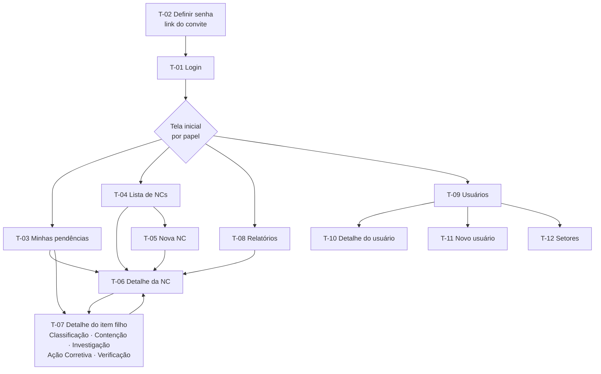

# QualityHub — Fluxo do App

> **O que é este documento:** quais telas existem, quem vê cada uma, o
> que dá pra fazer nelas e como se navega entre elas. Não trata de
> aparência (cores, tipografia, componentes) — isso é o documento de
> UI/UX. Os requisitos (RF-xx) e regras (RN-xx) citados estão em
> `docs/prd.md`.
>
> **Status:** v1 (2026-09-24). Decisões de navegação na §1 e §10.
>
> **Vocabulário:** este documento usa os termos do sistema (Submeter,
> Colaborador). **Na tela**, os textos seguem o glossário de
> `docs/ui-ux.md` §10.2 (ex.: "Enviar para aprovação", "Responsável").

---

## 1. Princípios de navegação

Decididos com Matthew em 2026-09-24:

1. **A tela inicial depende do papel** (§3).
2. **A NC é a página central, e cada filho tem página própria.** A página
   da NC mostra a etapa atual e um resumo de cada filho. Clicar num filho
   abre a página dele, com os próprios botões, feed e anexos. Cada item
   tem URL própria, que é também o destino das menções `#AC-2026-0003`.
3. **Botão bloqueado: depende do motivo.**
   - Falta **papel** (um `EDITOR` nunca aprova) → o botão **não aparece**.
   - Falta **algo que a pessoa pode resolver** (campo obrigatório vazio,
     guarda de fechamento não atendida) → o botão aparece **desabilitado,
     com a lista do que falta**.
   - Falta **atribuição** (tem o papel, mas não está no item) → o botão
     não aparece; o painel de atribuições mostra quem está.
4. **Computador primeiro; celular para o essencial.** No celular precisam
   funcionar bem: registrar NC, anexar foto, ver pendências, aprovar ou
   reprovar, comentar. Investigação A3, relatórios e administração só
   precisam funcionar no computador.

---

## 2. Mapa de telas

| ID | Tela | Rota | Quem acessa | Celular |
|---|---|---|---|:-:|
| T-01 | Login | `/login` | Todos | ✅ |
| T-02 | Definir senha | `/definir-senha?token=…` | Quem recebeu convite | ✅ |
| T-03 | Minhas pendências | `/pendencias` | `EDITOR`, `APROVADOR`, `GERENTE` | ✅ |
| T-04 | Lista de NCs | `/nc` | Todos com papel de negócio | ✅ |
| T-05 | Nova NC | `/nc/nova` | `EDITOR`, `GERENTE` | ✅ |
| T-06 | Detalhe da NC | `/nc/:id` | Todos com papel de negócio | ✅ |
| T-07 | Detalhe do item filho | `/classificacoes/:id`, `/contencoes/:id`, `/investigacoes/:id`, `/acoes-corretivas/:id`, `/verificacoes/:id` | Todos com papel de negócio | ✅ exceto Investigação |
| T-08 | Relatórios | `/relatorios` | `GERENTE` | — |
| T-09 | Usuários | `/admin/usuarios` | `ADMIN` | — |
| T-10 | Detalhe do usuário | `/admin/usuarios/:id` | `ADMIN` | — |
| T-11 | Novo usuário | `/admin/usuarios/novo` | `ADMIN` | — |
| T-12 | Setores | `/admin/setores` | `ADMIN` | — |

"Papel de negócio" = `VISUALIZADOR`, `EDITOR`, `APROVADOR` ou `GERENTE`.
Um `ADMIN` só com esse papel não vê NCs (PRD §8).

As rotas dos filhos seguem as rotas da API. O filho mostra no topo um
caminho de volta para a NC (`NC-2026-0042 › Investigação INV-2026-0007`).

### 2.1 Menu principal

Aparecem só os itens que o papel permite:

| Item | Papéis | Detalhe |
|---|---|---|
| Minhas pendências | `EDITOR`, `APROVADOR`, `GERENTE` | Com contador de itens |
| Não Conformidades | Papéis de negócio | |
| Relatórios | `GERENTE` | |
| Administração | `ADMIN` | Usuários, Setores |
| Tela inicial | Quem acessa mais de uma tela inicial possível | Preferência (§3) |
| Sair | Todos | |

---

## 3. Tela inicial por papel

Papéis se somam, então a pessoa pode ter vários. **Por padrão**, vale o
**primeiro** da lista que ela tiver:

| Ordem | Papel | Tela inicial padrão | Por quê |
|---|---|---|---|
| 1 | `EDITOR` ou `APROVADOR` | T-03 Minhas pendências | Quem executa ou aprova precisa ver primeiro o que está esperando por ele |
| 2 | `GERENTE` (sem os anteriores) | T-08 Relatórios | Visão geral do processo |
| 3 | `VISUALIZADOR` | T-04 Lista de NCs | Só leitura |
| 4 | `ADMIN` (sem papel de negócio) | T-09 Usuários | Única área que ele acessa |

**A pessoa pode trocar** (F1): no menu, **Tela inicial** lista as telas
que os papéis dela permitem, e a escolha fica salva na conta (vale em
qualquer computador ou celular). Exemplo: o gestor da qualidade
(`EDITOR` + `APROVADOR` + `GERENTE`) começa em Minhas pendências e pode
preferir Relatórios.

Se a pessoa perder o papel que dá acesso à tela escolhida (RN-43), volta
para o padrão.

---

## 4. Etapa da NC (RF-16)

A etapa é o "em que pé está" mostrado na lista e no detalhe. É
**calculada** a partir da NC e dos filhos, nunca armazenada. Vale a
**primeira** regra verdadeira, de cima para baixo:

| # | Condição | Etapa exibida |
|---|---|---|
| 1 | NC em `RASCUNHO` | Rascunho |
| 2 | NC `CANCELADA` | Cancelada |
| 3 | NC `EM_APROVACAO` | Aguardando aprovação do fechamento |
| 4 | NC `ABERTA`, sem Classificação `FECHADA` | Aguardando classificação |
| 5 | NC `ABERTA`, sem Investigação `FECHADA` | Em investigação |
| 6 | NC `ABERTA`, sem Ação Corretiva, ou com algum plano não aprovado | Em plano de ação |
| 7 | NC `ABERTA`, com Contenção pendente | Aguardando contenção |
| 8 | NC `ABERTA`, tudo atendido | Pronta para fechamento |
| 9 | NC `FECHADA`, com Ação Corretiva ainda não executada | Fechada · ação em execução |
| 10 | NC `FECHADA`, com Verificação em aberto | Fechada · em verificação |
| 11 | NC `FECHADA`, nada pendente | Concluída |

As regras 4 a 8 seguem a ordem da guarda de fechamento (RN-21), então a
etapa sempre aponta **o próximo requisito que falta**.

As regras 9 a 11 resolvem a preocupação da Q1 do PRD: uma NC fechada com
ação ainda em curso **não aparece como "Concluída"**. O auditor vê a
diferença.

**Indicadores paralelos** (aparecem junto da etapa, não no lugar dela):
- **Contenção em andamento** — há Contenção `ABERTA` ou `EM_APROVACAO`,
  em qualquer etapa. Contenção corre em paralelo (RN-19).
- **Prazo vencido** — alguma Ação Corretiva ou Verificação da NC passou
  do prazo.
- **Reaberta** — a NC já foi reaberta alguma vez.

---

## 5. Jornadas

Cada jornada é um caminho real, do começo ao fim. Juntas, cobrem todos os
requisitos do MVP (gate G0 do `arquitetura.md` §11).

### J1 — Registrar uma NC (colaborador, pode ser no celular) · RF-01, RF-02, RF-18

1. Menu → Não Conformidades → **Nova NC** (T-05).
2. Preenche título, descrição, requisito violado, processo afetado,
   setor, data de detecção, origem e, se houver, cliente. Opcional:
   escolhe colaboradores e anexa fotos.
3. **Salvar rascunho** a qualquer momento: a NC existe, sem código.
   Aparece nas pendências do autor como "Continuar rascunho".
4. **Publicar**: valida os campos obrigatórios; a NC ganha código
   (`NC-2026-0042`) e vai para `ABERTA` · etapa *Aguardando classificação*.
5. Cai no detalhe da NC (T-06).

### J2 — Triagem e classificação (QA) · RF-03, RF-10

1. A NC nova aparece nas pendências de **todo** `APROVADOR`/`GERENTE`
   como **"Triagem: NC sem aprovador"** (F5).
2. QA abre a NC → painel de atribuições → **Definir aprovador** (a si
   mesmo ou a outro QA). A pendência de triagem some para os outros.
3. Seção Classificação → **Nova classificação** (só `APROVADOR`/`GERENTE`,
   RN-20) → escolhe Maior/Menor e escreve a justificativa.
4. **Publicar** → **Submeter**. Se ele mesmo for o aprovador, a
   pendência "Aprovar" aparece para ele na hora; aprova, e o feed marca
   *"Aprovado pelo próprio autor"* (RN-27/28).
5. Etapa da NC → *Em investigação*.

### J3 — Contenção (colaborador) · RF-04

1. Na NC → seção Contenção → **Nova contenção** → descreve a ação
   imediata.
2. Publica. Depois de executar, volta e preenche **data de execução** e
   **disposição** (Aceito / Corrigido / Anulado / Em análise).
3. **Submeter**: se faltar data ou disposição, o botão fica desabilitado
   com a lista do que falta (princípio 3).
4. Aprovador aprova → Contenção `FECHADA`. Se não funcionou: cria-se uma
   **nova** contenção, não se reabre a anterior (RN-42).

### J4 — Investigação A3 SPS (colaborador, computador) · RF-05

1. Na NC → seção Investigação → **Nova investigação** → descreve o
   **real problema**.
2. Publica. O trabalho acontece ao longo de dias, com a investigação em
   `ABERTA` (editável, RN-07b).
3. O formulário é **uma página com uma seção por etapa do A3** (F2):
   *Percepção inicial → Descrição → Real problema → Ishikawa → Causa
   direta → 5 Porquês → Causa raiz → Contramedidas → Check de
   efetividade*. Um índice lateral mostra quais etapas já estão
   preenchidas e leva direto a qualquer uma, porque a investigação é
   trabalhada ao longo de dias e fora de ordem.
4. **Hipóteses**: lista dentro da investigação. Cada uma tem descrição,
   número no Ishikawa e classificação (causa direta / fator contribuinte /
   sem relação). Pode ficar incompleta até a submissão.
5. **Submeter**: exige causa direta, causa raiz, conteúdo do A3 e todas
   as hipóteses completas (RN-24). Aprovador aprova → etapa da NC → *Em
   plano de ação*.

### J5 — Ação Corretiva: plano, execução, verificação (colaborador + QA) · RF-06, RF-07

1. Na página da **Investigação** (ou na NC) → **Nova ação corretiva**,
   já vinculada à investigação.
2. Preenche o **plano**: descrição, prazo e instruções de verificação
   (como o QA vai checar a eficácia depois).
3. Publica → **Submeter plano** → aprovador aprova → a ação volta para
   `ABERTA`, agora com o selo **"Plano aprovado"**. A NC pode seguir para
   o fechamento (J6) sem esperar a execução.
4. O colaborador executa no mundo real e depois registra **data de
   execução** e **evidência** (texto + anexos).
5. **Finalizar execução**: pede "em quantos dias verificar?" → a ação
   fecha, **sem nova aprovação**, e a **Verificação nasce sozinha**, com
   prazo e instruções copiadas do plano, atribuída ao aprovador da ação.
6. A Verificação aparece nas pendências do QA como **"Verificar até
   dd/mm"** (J7).

### J6 — Fechar a NC · RF-08, RF-14

1. Com a etapa em *Pronta para fechamento*, o botão **Submeter para
   fechamento** fica habilitado. Antes disso, aparece desabilitado com a
   **lista do que falta**, por exemplo:
   - ✅ Classificação aprovada
   - ✅ Investigação aprovada
   - ❌ Plano da AC-2026-0003 ainda não aprovado
   - ❌ Riscos revisados não preenchido
2. O colaborador preenche **riscos revisados** e **mudanças no SGQ**
   (ISO 10.2.1 e/f).
3. Submete → o aprovador da NC aprova → NC `FECHADA` · etapa *Fechada ·
   ação em execução* (ou *em verificação*, ou *Concluída*, conforme os
   filhos).

### J7 — Verificação de eficácia (QA) · RF-07

1. Pendência **"Verificar até dd/mm"** → abre a Verificação.
2. Lê as instruções copiadas do plano, faz a checagem e preenche
   **resultado**, **conclusão** e **data da verificação**.
3. **Concluir**. Antes de confirmar, a tela explica o que vai acontecer:
   - *Eficaz* → nada mais.
   - *Parcialmente eficaz* → "Uma nova Ação Corretiva será criada em
     rascunho para os mesmos colaboradores."
   - *Não eficaz* → "A investigação e a NC serão reabertas" (só as que
     estiverem fechadas).
4. Confirmação obrigatória, porque a ação dispara efeitos automáticos.

### J8 — Aprovar ou reprovar (aprovador, pode ser no celular) · RN-04, RN-16

1. Pendência **"Aprovar"** → abre o item.
2. **Aprovar**, ou **Reprovar** com motivo obrigatório.
3. Reprovado → o item volta para `ABERTO`, e os colaboradores veem a
   pendência **"Corrigir: reprovado por Fulana — motivo…"**.

### J9 — Reabrir uma NC (QA) · RN-05, RN-17

NC `FECHADA` → **Reabrir** → motivo obrigatório → NC volta para
`ABERTA`, com o indicador *Reaberta*. Qualquer `APROVADOR` pode, sem
precisar estar atribuído.

### J10 — Conversar no item (qualquer papel com escrita) · RF-11

1. Em qualquer NC ou filho, o **feed** mostra eventos do sistema
   (publicado, aprovado, reprovado, reaberto...) e comentários, em ordem
   cronológica.
2. Comentar; `@` sugere pessoas e `#` sugere itens com código.
3. A pessoa mencionada recebe a pendência **"Você foi mencionado em
   NC-2026-0042"**, que some ao abrir o item.

### J11 — Administrar usuários e setores (TI) · RF-13, RF-15, RF-20

1. **Novo usuário** (T-11): nome, e-mail, setor, papéis → o sistema gera
   o **link de convite** (válido por 72 h), que o ADMIN envia à pessoa
   por fora (sem e-mail no MVP).
2. A pessoa abre o link → **Definir senha** (T-02) → login.
3. **Inativar** ou **revogar papel** (T-10): se a pessoa for aprovadora
   de itens abertos, o sistema recusa e lista os itens; um `GERENTE`
   reatribui e o ADMIN tenta de novo (RN-43).
4. **Setores** (T-12): criar, renomear, desativar (RN-44).

### J12 — Acompanhar o processo (gestor) · RF-19

Relatórios (T-08) → os quatro relatórios da RF-19. Cada número leva à
lista de NCs já filtrada (ex.: clicar em "3 atrasadas" abre a lista
dessas três).

---

## 6. Telas em detalhe

### T-03 Minhas pendências (RF-17)

Uma lista única, agrupada por tipo e ordenada por urgência (vencidos
primeiro). Cada linha tem: tipo, código, título da NC, prazo (se houver)
e um link direto para o item.

| Tipo de pendência | Quem vê | Some quando |
|---|---|---|
| **Aprovar** | O aprovador de itens `EM_APROVACAO` | Aprovar ou reprovar |
| **Corrigir (reprovado)** | Colaboradores de item reprovado | O item é submetido de novo |
| **Continuar rascunho** | Colaboradores de itens em `RASCUNHO` | Publicar ou excluir |
| **Triagem: NC sem aprovador** | Todo `APROVADOR`/`GERENTE` (F5) | Alguém define o aprovador |
| **Executar ação** | Colaboradores de AC com plano aprovado | Finalizar a execução |
| **Verificar** | Colaboradores de Verificação `ABERTA` | Concluir |
| **Submeter para fechamento** | Colaboradores de NC *Pronta para fechamento* | Submeter |
| **Você foi mencionado** | O mencionado | Abrir o item |

**Destaques de prazo:** vencido em vermelho; vencendo em até **7 dias**
em amarelo (F3). "Nunca só cor": o destaque também leva texto
("Vencido há 2 dias", "Vence em 5 dias").

**Vazio:** "Nada esperando por você." com atalho para a lista de NCs.

### T-04 Lista de NCs

- Colunas: código, título, etapa + indicadores, setor, origem,
  classificação, data de detecção.
- Filtros: estado, origem, classificação, período, **etapa**, setor,
  "só as minhas", "com prazo vencido". Os três últimos são novos na API.
- Busca por código ou por palavra no título.
- Botão **Nova NC** para `EDITOR`/`GERENTE`.
- No celular, vira uma lista de cartões (código, título, etapa).

### T-05 Nova NC

Formulário único com os campos da NC, **colaboradores** (Q10 do PRD) e
**anexos**. Dois botões: **Salvar rascunho** e **Publicar**. Sair com
alterações não salvas pede confirmação.

### T-06 Detalhe da NC (a página central)

De cima para baixo:

1. **Cabeçalho**: código, título, estado, etapa + indicadores.
2. **Barra de ações** (§7).
3. **Dados da NC**: editáveis inline enquanto `RASCUNHO`/`ABERTA` para
   colaboradores; só leitura para o resto.
4. **Checklist de fechamento**: os requisitos da RN-21, cada um com
   ✅/❌ e link para o item que resolve. Visível enquanto a NC estiver
   `ABERTA`.
5. **Filhos**, uma seção por tipo, na ordem do processo: Classificação ·
   Contenção · Investigação · Ação Corretiva · Verificação. Cada seção
   lista os itens (código, estado, responsável, prazo) e tem o botão
   **Novo…** quando o papel permite. As Verificações aparecem, mas **não
   têm "Nova"**, porque nascem sozinhas.
6. **Painel de atribuições**: colaboradores e aprovador, com
   adicionar/remover/definir conforme RN-18.
7. **Anexos**.
8. **Feed** (J10).

### T-07 Detalhe do item filho

A mesma estrutura para os cinco tipos: cabeçalho (com o caminho de volta
para a NC) → barra de ações → formulário do tipo → atribuições → anexos
→ feed. O que muda é o formulário:

| Tipo | Campos | Particularidade na tela |
|---|---|---|
| Classificação | Valor (Maior/Menor), justificativa | Formulário curto |
| Contenção | Descrição, data de execução, disposição | — |
| Investigação | Real problema, método (A3 SPS), conteúdo do A3, causa direta, causa raiz, **hipóteses** | Página com seções + índice lateral (J4), só no computador. Lista de ações corretivas vinculadas, com **Nova ação corretiva** |
| Ação Corretiva | **Plano:** descrição, prazo, instruções de verificação · **Execução:** data de execução, evidência | Dois blocos. O bloco Execução só fica editável depois do plano aprovado. Selo "Plano aprovado" |
| Verificação | Instruções (só leitura), prazo, resultado, conclusão, data da verificação | Confirmação do efeito automático antes de concluir (J7) |

### T-08 Relatórios

Os quatro relatórios da RF-19, cada um com filtro de período. Os números
levam à lista de NCs filtrada.

### T-09 a T-12 Administração

- **T-09 Usuários**: lista com busca por nome/e-mail, filtro ativo/inativo.
- **T-10 Detalhe**: dados, papéis (conceder/revogar), setor, inativar,
  gerar novo convite. A recusa da RN-43 mostra a lista de itens a
  reatribuir.
- **T-11 Novo usuário**: formulário → mostra o link de convite para copiar.
- **T-12 Setores**: lista, criar, renomear, desativar.

---

## 7. Ações por estado (a barra de ações)

A barra mostra só o que faz sentido **no estado atual**, filtrado pelo
papel e pela atribuição da pessoa (princípio 3).

| Estado | Ação | Quem | Tipos |
|---|---|---|---|
| `RASCUNHO` | Salvar | Colaborador | Todos (exceto Verificação, que nunca é rascunho) |
| | Publicar | Colaborador | Todos |
| | Excluir rascunho | Colaborador | Todos |
| `ABERTO` | Salvar | Colaborador | Todos |
| | Submeter | Colaborador | NC ("Submeter para fechamento"), Classificação, Contenção, Investigação |
| | Submeter plano | Colaborador | Ação Corretiva, antes do plano aprovado |
| | Finalizar execução | Colaborador | Ação Corretiva, depois do plano aprovado |
| | Concluir | Colaborador com papel `APROVADOR` | Verificação |
| | Cancelar | Aprovador do item ou `GERENTE` | Todos, **exceto Classificação** |
| `EM_APROVACAO` | Aprovar · Reprovar | **O** aprovador | Todos com portão |
| | Cancelar | Aprovador do item ou `GERENTE` | Todos, exceto Classificação |
| `FECHADO` | Reabrir | Qualquer `APROVADOR` | **Só NC** (RN-42) |
| `CANCELADO` | — | — | — |

Comentar vale em qualquer estado. Anexar vale enquanto o item estiver
editável (`RASCUNHO`/`ABERTO`); anexos de item fechado não são removidos
(RN-45).

**Exceção da Classificação:** nela, salvar, publicar, submeter e excluir
rascunho exigem papel `APROVADOR` ou `GERENTE`, não `EDITOR` (RN-20).

---

## 8. Estados de tela (valem para toda tela)

Base do gate G4. O documento de UI/UX define a aparência; aqui fica o
comportamento:

| Situação | Comportamento |
|---|---|
| **Carregando** | Esqueleto da tela, sem piscar conteúdo antigo |
| **Vazio** | Frase explicando o vazio + a ação que resolve, se houver ("Nenhuma NC ainda. **Registrar a primeira**") |
| **Erro de rede/servidor** | Mensagem + **Tentar de novo**. Formulários **não perdem** o que foi digitado |
| **Erro de validação** | Mensagem ao lado de cada campo, como o backend devolveu |
| **Sem permissão** (URL digitada à mão) | "Você não tem acesso a esta página" + link para a tela inicial |
| **Não encontrado** | "Este item não existe ou foi excluído" (rascunho excluído) + link para a lista |
| **Sessão expirada** | Volta para o login e, depois de entrar, retorna para onde a pessoa estava |

---

## 9. Lacunas encontradas no backend

O fluxo acima precisa de coisas que a API ainda não tem. Isto alimenta o
TRD e o Plano de Implementação:

| # | Lacuna | Usada em |
|---|---|---|
| L1 | **Hipóteses não têm rota**: o repository existe, mas nada as cria, edita ou exclui pela API | J4, T-07 Investigação |
| L2 | **Etapa calculada** (§4) não existe | T-04, T-06 |
| L3 | **"Plano aprovado"** não é distinguível pelo estado: a AC volta para `ABERTO` tanto antes de submeter quanto depois de aprovada. Precisa de um sinal explícito (o `Aprovacao` existe; falta expor) | §7, J5, etapa 6 e 9 |
| L4 | **Pendências** (T-03): nenhuma consulta junta tudo isso hoje | T-03 |
| L5 | **Filtros novos na lista**: etapa, setor, prazo vencido, "sem aprovador" | T-04, triagem |
| L6 | **Checklist de fechamento**: a guarda da RN-21 só responde com erro; a tela precisa perguntar *o que falta* sem tentar submeter | T-06, J6 |
| L7 | **Último motivo de reprovação** exposto no item | J8, pendência "Corrigir" |
| L8 | Tudo o que o PRD já listou: Feed, anexos, usuários, setores, relatórios, NC com colaboradores na criação | — |
| L9 | **Preferência de tela inicial** salva por usuário | §3, menu |

---

## 10. Decisões tomadas

Com Matthew, em 2026-09-24.

| # | Pergunta | Decisão |
|---|---|---|
| — | Tela inicial | Depende do papel → §3 |
| — | Organização da NC e dos filhos | NC como página central + página própria por filho → §1 |
| — | Botão bloqueado | Some se falta papel ou atribuição; desabilitado com a lista do que falta se a pessoa pode resolver → §1 |
| — | Aparelhos | Computador primeiro; celular para registrar, anexar, pendências, aprovar, comentar → §1 |
| **F1** | Quem tem vários papéis cai em qual tela? | **A pessoa escolhe**, com o padrão da §3 |
| **F2** | Formulário da Investigação A3 | **Página com seções** e índice lateral → J4 |
| **F3** | O que é "prazo vencendo"? | **7 dias** antes do prazo → T-03 |
| **F4** | Publicar e submeter num clique só? | **Não**, botões separados → §7 |
| **F5** | Quem vê a triagem de NC sem aprovador? | **Todos os QAs** (`APROVADOR`/`GERENTE`); some quando alguém assume → T-03 |

---

## Histórico

| Data | Mudança |
|---|---|
| 2026-09-24 | v1 — decisões de navegação e F1–F5 |
