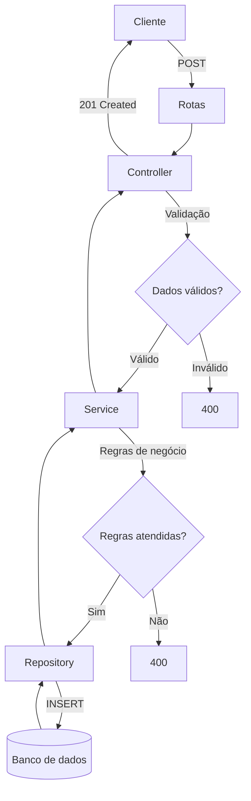

# Fluxo de requisição

```mermaid
flowchart TD
    A[Cliente] -->|POST| B[Rotas]
    B --> C[Controller]
    C -->|Validação| V{Dados válidos?}
    V -->|Válido| D[Service]
    V -->|Inválido| E[400]
    D -->|Regras de negócio| R{Regras atendidas?}
    R -->|Sim| F[Repository]
    R -->|Não| G[400]
    F -->|INSERT| H[(Banco de dados)]
    H --> F
    F --> D
    D --> C
    C -->|201 Created| A
```
