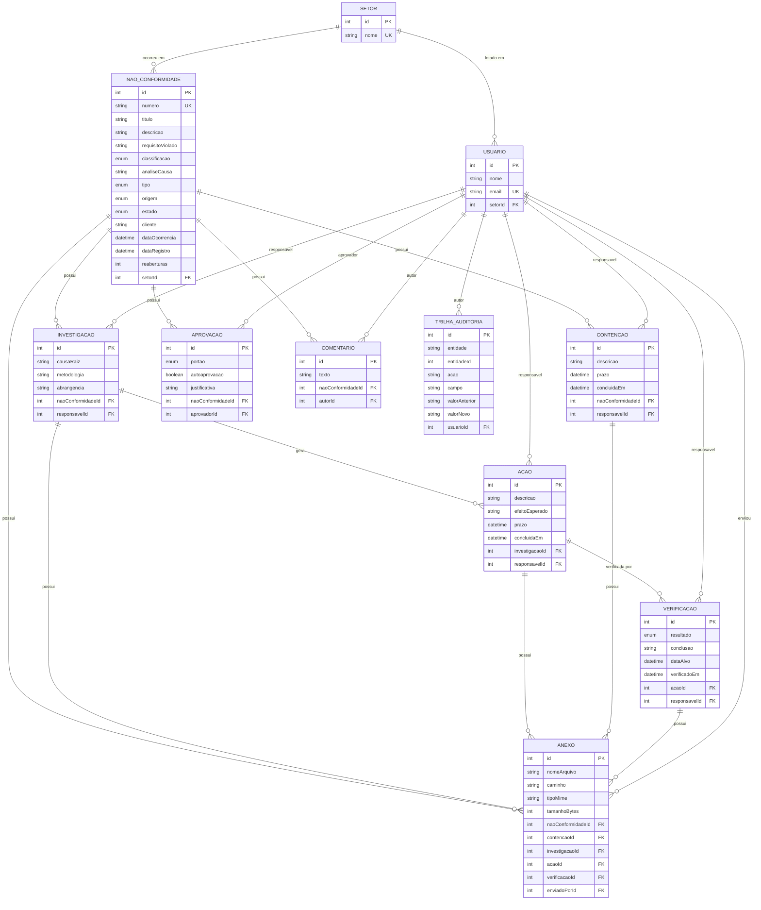

# Diagrama de Entidade-Relacionamento

## Valores dos enums

| Enum            | Valores                                                                                        |
| --------------- | ---------------------------------------------------------------------------------------------- |
| `classificacao` | `MINOR`, `MAJOR`                                                                               |
| `tipo`          | `NAO_CONFORMIDADE`, `CONCESSAO`                                                                |
| `origem`        | `AUDITORIA_INTERNA`, `AUDITORIA_EXTERNA`, `OPERACAO`, `RECLAMACAO_CLIENTE`                     |
| `estado`        | `ABERTA`, `ANALISE`, `IMPROCEDENTE`, `CONTENCAO`, `ACAO_CORRETIVA`, `VERIFICACAO`, `ENCERRADA` |
| `resultado`     | `PENDENTE`, `EFICAZ`, `PARCIALMENTE_EFICAZ`, `NAO_EFICAZ`                                      |
| `portao`        | `CLASSIFICACAO`, `ENCERRAMENTO_INVESTIGACAO`, `ENCERRAMENTO_NC`, `AUTORIZACAO_CONCESSAO`       |

## Notas de modelagem

- **`NAO_CONFORMIDADE` → `INVESTIGACAO` é 1:N**. Uma NC pode ter várias investigações — simultâneas, quando há mais de uma frente de apuração, ou sequenciais, quando uma reabertura exige nova análise de causa raiz. O modelo 1:1 impediria ambos os casos.
- **`ANEXO` tem cinco chaves estrangeiras opcionais**, das quais exatamente uma deve estar preenchida. Essa regra é garantida pela aplicação, não pelo banco.
- **`TRILHA_AUDITORIA` é polimórfica**: `entidade` guarda o nome do model e `entidadeId` o registro. Não há chave estrangeira, o que permite auditar qualquer entidade da plataforma — inclusive de módulos futuros.
- **`reaberturas` é um contador**, incrementado apenas quando uma verificação retorna `NAO_EFICAZ`.
- Os campos `criadoEm` e `atualizadoEm` foram omitidos do diagrama por brevidade; a maioria das entidades os possui.
