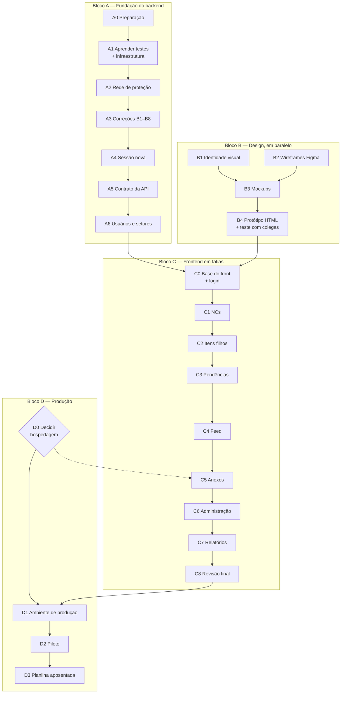

# QualityHub — Plano de Implementação

> **O que é este documento:** a ordem em que o sistema é construído a
> partir daqui — fases, o que cada uma entrega, quem escreve o quê, o
> que se aprende e quando a fase está pronta. Os documentos que ele
> executa: `docs/prd.md`, `docs/fluxo-app.md`, `docs/ui-ux.md`,
> `docs/trd.md`, `docs/esquema-backend.md`.
>
> **Status:** v1 (2026-09-24). Decisões na §1 e na §9.
>
> **Sem datas, de propósito.** O time não tem pressa (PRD §2); o plano
> diz a **ordem** e o **tamanho relativo** (P, M, G), não prazos.

---

## 1. Como trabalhamos

Decidido com Matthew em 2026-09-24:

| Regra | Como funciona |
|---|---|
| **Fundação antes do front** | Testes, correções, sessão, contrato da API e usuários ficam prontos antes da primeira tela (Bloco A) |
| **Depois, fatias verticais** | Cada funcionalidade nova (Feed, anexos, pendências, relatórios...) é feita **junto com a tela dela**: backend + tela da mesma coisa, na mesma fase (Bloco C) |
| **Quem escreve** | 🧑 **Matthew** escreve o núcleo de cada fase (a parte nova ou importante), depois de Claude explicar o conceito. 🤖 **Claude** gera o que é repetição de padrão já validado. 👀 Claude revisa tudo que Matthew escreve |
| **Git** | **Uma branch e um Pull Request por fase.** O CI roda no PR; só entra na `main` com tudo verde |
| **Bug** | Começa por um **teste que falha**; o conserto faz passar (TRD §9.4) |
| **Arquivos `.http`** | Cada um é **apagado** quando um teste automático cobre o mesmo fluxo |

### 1.1 Pronto quando (vale para toda fase)

- [ ] Testes novos escritos, e **todos** os testes passando
- [ ] `typecheck` e Biome sem erros
- [ ] CI verde no Pull Request
- [ ] Documentos atualizados: changelog (decisões), status no documento
      afetado, `CLAUDE.md` (se mudou algo que uma sessão futura precisa
      saber)
- [ ] `.http` coberto aposentado
- [ ] **Matthew consegue explicar** o que a fase mudou e por quê

---

## 2. Visão geral

O **Bloco B** não depende do código: pode andar enquanto o Bloco A
acontece. A **decisão de hospedagem (D0)** também pode sair a qualquer
momento, mas precisa existir **antes do C5** (anexos).

---

## 3. Bloco A — Fundação do backend

### A0 — Preparação · P

**Objetivo:** limpar o terreno antes de escrever testes.

| Entrega | Quem |
|---|---|
| Scripts no `package.json`: `build`, `typecheck`, `lint`, `test` | 🤖 |
| Biome configurado; primeira formatação do código (commit separado, só formatação) | 🤖 |
| Remover o barramento de eventos (ADR-38) | 🤖 |
| `ignoreTrailingSlash` → `routerOptions` (pendência 5) | 🤖 |
| Apagar os modelos comentados no fim do `schema.prisma` (M5) | 🤖 |
| Apagar `testes/requests-acao-corretiva.http` (descreve o modelo antigo) | 🤖 |
| Proteger a `main` no GitHub (exigir PR para entrar) | 🧑 na interface do GitHub, com instruções |

**Aprendizado:** o que é lint e formatação automática; o que é proteção
de branch.

### A1 — Aprender testes + infraestrutura · M

**Objetivo:** Matthew entende e escreve testes; o projeto passa a ter
onde colocá-los.

**Conceitos**, explicados antes de codar, nesta ordem:
1. O que é um teste automático e o que ele protege.
2. A estrutura de todo teste: **preparar → agir → conferir**.
3. Teste **unitário** × teste **de API** — e por que aqui a maioria é de
   API (TRD §9.3).
4. `app.inject()`: simular uma requisição sem abrir porta.
5. **Testcontainers**: um Postgres de verdade, criado e destruído pelo
   próprio teste.
6. **Isolamento**: por que cada teste começa com o banco vazio.
7. **Fábricas**: funções que criam usuários e itens de teste com uma
   linha.
8. Ler um teste que falha: a mensagem, o esperado e o recebido.

| Entrega | Quem |
|---|---|
| Vitest + Testcontainers configurados; banco criado uma vez por execução, tabelas limpas antes de cada teste | 🤖 com explicação linha a linha |
| Fábricas: os 8 perfis de usuário de `setup-usuarios-teste.sql`; login devolvendo o token | 🧑 a primeira, 🤖 as outras seguindo o padrão |
| **Primeiros testes**: login com sucesso, senha errada, usuário sem senha (RN-38) | 🧑 |
| **Um teste unitário**: `temPapel` | 🧑 |
| **GitHub Actions**: Biome → typecheck → testes, em todo push e PR | 🤖 com explicação |

**Pronto quando:** Matthew escreveu sozinho um teste de API novo (ex.:
criar rascunho de NC) sem consultar exemplo.

### A2 — Rede de proteção · M

**Objetivo:** tudo que **já funciona** hoje fica coberto por teste,
antes de qualquer mudança de regra.

| Entrega | Quem |
|---|---|
| **Fluxo completo** (a partir de `requests-fluxo-completo.http`): NC → classificação → contenção → investigação → ação → verificação → fechamento | 🧑 o caminho feliz; 🤖 os modos de falha |
| Máquina de estados: cada transição válida e inválida, para cada tipo | 🤖 (padrão repetido por tipo), 🧑 a primeira |
| Permissões: as três camadas; "tem o papel mas não é **o** aprovador"; RN-20 (classificar) | 🧑 |
| Código sequencial **sob concorrência**: várias publicações simultâneas, nenhum número repetido ou pulado | 🧑 com orientação (é o teste mais interessante do projeto) |
| Atribuições: um aprovador por item, sem duplicata, RN-12 | 🤖 |
| Aposentar os `.http` cobertos | 🤖 |

**Os bugs B1–B8 não entram aqui.** Esta fase fotografa o que está
**certo**; os bugs ganham seus testes na A3.

### A3 — Correções de regra · M

**Objetivo:** corrigir os comportamentos errados (`esquema-backend.md`
§7), cada um com um teste que falha antes e passa depois.

| Ordem | Correção | Quem |
|---|---|---|
| 1 | **Plano aprovado** derivado de `Aprovacao` (§4.2 do esquema) — base das próximas | 🧑 |
| 2 | **B1** — finalizar execução exige plano aprovado | 🧑 |
| 3 | **B2** — plano travado depois de aprovado | 🧑 |
| 4 | **Guarda que devolve "o que falta"** (TRD §5) + **B5** (RN-21 nova) + rota `GET /nc/:id/checklist-fechamento` | 🧑 a função; 🤖 a rota |
| 5 | **B4** — `NAO_EFICAZ` reabre só o que estiver fechado | 🧑 |
| 6 | **B6** — `PARCIALMENTE_EFICAZ` copia todos os colaboradores | 🤖 |
| 7 | **B3** — autor certo na auditoria da ação automática | 🤖 |
| 8 | **B8** — remover `DELETE /verificacoes/:id` | 🤖 |

**Aprendizado:** TDD (escrever o teste antes do conserto); por que uma
regra deve morar num lugar só.

### A4 — Sessão nova · M

**Objetivo:** revogação imediata e cookie seguro (TRD §4, ADR-35). É o
**B7**.

| Entrega | Quem |
|---|---|
| Migration **M1**: `desativadoEm`, `sessaoValidaDesde`, `telaInicial` | 🧑 |
| Login com cookie `HttpOnly`/`Secure`/`SameSite=Strict`; "manter conectado" (30 dias) ou cookie de sessão (teto 12 h) | 🧑 |
| Middleware `autenticar`: busca usuário ativo, papéis atuais e `sessaoValidaDesde` a cada requisição | 🧑 |
| `POST /auth/logout`, `POST /auth/sair-de-todos`, `GET /auth/eu`, `PATCH /auth/eu` | 🤖 |
| Limite de tentativas no login; sucesso na auditoria, falha no log (E1) | 🤖 |
| Testes: papel revogado vale na hora; usuário inativo recebe 401; "sair de todos" derruba sessão antiga; cookie de sessão sem validade | 🧑 |

**Aprendizado:** cookie × token no cabeçalho; o que `HttpOnly`,
`Secure` e `SameSite` protegem; por que papéis no token atrasam a
revogação.

### A5 — Contrato da API · M (muito repetitivo)

**Objetivo:** a API se descreve sozinha, e o frontend vai poder gerar o
cliente (TRD §7, ADR-37).

| Entrega | Quem |
|---|---|
| Prefixo `/api` em todas as rotas | 🤖 |
| **Schema de resposta** em todas as rotas | 🧑 as de NC (o padrão); 🤖 as demais |
| `@fastify/swagger`: OpenAPI em `/api/docs/json`; interface em `/api/docs` só em desenvolvimento | 🤖 com explicação |
| Catálogo de ações de auditoria tipado (pendência 1) | 🤖 |
| `GET /saude` no lugar de `GET /` | 🤖 |
| Último motivo de reprovação no detalhe de todo item (L7) | 🤖 |

**Aprendizado:** o que é OpenAPI e por que o schema de **resposta**
importa tanto quanto o de entrada.

### A6 — Usuários, setores e pessoas · M

**Objetivo:** administrar o sistema sem mexer no banco à mão (RF-15,
RF-20).

| Entrega | Quem |
|---|---|
| Migration **M2** (`Setor.desativadoEm`) | 🤖 |
| **Trava da RN-43**: não inativar/revogar `APROVADOR` de quem é aprovador de item aberto, devolvendo a lista | 🧑 |
| Rotas de usuários, setores e `GET /pessoas` (`esquema-backend.md` §6.2), incluindo reativar (E2) | 🤖 seguindo o padrão; 🧑 revisa |
| Testes das travas e das permissões de `ADMIN` | 🧑 |

### ✅ Portão: fundação pronta

Antes do Bloco C começar:
- A0–A6 concluídas, CI verde na `main`.
- Nenhum bug B1–B8 aberto.
- OpenAPI completo, gerando sem erro.

---

## 4. Bloco B — Design (em paralelo ao Bloco A)

Não depende de código. Detalhes em `docs/ui-ux.md` §2.

| Fase | Entrega | Quem | Depende de |
|---|---|---|---|
| **B1 · Identidade visual** | Cores, logo, fonte da empresa (ou decisão de seguir neutro) | 🧑 com a empresa | Decisão externa |
| **B2 · Wireframes (G1)** | Frames cinzas no Figma a partir de `ui-ux.md` §7, uma tela por frame | 🤖 cria no Figma de Matthew; 🧑 ajusta | — |
| **B3 · Fundações + mockups (G2, G4)** | Variables, componentes com variantes = enums, telas com cor e os estados vazio/carregando/erro/sem permissão | 🧑 (é onde mais se aprende Figma); 🤖 revisa | B1, B2 |
| **B4 · Protótipo + teste (G3)** | Protótipo HTML clicável; **3 colegas** completam sem ajuda: registrar NC com rascunho, aprovar item, comentar com menção | 🤖 o protótipo; 🧑 conduz o teste | B3 |

O que o teste com colegas revelar volta para os documentos **antes** do
C0.

---

## 5. Bloco C — Frontend em fatias verticais

Cada fase entrega **backend + tela** da mesma funcionalidade, testados.
A primeira tela de cada tipo é escrita por Matthew; as seguintes que
repetem o padrão, geradas.

| Fase | Telas | Backend junto | Tamanho |
|---|---|---|---|
| **C0 · Base do front** | Projeto Vite + Tailwind + shadcn/ui + Router + TanStack Query; cliente gerado pelo **Orval**; layout (menu lateral e barra inferior); login e definir senha (T-01, T-02); tela inicial por papel; estados de tela padrão (`fluxo-app.md` §8); mapa tipado de estados | — (já pronto no A4/A5) | G |
| **C1 · NCs** | Lista (T-04), Nova NC (T-05), Detalhe da NC (T-06) com checklist | Etapa calculada (função pura, testada sem banco); filtros novos; NC criada com colaboradores; `GET /registros/:id/atribuicoes` | G |
| **C2 · Itens filhos** | T-07 para os cinco tipos, barra de ações, `BotaoBloqueado`, `DialogoMotivo`, `DialogoEfeito`, Investigação A3 com índice | **Hipóteses** (L1); investigação com ações vinculadas | G |
| **C3 · Pendências** | Minhas pendências (T-03), contador no menu, preferência de tela inicial | `GET /pendencias` (esquema §4.4) | M |
| **C4 · Feed** | Feed em todo item, editor com `@`/`#` (Tiptap), pendência "mencionado" | Migration **M4**; comentários, menções, `GET /registros/:id/feed`, `GET /registros/busca` | G |
| **C5 · Anexos** | Anexos em todo item, câmera no celular | Migration **M3**; armazenamento (disco ou objetos, **conforme D0**); validação pelo conteúdo; limpeza de órfãos | M |
| **C6 · Administração** | Usuários, detalhe, novo, setores (T-09 a T-12) | — (já pronto no A6) | M |
| **C7 · Relatórios** | Relatórios (T-08), números levando à lista filtrada | 4 rotas de relatório | M |
| **C8 · Revisão final (G5)** | Jornadas do teste com colegas feitas **só com teclado**; foco visível; rótulos; celular nas telas que precisam | Ajustes | P |

**Testes no frontend:** Vitest nas peças com lógica (mapa de estados,
`BotaoBloqueado`, formatação de prazo). Os fluxos completos continuam
garantidos pelos testes de API do backend.

---

## 6. Bloco D — Produção e adoção

| Fase | Entrega | Quem |
|---|---|---|
| **D0 · Decidir hospedagem** | Escolha entre as opções de `trd.md` §10.6, depois de perguntar à empresa se os dados podem ficar fora e qual o orçamento. Atualiza o TRD e o ADR-30 | 🧑 decide e propõe; 🤖 ajuda a comparar |
| **D1 · Ambiente de produção** | Dockerfile do backend; Compose de produção (nginx, app, postgres, backup); HTTPS; backup diário **fora da máquina**; **primeiro teste de restauração**; monitor externo; manual de operação no `SETUP.md`; ambiente de homologação | 🧑 com orientação passo a passo (é conhecimento que Matthew vai precisar para operar sozinho); 🤖 gera os arquivos de configuração |
| **D2 · Piloto** | NCs reais registradas no sistema **em paralelo** com a planilha, por um período combinado com a analista | 🧑 + analista |
| **D3 · Planilha aposentada** | Data de corte; NC **nova** só no sistema (métrica de sucesso 1 do PRD). **Nenhuma NC da planilha é migrada** (P1): as que estiverem abertas na data de corte terminam na planilha, que fica guardada como arquivo histórico | 🧑 + analista |

---

## 7. Decisões externas que o plano espera

| Decisão | Quem decide | Precisa estar pronta antes de |
|---|---|---|
| Hospedagem (dados fora da empresa? orçamento?) | Matthew, com a empresa | **C5** (anexos) e **D1** |
| Identidade visual | Empresa | **B3** (mockups) |
| 3 colegas disponíveis para o teste | Matthew | **B4** |
| Período do piloto e data de corte | Matthew + analista | **D2**, **D3** |
| ~~NCs da planilha: migrar ou não~~ — decidido: **nenhuma** (P1) | — | — |

---

## 8. Rastreabilidade

Onde cada item dos documentos anteriores é feito:

| Item | Fase |
|---|---|
| B1, B2, B3, B4, B5, B6, B8 | A3 |
| B7 (papéis no JWT) · RNF-09, RNF-10 | A4 |
| Pendência 1 (ações de auditoria) · pendência 5 (`ignoreTrailingSlash`) | A5 · A0 |
| Pendência 4 (login auditado) | A4 |
| Pendência OpenAPI · RNF-04 (schema de resposta) · L7 (último motivo de reprovação) | A5 |
| RF-15 (usuários) · RF-20 (setores) · RN-43 · RN-44 | A6 (backend), C6 (telas) |
| RF-01 (NC com colaboradores) · RF-16 (etapa) · L2, L5, L6 | C1 |
| L1 (hipóteses) · L3 (plano aprovado) | C2 · A3 |
| RF-17 (pendências) · L4 · L9 (tela inicial) | C3 · A4 |
| RF-11 (Feed) · M4 | C4 |
| RF-18 (anexos) · M3 · RN-45 · ADR-34 | C5 |
| RF-19 (relatórios) | C7 |
| RNF-05, RNF-13 (backup, HTTPS) · ADR-30 | D1 · D0 |
| Métricas de sucesso do PRD | D3 e depois |

---

## 9. Decisões tomadas

Com Matthew, em 2026-09-24.

| # | Pergunta | Decisão |
|---|---|---|
| — | Fundação antes do front? | **Só a fundação** (Bloco A); funcionalidades novas em fatias verticais com a tela (Bloco C) |
| — | Quem escreve | **Matthew o núcleo, Claude o repetitivo**, Claude revisa |
| — | Git | **Branch + Pull Request por fase**, CI obrigatório |
| — | Arquivos `.http` | **Aposentados** quando cobertos por teste |
| **P1** | As 54 NCs da planilha entram no sistema? | **Nenhuma.** O sistema começa do zero na data de corte; as NCs abertas nessa data terminam na planilha, que fica como arquivo histórico. Sem script de importação |

**Consequência da P1 para o piloto (D2):** como nada é migrado, o
período em paralelo serve também para as NCs antigas irem fechando na
planilha. Vale escolher a data de corte quando houver poucas abertas.

---

## Histórico

| Data | Mudança |
|---|---|
| 2026-09-24 | v1 — blocos A–D, decisões de trabalho e P1 |
