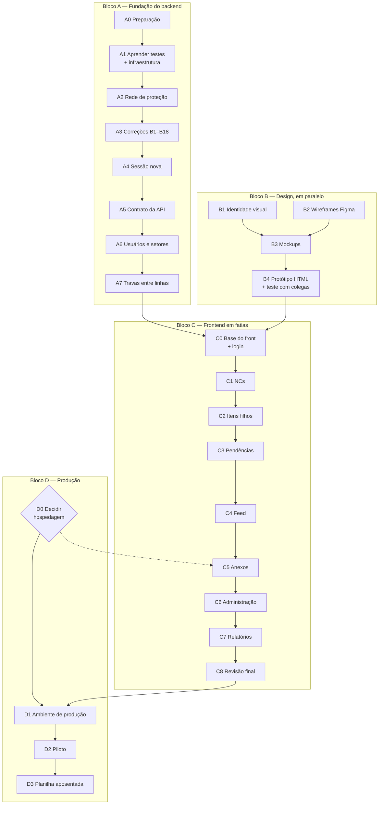

# QualityHub — Plano de Implementação

> **O que é este documento:** a ordem em que o sistema é construído a
> partir daqui — fases, o que cada uma entrega, quem escreve o quê, o
> que se aprende e quando a fase está pronta. Os documentos que ele
> executa: `docs/prd.md`, `docs/fluxo-app.md`, `docs/ui-ux.md`,
> `docs/trd.md`, `docs/esquema-backend.md`.
>
> **Status:** v1 (2026-09-24). Decisões na §1 e na §9.
>
> **Sem datas, de propósito.** O time não tem pressa (PRD §2); o plano
> diz a **ordem** e o **tamanho relativo** (P, M, G), não prazos.

---

## 1. Como trabalhamos

Decidido com Matthew em 2026-09-24:

| Regra | Como funciona |
|---|---|
| **Fundação antes do front** | Testes, correções, sessão, contrato da API e usuários ficam prontos antes da primeira tela (Bloco A) |
| **Depois, fatias verticais** | Cada funcionalidade nova (Feed, anexos, pendências, relatórios...) é feita **junto com a tela dela**: backend + tela da mesma coisa, na mesma fase (Bloco C) |
| **Quem escreve** | 🧑 **Matthew** escreve **tudo o que puder ser codado**, inclusive configuração (Vitest, CI, scripts), depois de Claude explicar o conceito. 🤖 **Claude** só gera o que é **repetição** de um padrão que Matthew já escreveu. 👀 Claude revisa tudo. *(Decidido em 2026-09-24: esta regra vale sobre as marcações 🤖 das tabelas abaixo — item que não for repetição passa a ser 🧑.)* *(Revisto em 2026-09-28: Matthew escreve só o que ensina conceito novo — o teste "pronto quando" da A1, o de concorrência da A2 e o B9 da A3; Claude faz o resto na ordem do plano, anunciando antes de cada item e esperando a confirmação de Matthew. Esta revisão vale sobre as marcações 🧑 das tabelas.)* |
| **Git** | **Uma branch e um Pull Request por fase.** O CI roda no PR; só entra na `main` com tudo verde |
| **Bug** | Começa por um **teste que falha**; o conserto faz passar (TRD §9.4) |
| **Arquivos `.http`** | Cada um é **apagado** quando um teste automático cobre o mesmo fluxo |
| **Dois computadores** | Matthew alterna entre trabalho e casa: **push ao sair, `git pull` + `npm run preparar` ao chegar**, e o `handoff.md` sempre atualizado (`SETUP.md` §12) |

### 1.1 Pronto quando (vale para toda fase)

- [ ] Testes novos escritos, e **todos** os testes passando
- [ ] `typecheck` e Biome sem erros
- [ ] CI verde no Pull Request
- [ ] Documentos atualizados: changelog (decisões), status no documento
      afetado, `CLAUDE.md` (se mudou algo que uma sessão futura precisa
      saber)
- [ ] `.http` coberto aposentado
- [ ] **Matthew consegue explicar** o que a fase mudou e por quê

---

## 2. Visão geral

```mermaid
flowchart TD
    subgraph A[Bloco A — Fundação do backend]
        A0[A0 Preparação] --> A1[A1 Aprender testes<br/>+ infraestrutura]
        A1 --> A2[A2 Rede de proteção]
        A2 --> A3[A3 Correções B1–B18]
        A3 --> A4[A4 Sessão nova]
        A4 --> A5[A5 Contrato da API]
        A5 --> A6[A6 Usuários e setores]
        A6 --> A7[A7 Travas entre linhas]
    end

    subgraph B[Bloco B — Design, em paralelo]
        B1[B1 Identidade visual] --> B3
        B2[B2 Wireframes Figma] --> B3[B3 Mockups]
        B3 --> B4[B4 Protótipo HTML<br/>+ teste com colegas]
    end

    subgraph C[Bloco C — Frontend em fatias]
        C0[C0 Base do front<br/>+ login] --> C1[C1 NCs]
        C1 --> C2[C2 Itens filhos]
        C2 --> C3[C3 Pendências]
        C3 --> C4[C4 Feed]
        C4 --> C5[C5 Anexos]
        C5 --> C6[C6 Administração]
        C6 --> C7[C7 Relatórios]
        C7 --> C8[C8 Revisão final]
    end

    subgraph D[Bloco D — Produção]
        D0{D0 Decidir<br/>hospedagem} --> D1[D1 Ambiente de produção]
        D1 --> D2[D2 Piloto]
        D2 --> D3[D3 Planilha aposentada]
    end

    A7 --> C0
    B4 --> C0
    D0 -.-> C5
    C8 --> D1
```

O **Bloco B** não depende do código: pode andar enquanto o Bloco A
acontece. A **decisão de hospedagem (D0)** também pode sair a qualquer
momento, mas precisa existir **antes do C5** (anexos).

---

## 3. Bloco A — Fundação do backend

### A0 — Preparação · P

**Objetivo:** limpar o terreno antes de escrever testes.

| Entrega | Quem |
|---|---|
| Scripts no `package.json`: `typecheck`, `lint`, `lint:fix`. **Feito** — `test` entra na A1 (com o Vitest) e `build` na D1 (onde é usado) | 🤖 |
| Biome configurado; primeira formatação do código (commit separado, só formatação) | 🤖 |
| Remover o barramento de eventos (ADR-38) | 🤖 |
| `ignoreTrailingSlash` → `routerOptions` (pendência 5) | 🤖 |
| Apagar os modelos comentados no fim do `schema.prisma` (M5) | 🤖 |
| Apagar `testes/requests-acao-corretiva.http` (descreve o modelo antigo) | 🤖 |
| Proteger a `main` no GitHub (exigir PR para entrar) | 🧑 na interface do GitHub, com instruções |
| Decidir como os Pull Requests são abertos. **Decidido:** o PR da A0 pelo site do GitHub (para ver cada etapa); o `gh` é instalado no começo da A1, quando ler o CI passa a importar | 🧑 decide |

**Aprendizado:** o que é lint e formatação automática; o que é proteção
de branch.

### A1 — Aprender testes + infraestrutura · M

**Objetivo:** Matthew entende e escreve testes; o projeto passa a ter
onde colocá-los.

**Pré-requisito:** Docker Desktop **aberto** — os testes criam um
Postgres pelo Docker. A integração com o WSL foi confirmada em
2026-09-24.

**Conceitos**, explicados antes de codar, nesta ordem:
1. O que é um teste automático e o que ele protege.
2. A estrutura de todo teste: **preparar → agir → conferir**.
3. Teste **unitário** × teste **de API** — e por que aqui a maioria é de
   API (TRD §9.3).
4. `app.inject()`: simular uma requisição sem abrir porta.
5. **Testcontainers**: um Postgres de verdade, criado e destruído pelo
   próprio teste.
6. **Isolamento**: por que cada teste começa com o banco vazio.
7. **Fábricas**: funções que criam usuários e itens de teste com uma
   linha.
8. Ler um teste que falha: a mensagem, o esperado e o recebido.

| Entrega | Quem |
|---|---|
| Vitest + Testcontainers configurados; banco criado uma vez por execução, tabelas limpas antes de cada teste | 🧑 com orientação passo a passo |
| Fábricas: os 7 perfis de usuário de `setup-usuarios-teste.sql`; login devolvendo o token | 🧑 a primeira, 🤖 as outras seguindo o padrão |
| **Um único helper de autenticação** para os testes (`loginComo(perfil)`): na A4 o login passa a devolver cookie em vez de token, e só esse helper muda | 🧑 |
| **Primeiros testes**: login com sucesso, senha errada, usuário sem senha (RN-38) | 🧑 |
| **Um teste unitário**: `temPapel` | 🧑 |
| **Instalar e autenticar o `gh`** (`sudo apt install gh` + `gh auth login`), para Claude abrir PRs e ler o resultado do CI | 🧑 com instruções |
| **GitHub Actions**: `npm ci` → `prisma generate` → Biome → typecheck → testes, em todo push e PR (o `prisma generate` é obrigatório porque `src/generated/` não vai para o Git — TRD §9.5). Depois disso, exigir o CI verde na proteção da `main` | 🧑 com orientação |

**Pronto quando:** Matthew escreveu sozinho um teste de API novo (ex.:
criar rascunho de NC) sem consultar exemplo.

### A2 — Rede de proteção · M

**Objetivo:** tudo que **já funciona** hoje fica coberto por teste,
antes de qualquer mudança de regra.

| Entrega | Quem |
|---|---|
| **Fluxo completo** (a partir de `requests-fluxo-completo.http`): NC → classificação → contenção → investigação → ação → verificação → fechamento | 🧑 o caminho feliz; 🤖 os modos de falha |
| Máquina de estados: cada transição válida e inválida, para cada tipo | 🤖 (padrão repetido por tipo), 🧑 a primeira |
| Permissões: as três camadas; "tem o papel mas não é **o** aprovador"; RN-20 (classificar) | 🧑 |
| Código sequencial **sob concorrência**: várias publicações simultâneas, nenhum número repetido ou pulado | 🧑 com orientação (é o teste mais interessante do projeto) |
| Atribuições: um aprovador por item, sem duplicata, RN-12 | 🤖 |
| Aposentar os `.http` cobertos | 🤖 |

**Os bugs B1–B18 não entram aqui.** Esta fase fotografa o que está
**certo**; os bugs ganham seus testes na A3.

### A3 — Correções de regra · G

**Objetivo:** corrigir os comportamentos errados (`esquema-backend.md`
§7), cada um com um teste que falha antes e passa depois.

| Ordem | Correção | Quem |
|---|---|---|
| 1 | **B9** — data de detecção comparada com o dia de hoje **a cada validação** (hoje, com o servidor ligado há dias, ninguém registra NC nova). Primeiro porque é grave e pequeno — bom primeiro TDD | 🧑 |
| 2 | **B11** — função "dia de hoje em `America/Sao_Paulo`", usada no ano do código, nos prazos e no B9 | 🧑 |
| 3 | **B14** — data obrigatória vazia recusada nos cinco schemas (hoje o `null` vira 01/01/1970). Junto do B11 porque também é sobre datas | 🤖 |
| 4 | **Plano aprovado** derivado de `Aprovacao` (§4.2 do esquema) — base das próximas | 🧑 |
| 5 | **B1** — finalizar execução exige plano aprovado | 🧑 |
| 6 | **B2** — plano travado depois de aprovado | 🧑 |
| 7 | **B10** — investigação obrigatória no plano, da mesma NC, não cancelada | 🧑 |
| 8a | **Escada de cenários na ordem real** (PRD Q17): investigação aberta → ação com plano aprovado → investigação fechada; o `levarAcaoCorretivaAte` parte de uma investigação aberta. Só refatoração: nenhuma regra muda, a suíte continua verde com os mesmos testes. Commit separado | 🤖 |
| 8b | **RN-49** — `investigacaoId` obrigatório na criação, não se apaga, só com investigação em `ABERTO` (amplia o B10). Migration: coluna `NOT NULL`, para o banco também garantir | 🤖 |
| 8c | **`avaliarFechamentoNC`** — função pura que devolve a lista do que falta, um item por requisito, em dois grupos, filhos e envio (RN-21: toda investigação não cancelada fechada; TRD §5, esquema §4.3). Testada sem banco | 🧑 |
| 8d | **Submeter da NC** usando a função: 409 com a lista (o `AppError` passa a levar detalhes no campo `error`) + rota `GET /nc/:id/checklist-fechamento` | 🤖 |
| 8e | **RN-24 — o B5**: a Investigação só é submetida com os planos das suas ações aprovados; mesmo formato de lista e 409 do 8d. Vem depois da RN-49, que garante que nenhuma ação se liga depois do envio | 🤖 |
| 8f | **RN-50** — cancelar a Investigação exige as ações dela canceladas ou fechadas (409 com a lista das que faltam) | 🤖 |
| 9 | **B4** — `NAO_EFICAZ` reabre só o que estiver fechado | 🧑 |
| 10 | **B6** — `PARCIALMENTE_EFICAZ` copia todos os colaboradores | 🤖 |
| 11 | **B3** — autor certo na auditoria da ação automática | 🤖 |
| 12 | **B13** — filho nasce com o aprovador da NC (RN-46) | 🤖 |
| 13 | **B12** — cancelar recusa rascunho (RN-06) | 🤖 |
| 14 | **B8** — remover `DELETE /verificacoes/:id` | 🤖 |
| 15 | **B15** — primeira publicação do ano sob concorrência: criar ou incrementar o contador num único comando atômico. O teste já existe (`sequencia.test.ts`, com `it.fails`): o conserto é trocar para `it` | 🤖 |
| 16 | **B16** — colaborador inexistente responde 404, não 500 | 🤖 |
| 17 | **B17** — atribuições só em `RASCUNHO`/`ABERTO`; em `EM_APROVACAO`, só o `GERENTE` troca o aprovador (RN-47) | 🤖 |
| 18 | **RN-48** — retirar da aprovação (`POST /<tipo>/:id/retirar`): transição nova no `ciclo-vida.service.ts`, auditada. Não é bug: regra nova (PRD Q16) | 🤖 |
| 19 | **B18** — motivo em branco (reabrir, cancelar) recusado com 400 no schema; mensagens corrigidas. Testes prontos com `it.fails` | 🤖 |

**Aprendizado:** TDD (escrever o teste antes do conserto); por que uma
regra deve morar num lugar só.

### A4 — Sessão nova · M

**Objetivo:** revogação imediata e cookie seguro (TRD §4, ADR-35). É o
**B7**.

| Entrega | Quem |
|---|---|
| **Antes do B19: simplificar o `ciclo-vida.service.ts`** (revisão de código de 2026-10-02), para o conserto do B19 cair num lugar só. Primeiro, os **testes de caracterização** (auditoria de cada transição e 404 das transições, em `ciclo-vida.service.test.ts`; o texto foi aprovado na conversa). Depois, um commit `refactor:` por item, com a suíte completa a cada um: (1) `aplicarTransicao`, o "atualizar + auditar" que hoje está copiado em 7 transições; (2) `buscarRegistroOuFalhar`, com a mensagem única "Item não encontrado." (muda o texto; a asserção entra antes, vermelha); (3) o validador no formato do `cancelar` (`() => void`), sem o parâmetro `dados: unknown`; (4) `estadoAposDecisao`, uma função pura, com `{ fecharAoAprovar }` no lugar do booleano solto (o nome perdeu o "último portão" junto com o ramo) e sem o ramo de vários portões, que não roda desde que a Ação Corretiva voltou a ter um portão só | 🤖 os testes e os itens 1–3; o item 4 era de 🧑, e Matthew passou para 🤖 em 2026-10-05, acompanhando |
| **B19**: transições sem trava sob concorrência (`esquema-backend.md` §7). Um teste de concorrência que falha por transição, depois o `UPDATE` condicionado ao estado esperado. Inclui o convite usado duas vezes no `definir-senha` | 🤖 o padrão do teste já é conhecido (A2) |
| **Depois do B19:** simplificar o `finalizarExecucaoAcaoCorretiva` (100 linhas; extrair um `gerarVerificacao`) e corrigir os comentários de `acao-corretiva.service.ts:141-165` (sem acento; o do `decidir`, que estava em cima do `retirar`, já foi para o lugar no item 4 acima) | 🤖 |
| Migration **M1**: `desativadoEm`, `sessaoValidaDesde`, `telaInicial` | 🧑 |
| Login com cookie `HttpOnly`/`Secure`/`SameSite=Strict`; "manter conectado" (30 dias) ou cookie de sessão (teto 12 h) | 🧑 |
| Middleware `autenticar`: busca usuário ativo, papéis atuais e `sessaoValidaDesde` a cada requisição | 🧑 |
| `POST /auth/logout`, `POST /auth/sair-de-todos`, `GET /auth/eu`, `PATCH /auth/eu` | 🤖 |
| Limite de tentativas no login; sucesso na auditoria, falha no log (E1); usuário inativo recusado com a mesma mensagem (RN-38) | 🤖 |
| Login com o **mesmo tempo de resposta** para e-mail inexistente (comparar com um hash falso) — auditoria L1 | 🤖 |
| `@fastify/helmet` (cabeçalhos de segurança) — auditoria R3. **Sem** `@fastify/cors`: front e back na mesma origem (TRD §2.1), e sem o plugin o navegador já recusa outras origens. O HTTPS fica na D1 | 🤖 |
| Testes: papel revogado vale na hora; usuário inativo recebe 401; "sair de todos" derruba sessão antiga; cookie de sessão sem validade | 🧑 |
| **Instalar as cinco ferramentas do `CONSTRAINTS.md`** (gitleaks, Semgrep, osv-scanner, as regras de arquitetura e `@vitest/coverage-v8`; a arquitetura ficou no Biome, porque o dependency-cruiser não lê o TypeScript 7) antes do fim da fase: o "só avisa" de SAST, dependências e cobertura vira bloqueio no fim da A4 | 🧑 (configuração) |
| **B21** e depois **B20** (`esquema-backend.md` §7, revisão de segurança de 2026-10-05): erro 4xx do Fastify sai com o status dele; depois, corpo só em JSON (`text/plain` → 415). Um teste que falha por bug | 🧑 passo a passo |

**Aprendizado:** cookie × token no cabeçalho; o que `HttpOnly`,
`Secure` e `SameSite` protegem; por que papéis no token atrasam a
revogação.

### A5 — Contrato da API · M (muito repetitivo)

**Objetivo:** a API se descreve sozinha, e o frontend vai poder gerar o
cliente (TRD §7, ADR-37).

| Entrega | Quem |
|---|---|
| Prefixo `/api` em todas as rotas, e o `Path` do cookie `qh_sessao` de `/` para `/api` (TRD §4.1; na A4 ficou `/` porque as rotas ainda não tinham o prefixo) | 🤖 |
| **B23** (rotas aceitam o `id` de um item de outro tipo): o ciclo de vida confere o tipo e responde 404; começa por teste. **Antes** do schema de resposta da Contenção, que transformaria o `GET` com tipo errado em 500. **Feito** (2026-10-07) | 🧑 o ciclo de vida e o primeiro tipo (passo a passo); 🤖 a repetição nos outros |
| **B24** (editar não muda o `atualizadoEm`): a edição toca o `Registro` na mesma transação; começa por teste. Depois do B23. **Feito** (2026-10-07) | 🤖 |
| **B25** (o `finalizar-execucao` aceita o `id` de outro tipo): busca com tipo, como o B23. Achado pela trava do lote 5 (2026-10-08), que é o teste que falha primeiro. **Feito** (2026-10-08) | 🤖 |
| **B26** (e-mail sem teto: um anônimo enchia a memória pela chave do limite de tentativas): `.max(254)` e a trava dos tetos apertada, que é o teste que falha primeiro. Achado na revisão de segurança da fase. **Feito** (2026-10-08) | 🤖 |
| **Schema de resposta** em todas as rotas, com o contrato D1–D5 (changelog) e o **B22** (dia de calendário sai em `"AAAA-MM-DD"`, por um codec; começa por teste) | 🧑 as de NC (o padrão); 🤖 as demais |
| `@fastify/swagger`: OpenAPI em `/api/docs/json`; interface em `/api/docs` só em desenvolvimento. O `Content-Security-Policy` do `helmet` (A4) pode bloquear os scripts da interface: se bloquear, afrouxar só nessa rota. **Feito** (2026-10-07): OpenAPI 3.1, JSON também só em desenvolvimento, e o CSP não bloqueou (conferido no navegador) | 🤖 com explicação |
| Catálogo de ações de auditoria tipado (pendência 1). A edição grava `SALVAR_RASCUNHO` mesmo com o item `ABERTO`: o nome engana quem lê a trilha. **Feito** (2026-10-07): `AcaoAuditada`, com `EDITAR` e `REMOVER_COLABORADORES` | 🤖 |
| `GET /saude` no lugar de `GET /`. **Feito** (2026-10-07): `GET /api/saude`, sem testar o banco (fica para a D1) | 🤖 |
| Último motivo de reprovação no detalhe de todo item (L7). **Feito** (2026-10-07): `ultimoMotivoReprovacao` no detalhe dos cinco tipos com portão | 🤖 |
| ~~Erros do próprio Fastify (JSON malformado, corpo grande demais) respondem com o status deles (400, 413), não 500 — auditoria L3~~ **Feito na A4, como B21** (2026-10-06); o teste do 413 entra com os tetos de entrada (L4), abaixo | — |
| Permissão conferida **antes** de buscar o usuário-alvo no `definirAprovador` (quem não pode agir não aprende nada com a resposta) — auditoria L5. **Feito** (2026-10-07): permissão, item, estado e só então o usuário escolhido | 🤖 |
| **Avaliar** as funções repetidas nos seis services de entidade (`retirarX`, `decidirX`, `cancelarX`, `buscarPorIdX`, `listarX`; revisão de código de 2026-10-02). Mudar o padrão de módulo é decisão de arquitetura: registrar no `changelog-arquitetura.md` antes de mexer. **Feito** (2026-10-08): ficam como estão, com a trava do B23 sobre o OpenAPI (changelog, "Fase A5") | 🧑 decide; 🤖 propõe |
| Tetos de entrada (auditoria L4): `.max()` nos textos, paginação nas listas dos filhos, avaliar `z.strictObject` (recusar campo extra com 400 em vez de descartar), e o teste do 413 (corpo acima de 1 MB). **Feito** (2026-10-07): tetos `TEXTO_CURTO`/`TEXTO_LONGO`, senha até 72 bytes, corpo estrito, as cinco listas dos filhos paginadas, o 413 testado | 🤖 |

**Aprendizado:** o que é OpenAPI e por que o schema de **resposta**
importa tanto quanto o de entrada.

### A6 — Usuários, setores e pessoas · M

**Objetivo:** administrar o sistema sem mexer no banco à mão (RF-15,
RF-20).

| Entrega | Quem |
|---|---|
| Migration **M2** (`Setor.desativadoEm`). **Feito** (2026-10-08): migration `setor_desativacao`, só a coluna; quem a usa são as rotas de setores | 🤖 |
| **Trava da RN-43**: não inativar/revogar `APROVADOR` de quem é aprovador de item aberto (`RASCUNHO`, `ABERTO`, `EM_APROVACAO`), devolvendo a lista; e não inativar/revogar o `ADMIN` do último `ADMIN` ativo (`interview-me`, 2026-10-08; PRD RN-43). **Feito** (2026-10-08): no revogar e no inativar, pelo `conferirSaida` | 🧑 |
| Rotas de usuários, setores e `GET /pessoas` (`esquema-backend.md` §6.2), incluindo reativar (E2); convite novo invalida os anteriores; definir senha recusa usuário inativo e **derruba as sessões** (soma 1 à `versaoSessao`, B27) (redefinir a senha derruba as sessões antigas, TRD §4.1; na A4 a senha só era definida no primeiro acesso, sem sessão a derrubar). Em 7 fatias (F1–F7, abaixo da tabela). **F1 feita** (2026-10-08): `GET /usuarios` (busca, situação, paginado) e `GET /usuarios/:id`. **F2 feita** (2026-10-08): `PATCH /usuarios/:id` (nome e setor; vale para o inativo). **F3 feita** (2026-10-08): conceder e revogar papel, com a trava da RN-43 e a do último `ADMIN` (as travas, de Matthew). **F4 feita** (2026-10-08): inativar e reativar, com as travas extraídas para o `conferirSaida` (Matthew). **F5 feita** (2026-10-08, em três fatias: o B27, o convite que revoga os anteriores e o definir senha endurecido; desenho no changelog). **F6 feita** (2026-10-08, em duas fatias: listar, criar e renomear; desativar e reativar, com a RN-44 detalhada). **As rotas da A6 estão completas.** **F7 feita** (2026-10-08, antes da F4–F6): `GET /pessoas` | 🤖 seguindo o padrão; 🧑 revisa |
| **Script do primeiro acesso** (`npm run criar-admin`): cria o primeiro setor e o primeiro `ADMIN` e mostra o link de convite. Sem ele, produção não tem como começar — criar usuário exige já ser `ADMIN`, e todo usuário exige um setor. **Feito** (2026-10-09, escrito por Matthew): o miolo `garantirAdmin` (garante que o e-mail seja um `ADMIN` ativo, com convite novo; serve também de recuperação; trava a linha da pessoa antes de ler) e a casca `criarAdminPeloTerminal` (perguntas, Zod, confirmação, link), com o ponto de entrada `src/criar-admin.ts` fora da cobertura (exceção X5); desenho no changelog | 🧑 |
| Testes das travas e das permissões de `ADMIN`. **Feito** (2026-10-09, escrito por Matthew): os limites da RN-43, onde a trava **não** age (revogar o `APROVADOR` de quem é aprovador só de itens `FECHADO`, ou só colaborador de item aberto; revogar o `EDITOR` de quem é aprovador de item aberto), cada um com prova de quebra. As permissões de `ADMIN` já estavam cobertas pelas tabelas de permissões da A2 (`permissoes.*.test.ts`: o `admin` recusado nas ações de negócio das seis entidades) e pelo `GET /pessoas`: sem teste novo | 🧑 |
| **B27** (login em voo sobrevive à derrubada das sessões): o JWT leva a versão da sessão (`sv`), e o `autenticar` exige igualdade. Junto da F5, que promete "redefinir a senha derruba as sessões"; começa por teste. **Feito** (2026-10-08, F5a): a `versaoSessao` no lugar da data | 🤖 |
| **B28** (pessoa inativa designada aprovadora ou colaboradora; contornava a trava da RN-43), achado na revisão da fase (`/abrir-pr`, 2026-10-09). **Feito** (2026-10-09, na sessão na nuvem): as rotas de atribuição recusam a pessoa inativa com 409, e a cópia dos colaboradores do B6 a pula | 🤖 |
| Setor inexistente no `POST`/`PATCH` da NC responde 404, não 500 (auditoria L6 — confirmar antes com teste, como o B16). Junto: o `setorId` do `ncBaseSchema` sai do `z.coerce.number()` para `z.number()`, como no criar usuário (o coerce aceita `true`, `"1"` e `[1]` como setor 1; revisão da A5). **Feito** (2026-10-08): o `conferirSetor` (`modulos/setor/conferir-setor.ts`) responde 404 no `POST`/`PATCH` da NC e também no `POST /usuarios`, que tinha o mesmo 500; as rotas novas que recebem setor o usam. NC num setor **desativado** (RN-44): decidir na fatia de setores | 🤖 |

**Ordem** (combinada no começo da fase, 2026-10-08): M2 → L6 → as rotas, em fatias, com a trava da RN-43
entrando na fatia de revogar papel e inativar (ela precisa dessas rotas) → o script do primeiro acesso → os testes
de `ADMIN`. As travas da A5 valem para as rotas novas: o `GET /setores` pagina ou entra como exceção, e a trava
do `{id}` precisa lidar com o `id` numérico do setor.

**Fatias das rotas:** F1 leitura de usuários · F2 editar usuário · F3 papéis, com a trava da RN-43
(`interview-me` antes) · F4 inativar e reativar · F5 convite e senha (`doubt-driven-development` e
`security-and-hardening` antes) · F6 setores · F7 pessoas.

### A7 — Travas entre linhas · P

**Objetivo:** as regras que conferem **outras linhas** (os filhos da NC, as ações da investigação, os outros
`ADMIN`s, as pessoas do setor, os colaboradores) continuarem valendo com duas requisições ao mesmo tempo; e o
filho novo só com a NC aberta (RN-51). Nasceu da revisão de concorrência da A6 (2026-10-09), que confirmou cada
caso com teste.

**O mecanismo, um só:** **travar antes de ler** (o mesmo do `garantirAdmin` e, por outro caminho, do B19). Antes de
conferir uma regra que depende de outra linha, a transação trava essa linha; a requisição concorrente espera e,
quando segue, lê o estado novo. Os dois lados da corrida travam a **mesma** linha (o pai, o item, a pessoa, o setor);
o último `ADMIN`, em que cada lado mexe numa pessoa diferente, usa uma trava única (*advisory lock*).

| Entrega | Quem |
|---|---|
| **B29** (filho só com a NC `ABERTO`, RN-51) e a trava da NC no `submeter` | 🤖 |
| **B30** e **B31** (a trava da investigação: enviar, cancelar, criar e religar ação) | 🤖 |
| **B32** (último `ADMIN`) e **B33** (revogar ou inativar × designar) | 🤖 |
| **B34** (RN-12) e **B36** (a troca de aprovador que respondia 500): a trava do item nas atribuições | 🤖 |
| **B35** (desativar o setor × escolher o setor) | 🤖 |

**Quem escreve:** combinado em 2026-10-09, na sessão na nuvem (Matthew pelo iPad, sem como digitar código): Claude
escreve, Matthew revisa os diffs. Cada bug começa por um teste de concorrência que falha (`abrirDuasConexoes`
antes do `Promise.all`), como o da A2.

### ✅ Portão: fundação pronta

Antes do Bloco C começar:
- A0–A7 concluídas, CI verde na `main`.
- Nenhum bug aberto no `esquema-backend.md` §7.
- OpenAPI completo, gerando sem erro.

---

## 4. Bloco B — Design (em paralelo ao Bloco A)

Não depende de código. Detalhes em `docs/ui-ux.md` §2.

| Fase | Entrega | Quem | Depende de |
|---|---|---|---|
| **B1 · Identidade visual** | Cores, logo, fonte da empresa (ou decisão de seguir neutro) | 🧑 com a empresa | Decisão externa |
| **B2 · Wireframes (G1)** | Frames cinzas no Figma a partir de `ui-ux.md` §7, uma tela por frame | 🤖 cria no Figma de Matthew; 🧑 ajusta | — |
| **B3 · Fundações + mockups (G2, G4)** | Variables, componentes com variantes = enums, telas com cor e os estados vazio/carregando/erro/sem permissão | 🧑 (é onde mais se aprende Figma); 🤖 revisa | B1, B2 |
| **B4 · Protótipo + teste (G3)** | Protótipo HTML clicável; **3 colegas** completam sem ajuda: registrar NC com rascunho, aprovar item, comentar com menção | 🤖 o protótipo; 🧑 conduz o teste | B3 |

O que o teste com colegas revelar volta para os documentos **antes** do
C0.

---

## 5. Bloco C — Frontend em fatias verticais

Cada fase entrega **backend + tela** da mesma funcionalidade, testados.
A primeira tela de cada tipo é escrita por Matthew; as seguintes que
repetem o padrão, geradas.

| Fase | Telas | Backend junto | Tamanho |
|---|---|---|---|
| **C0 · Base do front** | Projeto Vite + Tailwind + shadcn/ui + Router + TanStack Query; cliente gerado pelo **Orval**; layout (menu lateral e barra inferior); login e definir senha (T-01, T-02); tela inicial por papel; estados de tela padrão (`fluxo-app.md` §8); mapa tipado de estados | — (já pronto no A4/A5) | G |
| **C1 · NCs** | Lista (T-04), Nova NC (T-05), Detalhe da NC (T-06) com checklist | Etapa calculada (função pura, testada sem banco); filtros novos; NC criada com colaboradores; `GET /registros/:id/atribuicoes`; **o que a T-06 pedir no `GET /nc/:id`** (etapa, resumo dos filhos, aprovador, colaboradores; decidir aqui entre uma chamada só ou várias), acrescentado ao `ncSchema` da A5 sem tirar nada (decisão D5 da A5) | G |
| **C2 · Itens filhos** | T-07 para os cinco tipos, barra de ações, `BotaoBloqueado`, `DialogoMotivo`, `DialogoEfeito`, Investigação A3 com índice e as **contramedidas** (ações vinculadas, com o selo do plano) | **Hipóteses** (L1); investigação com ações vinculadas; **rota de leitura da lista do envio** (a tela precisa dela antes do clique; hoje só a NC tem checklist): decidir entre uma rota por tipo ou uma genérica, `GET /<tipo>/:id/checklist-submissao` (TRD §5). Junto, o **aprovador entra na lista** dos seis tipos: a checagem genérica do `cicloVidaService.submeter` deixa de barrar antes da guarda (hoje, sem aprovador, o 409 vem sem a lista — esquema §4.3). Junto da Q22, a **Q23** (PRD): o colaborador (`EDITOR`) define o aprovador dos itens em que é colaborador — a regra de permissão do `definirAprovador` passa a combinar papel e atribuição (`podeExecutar`) | G |
| **C3 · Pendências** | Minhas pendências (T-03), contador no menu, preferência de tela inicial | `GET /pendencias` (esquema §4.4) | M |
| **C4 · Feed** | Feed em todo item, editor com `@`/`#` (Tiptap), pendência "mencionado". **Texto formatado guardado como o JSON do Tiptap, validado por schema no backend (só os nós permitidos), nunca como HTML** (XSS); o teto do campo é revisto junto (Matthew, 2026-10-07) | Migration **M4**; comentários, menções, `GET /registros/:id/feed`, `GET /registros/busca` | G |
| **C5 · Anexos** | Anexos em todo item, câmera no celular | Migration **M3**; armazenamento (disco ou objetos, **conforme D0**); validação pelo conteúdo; limpeza de órfãos | M |
| **C6 · Administração** | Usuários, detalhe, novo, setores (T-09 a T-12) | — (já pronto no A6) | M |
| **C7 · Relatórios** | Relatórios (T-08), números levando à lista filtrada | 4 rotas de relatório | M |
| **C8 · Revisão final (G5)** | Jornadas do teste com colegas feitas **só com teclado**; foco visível; rótulos; celular nas telas que precisam | Ajustes | P |

**Testes no frontend:** Vitest nas peças com lógica (mapa de estados,
`BotaoBloqueado`, formatação de prazo). Os fluxos completos continuam
garantidos pelos testes de API do backend.

---

## 6. Bloco D — Produção e adoção

| Fase | Entrega | Quem |
|---|---|---|
| **D0 · Decidir hospedagem** | Escolha entre as opções de `trd.md` §10.6, depois de perguntar à empresa se os dados podem ficar fora e qual o orçamento. Atualiza o TRD e o ADR-30. **Junto:** para onde vai o log da aplicação e por quanto tempo fica guardado. As tentativas de login com falha (e o 429) só estão no log (esquema, E1); se a retenção for curta, ou se a analista disser que o auditor ISO pede essa evidência, elas passam a ir também para a auditoria quando há usuário identificado (senha errada, inativo), sem mudar o banco (decidido em 2026-10-05) | 🧑 decide e propõe; 🤖 ajuda a comparar |
| **D1 · Ambiente de produção** | Dockerfile do backend; Compose de produção (nginx, app, postgres, backup); HTTPS; backup diário **fora da máquina**; **primeiro teste de restauração**; monitor externo; manual de operação no `SETUP.md`; ambiente de homologação; o `GET /api/saude` passa a testar o banco (`SELECT 1`), para o Docker e o nginx saberem se o app está de pé de verdade; `trustProxy` no Fastify atrás do nginx (sem ele, o `request.ip` é o do nginx e o limite do login vira só por e-mail: qualquer um bloqueia o login de outro por 1 minuto) e o limite de tentativas, que fica em memória, conferido para um servidor só (revisão de segurança da A4, S2); **Fetch Metadata**: um hook que recusa `POST`/`PATCH`/`DELETE` com `Sec-Fetch-Site` diferente de `same-origin` (ou `none`), porque POST **sem** corpo não tem `content-type`, passa pela regra "só JSON" do B20 e só tem o `SameSite=Strict`, que não barra um subdomínio irmão (18 rotas, como `sair-de-todos` e o `publicar`/`submeter`/`retirar` dos seis tipos; revisão de segurança da A4, S5) | 🧑 com orientação passo a passo (é conhecimento que Matthew vai precisar para operar sozinho); 🤖 gera os arquivos de configuração |
| **D2 · Piloto** | NCs reais registradas no sistema **em paralelo** com a planilha, por um período combinado com a analista | 🧑 + analista |
| **D3 · Planilha aposentada** | Data de corte; NC **nova** só no sistema (métrica de sucesso 1 do PRD). **Nenhuma NC da planilha é migrada** (P1): as que estiverem abertas na data de corte terminam na planilha, que fica guardada como arquivo histórico | 🧑 + analista |

---

## 7. Decisões externas que o plano espera

| Decisão | Quem decide | Precisa estar pronta antes de |
|---|---|---|
| Hospedagem (dados fora da empresa? orçamento?) | Matthew, com a empresa | **C5** (anexos) e **D1** |
| Identidade visual | Empresa | **B3** (mockups) |
| 3 colegas disponíveis para o teste | Matthew | **B4** |
| Período do piloto e data de corte | Matthew + analista | **D2**, **D3** |
| ~~NCs da planilha: migrar ou não~~ — decidido: **nenhuma** (P1) | — | — |

---

## 8. Rastreabilidade

Onde cada item dos documentos anteriores é feito:

| Item | Fase |
|---|---|
| B1–B6, B8–B18 · RN-06, RN-46, RN-47, RN-48 · RN-21 e RN-24 revistas, RN-49, RN-50 (PRD Q17, Q18) | A3 |
| Primeiro `ADMIN` e primeiro setor em produção | A6 (script), D1 (uso) |
| B7 (papéis no JWT) · B19 (transições sem trava) · B20 (corpo `text/plain`) · B21 (4xx do Fastify vira 500) · RNF-09, RNF-10 | A4 |
| Pendência 1 (ações de auditoria) · pendência 5 (`ignoreTrailingSlash`) | A5 · A0 |
| Pendência 4 (login auditado) | A4 |
| Pendência OpenAPI · RNF-04 (schema de resposta) · L7 (último motivo de reprovação) · B22 (dia de calendário na resposta) · B23 (`id` de outro tipo) · B24 (`atualizadoEm` na edição) · B25 (`finalizar-execucao` sem tipo) · B26 (e-mail sem teto) | A5 |
| B27 (login em voo sobrevive à derrubada das sessões) · B28 (pessoa inativa recebe atribuição) | A6 |
| B29–B36 (filho fora da NC aberta; as conferências entre linhas sem trava) · RN-51 | A7 |
| RF-15 (usuários) · RF-20 (setores) · RN-43 · RN-44 | A6 (backend), C6 (telas) |
| RF-01 (NC com colaboradores) · RF-16 (etapa) · L2, L5, L6 · R7 (código de erro para máquina) e R8 (`DELETE` com corpo), da revisão de design da A5 | C1 |
| L1 (hipóteses) · L3 (plano aprovado) | C2 · A3 |
| PRD Q19–Q22 (classificação vigente, exigências por classificação, abrangência, colaborador e aprovador excludentes) | C2 (proposta) |
| RF-17 (pendências) · L4 · L9 (tela inicial) | C3 · A4 |
| RF-11 (Feed) · M4 | C4 |
| RF-18 (anexos) · M3 · RN-45 · ADR-34 | C5 |
| RF-19 (relatórios) | C7 |
| RNF-05, RNF-13 (backup, HTTPS) · ADR-30 | D1 · D0 |
| Métricas de sucesso do PRD | D3 e depois |

---

## 9. Decisões tomadas

Com Matthew, em 2026-09-24.

| # | Pergunta | Decisão |
|---|---|---|
| — | Fundação antes do front? | **Só a fundação** (Bloco A); funcionalidades novas em fatias verticais com a tela (Bloco C) |
| — | Quem escreve | **Matthew o núcleo, Claude o repetitivo**, Claude revisa |
| — | Git | **Branch + Pull Request por fase**, CI obrigatório |
| — | Arquivos `.http` | **Aposentados** quando cobertos por teste |
| **P1** | As 54 NCs da planilha entram no sistema? | **Nenhuma.** O sistema começa do zero na data de corte; as NCs abertas nessa data terminam na planilha, que fica como arquivo histórico. Sem script de importação |

**Consequência da P1 para o piloto (D2):** como nada é migrado, o
período em paralelo serve também para as NCs antigas irem fechando na
planilha. Vale escolher a data de corte quando houver poucas abertas.

---

## Histórico

| Data | Mudança |
|---|---|
| 2026-09-24 | v1 — blocos A–D, decisões de trabalho e P1 |
| 2026-09-24 | v1.1 — revisão cruzada: B9–B13 na A3 (B9 primeiro), pré-requisito do Docker no WSL, `prisma generate` no CI, helper único de autenticação nos testes, script do primeiro ADMIN |
| 2026-10-01 | v1.2 — ordem 8 da A3 dividida em 8a–8f pela regra revista (PRD Q17, Q18); C2 com as contramedidas e a rota de leitura da lista do envio |
| 2026-10-02 | v1.3 — achados da auditoria de segurança alocados: B19, L1 e R3 na A4 (C1 e R2 já eram dela), L3, L4 e L5 na A5, L6 na A6. L2, L7 e L8 aplicados na branch `chore/analise-repositorio` |
| 2026-09-24 | **A0 concluída** (branch `fase/a0-preparacao`): código sem uso removido, aviso do Fastify corrigido, Biome configurado, código formatado e lint limpo. `test` e `build` adiados para A1 e D1; `gh` na A1 |
| 2026-09-28 | **A1 concluída** (branch `fase/a1-testes`, PR #2): Vitest + Testcontainers, fábricas e `loginComo` (7 perfis), testes do login, do `temPapel` e da criação de rascunho de NC (o "pronto quando", escrito por Matthew), CI com check obrigatório na `main`. Divisão de trabalho revista (§1) |
| 2026-09-28 | B14 entra na A3 (ordem 3, depois do B11), achado pelos testes da A2 |
| 2026-09-30 | B15 entra na A3 (ordem 15), achado pelo teste de concorrência da A2 |
| 2026-09-30 | B16, B17 e RN-48 entram na A3 (ordens 16–18), dos testes de atribuição da A2 |
| 2026-09-30 | B18 entra na A3 (ordem 19), dos testes que aposentaram os `.http` |
| 2026-09-30 | **A2 concluída** (branch `fase/a2-rede-protecao`, PR #3): fluxo completo, máquina de estados e permissões nos seis tipos, concorrência do código sequencial (escrito por Matthew), atribuições, e os `.http` aposentados. Achados B15–B18 e regras RN-47/RN-48, todos na A3. CI verde e merge na `main` |
| 2026-10-02 | **A3 concluída** (branch `fase/a3-correcoes`, PR #4): B1–B6 e B8–B18, regra revista dos planos de ação (RN-21 e RN-24 revistas, RN-49, RN-50, PRD Q17/Q18), checklist de fechamento, RN-46 a RN-48. 250 testes. O B7 fica na A4 |
| 2026-10-02 | v1.5 — coerência documental: o CORS sai da linha do R3 na A4 (TRD §2.1, mesma origem) |
| 2026-10-02 | v1.4 — análise do repositório (branch `chore/analise-repositorio`, PR #5): na A4, a simplificação do `ciclo-vida` antes do B19, a do `finalizarExecucao` depois dele e a instalação das ferramentas do `CONSTRAINTS.md`; na A5, avaliar a duplicação dos services de entidade |
| 2026-10-06 | v1.6 — B21 e B20 entram na A4 (nessa ordem), da revisão de segurança de 2026-10-05 |
| 2026-10-06 | v1.7 — D1: `trustProxy` e o limite de tentativas em memória (revisão de segurança da A4, S2) |
| 2026-10-06 | v1.8 — D1: *Fetch Metadata* para o POST sem corpo (revisão de segurança da A4, S5) |
| 2026-10-06 | **A4 concluída** (branch `fase/a4-sessao`, PR #6): sessão por cookie com papéis conferidos no banco a cada requisição (B7), trava de concorrência nas transições (B19), login endurecido, `helmet`, B20 e B21, e o contrato de qualidade bloqueando no CI (cobertura, arquitetura, gitleaks, Semgrep, osv-scanner). 304 testes. S2 e S5 ficam para a D1 |
| 2026-10-06 | v1.9 — A5: a L3 sai (feita na A4 como B21); o teste do 413 vai para a entrega da L4 |
| 2026-10-06 | v1.10 — C1: o que a T-06 pedir no `GET /nc/:id` entra lá, só acrescentando ao contrato da A5 (D5) |
| 2026-10-06 | v1.11 — B22 entra na A5, no item do schema de resposta |
| 2026-10-07 | v1.12 — B23 entra na A5, antes do schema de resposta da Contenção |
| 2026-10-07 | v1.13 — PRD Q19–Q21 (classificação e reincidência) na C2, como proposta; a confirmação da analista sobre a 3ª ocorrência, no §7 |
| 2026-10-07 | v1.14 — a analista respondeu (3ª ocorrência com justificativa): sai do §7; PRD Q22 entra na C2 |
| 2026-10-07 | v1.15 — B24 entra na A5, depois do B23 |
| 2026-10-07 | v1.16 — D1: o `GET /api/saude` testa o banco (na A5, ele só diz que o servidor está de pé) |
| 2026-10-07 | v1.17 — C1: R7 e R8, da revisão de design das APIs na A5; C4: texto formatado como JSON validado |
| 2026-10-08 | v1.18 — B25 entra na A5, achado pela trava do B23 no lote 5 |
| 2026-10-08 | v1.19 — A5, lote 5: as funções repetidas dos services ficam, com a trava do B23 |
| 2026-10-08 | v1.20 — B26 entra na A5 (revisão de segurança da fase); A6: o `setorId` sem coerce, junto da L6 |
| 2026-10-08 | **A5 concluída** (branch `fase/a5-contrato-api`, PR #8): prefixo `/api`, schema de resposta em todas as rotas (D1–D5), OpenAPI 3.1 só em desenvolvimento, `GET /api/saude`, catálogo de auditoria, L4, L5, L7, B22–B26 e cinco travas sobre o OpenAPI no `app.test.ts`; as funções repetidas dos services ficam (lote 5). 374 testes. R7 e R8 ficam para a C1 |
| 2026-10-08 | v1.21 — A6: a ordem das entregas (a trava da RN-43 junto das rotas de revogar e inativar) e as travas da A5 nas rotas novas |
| 2026-10-08 | v1.22 — A6: a RN-43 detalhada e o último `ADMIN`; C2: a Q23 (o colaborador escolhe o aprovador) |
| 2026-10-08 | v1.23 — B27 entra na A6, junto da F5 |
| 2026-10-08 | v1.24 — A6: a F6 em duas fatias (F6a ler, criar e renomear; F6b desativar e reativar, com a RN-44 detalhada) |
| 2026-10-09 | v1.25 — B28 entra na A6 (revisão da fase) |
| 2026-10-09 | v1.26 — fase A7 (travas entre linhas): B29–B36, da revisão de concorrência da A6; o portão passa a exigir A0–A7 |
