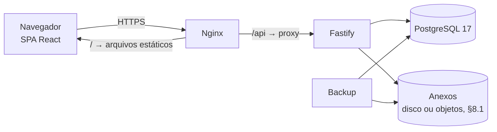

# QualityHub — TRD (Documento de Requisitos Técnicos)

> **O que é este documento:** *como* o sistema é construído — stack,
> camadas, segurança, API, arquivos, testes, infraestrutura e requisitos
> não funcionais. O *quê* está em `docs/prd.md`; as telas, em
> `docs/fluxo-app.md` e `docs/ui-ux.md`; o modelo de dados detalhado, no
> Esquema Backend.
>
> **Status:** v1 (2026-09-24). Consolidado a partir de `arquitetura.md`
> (§7, §10, §13, §14), do changelog e do código atual. Decisões novas
> numeradas como ADR a partir de 33, continuando a lista do documento
> original.

---

## 1. Princípios técnicos

Derivados do princípio do produto (*funcional e sem risco de falha vale
mais que entregar rápido*, PRD §2):

1. **Regra crítica tem teste automático.** Nenhuma regra de negócio
   crítica muda sem um teste que a proteja (§9).
2. **Menos peças, menos falhas.** Toda dependência nova é justificada e
   registrada no changelog. Se poucas linhas resolvem, não entra
   biblioteca.
3. **Tudo ou nada.** Escrita em mais de uma tabela acontece numa
   transação só, junto com a auditoria (RN-07).
4. **Falhar alto.** Erro inesperado vira 500 com log completo, nunca é
   engolido. Configuração faltando (`JWT_SECRET`, `DATABASE_URL`...)
   impede o servidor de subir.
5. **O banco garante o que pode garantir** (unicidade, chaves
   estrangeiras, um aprovador por item), em vez de confiar só no código.

---

## 2. Arquitetura

### 2.1 Visão geral



Um único endereço (ex.: `https://qualityhub.empresa.com.br`): o Nginx
entrega o frontend em `/` e repassa `/api` ao backend. **Mesma origem**
para front e back, então não há CORS, e o cookie de sessão funciona com
a configuração mais restritiva (§4).

### 2.2 Camadas do backend

Mantidas do `arquitetura.md` §7.1:

| Camada | Faz | Não faz |
|---|---|---|
| **Route** | Método, caminho, schema Zod, `preHandler` de autenticação | Regra de negócio |
| **Controller** | Traduz HTTP ↔ domínio; lida com cookie e status | Falar com o banco |
| **Service** | Regra de negócio; **abre a transação**; chama repositories; grava auditoria | Conhecer HTTP |
| **Repository** | Fala com o banco; **recebe o cliente (`tx`) por parâmetro** | Regra de negócio; abrir transação |

### 2.3 Estrutura de pastas

Monólito modular por domínio (ADR-06), como está hoje:

```
src/
  modulos/
    auth/ · usuario/ · setor/ (novo) · feed/ (novo) · anexo/ (novo)
    pendencias/ (novo) · relatorio/ (novo)
    nc/  nc/ · classificacao/ · contencao/ · investigacao/ (+ hipotese.*)
         acao-corretiva/ · verificacao/
  compartilhado/
    entidades/ · permissoes/ · registro/ · atribuicao/ · aprovacao/
    auditoria/ · sequencia/ · reabertura/ · cancelamento/ · errors/
    prisma/ · armazenamento/ (novo — salvar/ler/apagar anexos)
  middlewares/ · types/
  app.ts   (monta o Fastify)   server.ts   (só chama listen)
```

**Barramento de eventos** (`compartilhado/eventos/barramento.ts`): existe
desde a Fase 1, mas **nenhum código o usa**. **Será removido** (T1,
ADR-38) e volta quando existir o primeiro assinante real (provavelmente
as notificações por e-mail, fora do MVP).

**Armazenamento de anexos** (`compartilhado/armazenamento/`): um módulo
pequeno com três funções — `salvar`, `ler`, `apagar`. O resto do código
só conhece essas três, então a escolha de **onde** os arquivos ficam
(§8.1) não se espalha pelo sistema.

---

## 3. Stack

### 3.1 Backend — como está

Node.js 24 · TypeScript 7 · Fastify 5 · `fastify-type-provider-zod` ·
Prisma 7 (`@prisma/adapter-pg`) · PostgreSQL 17 · Zod 4 · bcrypt ·
`@fastify/jwt` · `tsx` (desenvolvimento).

### 3.2 Backend — acréscimos

| Pacote | Para quê | Decisão |
|---|---|---|
| `@fastify/cookie` | Sessão em cookie httpOnly | ADR-35 |
| `@fastify/rate-limit` | Limitar tentativas de login | §4.3 |
| `@fastify/multipart` | Receber upload de anexos | ADR-34 |
| Cliente S3 (`minio` ou equivalente) | **Só se** os anexos forem para armazenamento de objetos; em disco, usa o `fs` do próprio Node | ADR-34, §8.1 |
| `@fastify/swagger` + `@fastify/swagger-ui` | Gerar e exibir o OpenAPI (a interface visual só em desenvolvimento) | ADR-37 |
| **Dev:** `vitest`, `@testcontainers/postgresql` | Testes automáticos com banco real e descartável (mais um contêiner do MinIO pelo Testcontainers, se os anexos forem para armazenamento de objetos) | ADR-36 |
| **Dev:** `@biomejs/biome` | Lint e formatação num só binário | §9.5 |

### 3.3 Frontend

| Pacote | Para quê |
|---|---|
| React + Vite + TypeScript | SPA (ADR-28, mantido na parte React/Vite) |
| React Router | Rotas das telas (`fluxo-app.md` §2) |
| Tailwind CSS + shadcn/ui (Radix) + Lucide | Componentes e estilo (ADR-33) |
| TanStack Query | Dados vindos da API: cache, carregamento, revalidação |
| TanStack Table | Tabelas com ordenação e filtro |
| React Hook Form + Zod | Formulários |
| react-day-picker + date-fns | Datas, formatadas em pt-BR |
| Sonner | Avisos rápidos |
| Tiptap + extensão Mention | Editor de comentário com `@` e `#` |
| react-dropzone | Envio de anexos |
| **Dev:** Orval | Gera o cliente da API a partir do OpenAPI (ADR-37) |

Justificativas de cada peça visual: `docs/ui-ux.md` §1.1.

### 3.4 Infraestrutura

Docker Compose com **nginx**, **app**, **postgres** e **backup**, mais
**minio** se os anexos forem para armazenamento de objetos próprio
(§10). Onde isso roda ainda está em decisão (§10.6).

---

## 4. Autenticação e sessão

### 4.1 Como funciona (ADR-35)

1. `POST /api/auth/login` com e-mail, senha e **"manter conectado"**
   (sim/não) → o backend confere e devolve um **cookie** `qh_sessao` com
   o JWT.
2. O JWT carrega **só o `id`** do usuário e a data de emissão (hoje
   carrega também os papéis — muda).
3. Cookie: `HttpOnly` (o JavaScript da página não lê), `Secure` (só via
   HTTPS), `SameSite=Strict` (o navegador não o envia em requisições
   vindas de outros sites), `Path=/api`.
4. **Duração** (T2):

   | "Manter conectado" | Cookie | Validade do JWT | Efeito |
   |---|---|---|---|
   | **Marcado** | Com validade de **30 dias** | 30 dias | Continua conectado ao fechar o navegador |
   | **Desmarcado** | **De sessão** (sem validade) | 12 h | O navegador apaga o cookie **ao ser fechado**. As 12 h são segurança extra, porque Chrome/Edge com "continuar de onde parou" restauram cookies de sessão |

   **Limite honesto:** fechar **só a aba** não desconecta de forma
   confiável — o navegador não avisa o site quando uma aba fecha. Quem
   precisa sair de verdade usa o botão **Sair**.

   Na tela de login, o texto do "manter conectado" avisa: *"Não marque
   em computador compartilhado."*
5. **A cada requisição**, o middleware `autenticar`:
   - verifica a assinatura e a validade do JWT;
   - busca no banco o usuário (**ativo?**), os **papéis atuais** e a
     data `sessaoValidaDesde`;
   - recusa o JWT se ele foi emitido **antes** de `sessaoValidaDesde`;
   - monta `request.user: Ator` com esses dados.

   Usuário inativo → 401. Papel revogado → deixa de valer **na hora**
   (RN-43). Custo: uma consulta por requisição, por chave primária —
   irrelevante neste volume.
6. **Desconectar de todos os aparelhos:** atualizar `sessaoValidaDesde`
   para "agora" invalida toda sessão já emitida daquela pessoa.
   Acontece automaticamente ao **inativar**, ao **trocar a senha**, e
   quando a própria pessoa pede ("Sair de todos os aparelhos" — útil se
   perder o celular). Importante porque sessões de 30 dias existem.
7. `POST /api/auth/logout` apaga o cookie deste navegador.
8. `GET /api/auth/eu` devolve o usuário logado (id, nome, papéis, tela
   inicial preferida) — é o que o frontend chama ao abrir.

### 4.2 Proteção contra requisição forjada (CSRF)

`SameSite=Strict` + mesma origem + a API só aceita corpo
`application/json` (exceto upload, que exige sessão válida) cobrem o
caso de um site externo tentar agir em nome do usuário. Não é preciso
token anti-CSRF adicional.

### 4.3 Login

- **Limite de tentativas:** 5 por minuto por combinação IP + e-mail;
  depois, 429 com "Muitas tentativas, aguarde um minuto".
- **Registro de login** (pendência 4 do changelog): **sucesso** vai para
  a auditoria; **falha** vai para o log da aplicação (nível de aviso,
  com e-mail tentado e IP), porque não há usuário identificado para ser
  o autor da linha de auditoria (`docs/esquema-backend.md`, E1). Nunca a
  senha. Mensagem de erro continua idêntica para qualquer falha (RN-38).
- **Usuário inativo** não entra: o login recusa com a **mesma** mensagem
  de qualquer outra falha (RN-38), e a definição de senha por convite
  também recusa.
- **Convite novo invalida os anteriores** ainda não usados daquela
  pessoa — só o link mais recente funciona.
- Convite e definição de senha, no resto: sem mudança (RN-39, RN-40).
  Como "esqueci minha senha" está fora do MVP, **um novo convite gerado
  pelo `ADMIN` é o caminho para redefinir a senha** — a definição de
  senha já aceita usuário que tinha senha.

---

## 5. Autorização

Sem mudança de modelo: **papel → estado → atribuição**
(`pode-executar.ts`), com as checagens estritas já existentes (`decidir`
exige ser **o** aprovador; `cancelar` exige aprovador do item ou
`GERENTE`).

**Guardas que respondem "o que falta"** (lacuna L6 do fluxo): a guarda de
fechamento da NC (RN-21) e as validações de submissão passam a ser
funções que **devolvem a lista de pendências**, em vez de só lançar
erro. A mesma função é usada:
- pelo `submeter`, que lança `TransicaoInvalidaError` se a lista não
  estiver vazia;
- por uma rota de leitura (ex.: `GET /api/nc/:id/checklist-fechamento`),
  que só devolve a lista para a tela mostrar.

Assim a regra existe **num lugar só**, e a tela nunca diverge do
backend.

---

## 6. Dados, transações e auditoria

- **Transação:** aberta pelo service, `tx` passado a cada repository
  (ADR-07). Toda escrita em mais de uma tabela é transacional (RNF-08).
- **Auditoria:** append-only, gravada na mesma transação (ADR-18). O
  repository não expõe update nem delete.
- **Catálogo de ações de auditoria tipado** (pendência 1 do changelog):
  as strings soltas (`"PUBLICAR"`, `"SALVAR_RASCUNHO"`...) viram um enum
  `as const` em `compartilhado/entidades/`, como os demais.
- **Retenção:** o que é evidência nunca é apagado; rascunho, comentário
  e atribuição substituída podem ser (ADR-19, `arquitetura.md` §7.4).
- **Datas e fuso:** data e hora de eventos (`criadoEm`, `decididoEm`...)
  gravadas em UTC e convertidas para `America/Sao_Paulo` só no frontend.
  **Mas todo cálculo de "dia" no backend usa `America/Sao_Paulo`**, não
  UTC — senão, entre 21 h e meia-noite, o servidor já está "no dia
  seguinte":
  - o **ano do código** (`NC-2026-…`): uma NC publicada em 31/12 às
    22 h é de 2026, não de 2027;
  - o **"hoje"** de `prazo = hoje + N dias` e de "vencido/vencendo";
  - a checagem de "data de detecção não pode ser no futuro".

  Campos que são **datas de calendário** (`prazo`, `detectadoEm`,
  `executadaEm`, `executadoEm`, `verificadoEm`) são comparados pelo
  **dia**, não pelo instante. Correção: B11 do Esquema Backend.
- **Migrations:** sempre versionadas; em produção, só `prisma migrate
  deploy`.

O modelo de dados detalhado (tabelas, campos, índices e as mudanças
necessárias) fica no **Esquema Backend**.

---

## 7. API

### 7.1 Convenções

- **Prefixo `/api`** em todas as rotas (hoje não há prefixo — muda).
- REST, JSON, nomes em português e no plural (`/api/contencoes/:id`),
  ações de ciclo de vida como sub-rotas `POST` (`/publicar`,
  `/submeter`, `/decidir`...), como já é hoje.
- **Datas** em ISO 8601 (UTC). **IDs** UUID v7.
- **Listas** com paginação por cursor (`cursor`, `limit`, teto 100) —
  helper `paginacao-cursor.ts`, já existente, reaproveitado nas listas
  novas.
- **Erros** sempre no formato
  `{ "mensagem": string, "error"?: detalhes }`, com os status atuais:
  400 validação · 401 sem sessão · 403 sem permissão · 404 não
  encontrado · 409 transição inválida · 413 arquivo grande demais ·
  429 muitas tentativas · 500 erro interno.
- `ignoreTrailingSlash` migra para `routerOptions` (aviso de
  depreciação `FSTDEP022`, pendência 5 do changelog).

### 7.2 Contrato com o frontend (ADR-37)

1. O `fastify-type-provider-zod` transforma os schemas Zod das rotas em
   **OpenAPI** (`@fastify/swagger`), disponível em `/api/docs/json`.
2. Em desenvolvimento, a documentação navegável fica em `/api/docs`.
3. No frontend, o **Orval** lê esse OpenAPI e gera: tipos TypeScript,
   hooks do TanStack Query para cada rota e schemas Zod para os
   formulários.
4. **Regra:** o frontend nunca escreve à mão um tipo que venha da API.
   Mudou a API → gera de novo o cliente → o TypeScript aponta o que
   quebrou.

Para isso funcionar, **toda rota precisa declarar o schema de resposta**,
não só o de entrada. Hoje só as entradas são declaradas — isso entra no
Plano de Implementação.

---

## 8. Anexos (ADR-34)

### 8.1 Armazenamento

**Onde os arquivos ficam é decidido junto com a hospedagem** (§10.6):

| Hospedagem | Armazenamento |
|---|---|
| Servidor na empresa ou servidor alugado (VPS) | **Disco**: um volume do Docker. Backup = cópia da pasta |
| Plataforma gerenciada (PaaS) | **Armazenamento de objetos do provedor** (compatível com S3), porque o disco dessas plataformas é apagado a cada deploy |
| Qualquer uma, se preferir padrão S3 desde o início | **MinIO** no próprio Compose |

Vale para qualquer das opções:

- **O navegador nunca acessa os arquivos direto.** Upload e download
  passam pelo backend, que confere a permissão antes. Assim o anexo
  segue a visibilidade do item (RN-45) sem configuração extra no
  armazenamento.
- O banco guarda os metadados: item (`registroId`), nome original, tipo,
  tamanho, **chave** do arquivo (UUID — nunca o nome original, que pode
  conter caracteres perigosos para um caminho), quem enviou, quando.
- O código só usa `salvar`/`ler`/`apagar` de
  `compartilhado/armazenamento/` (§2.3).

### 8.2 Envio

1. `POST /api/registros/:id/anexos` (multipart). Exige ser colaborador
   do item e o item estar editável (`RASCUNHO`/`ABERTO`).
2. **Limite: 10 MB por arquivo** (variável `ANEXO_TAMANHO_MAXIMO`).
   Acima disso, 413.
3. **Tipos aceitos: JPEG, PNG, WebP e PDF**, conferidos pelos **primeiros
   bytes do arquivo**, não pela extensão nem pelo tipo que o navegador
   declara (ambos são fáceis de falsificar). São quatro assinaturas
   fixas: poucas linhas, sem biblioteca.
4. O arquivo vai em streaming para o armazenamento; os metadados e a
   auditoria são gravados numa transação. Se o banco falhar depois do
   upload, o arquivo órfão é removido; se sobrar algum, uma rotina de
   limpeza (§10.4) o encontra.

### 8.3 Download e remoção

- `GET /api/anexos/:id` → confere `VISUALIZAR` → faz streaming do
  arquivo com `Content-Disposition` e o tipo correto.
- **Imagens** podem ser exibidas na página; **PDF** sempre como
  download (`attachment`), para não executar conteúdo no contexto do
  sistema.
- `DELETE /api/anexos/:id` → só colaborador, só com o item editável;
  item `FECHADO` nunca perde anexo (RN-45). Remoção auditada.

---

## 9. Testes (ADR-36)

### 9.1 Quando

**Antes de qualquer correção de regra no backend.** Primeiro a rede de
proteção; depois as mudanças. Matthew quer **aprender e escrever parte
dos testes** — o Plano de Implementação reserva uma fase para isso,
seguindo o mesmo formato de sempre: conceito explicado → Matthew escreve
→ revisão.

### 9.2 Ferramentas

| Peça | Escolha | Por quê |
|---|---|---|
| Executor | **Vitest** | TypeScript/ESM nativo; mesma ferramenta no frontend |
| Requisições | **`app.inject()`** do Fastify | Simula HTTP em memória, sem abrir porta — rápido e estável. Possível porque `app.ts` já é separado de `server.ts` |
| Banco | **Testcontainers** (PostgreSQL 17) | Postgres **real** e descartável, criado pelo próprio teste. Mesmo comportamento de produção (transações, `SELECT FOR UPDATE`, índice parcial) |
| Arquivos | Pasta temporária (disco) ou **Testcontainers** (MinIO) | Conforme o armazenamento escolhido; só nos testes de anexo |
| Isolamento | `TRUNCATE` das tabelas antes de cada teste | Cada teste começa do zero |
| Usuários | Fábricas com os 8 perfis de `testes/setup-usuarios-teste.sql` | Cobre cada combinação de papel |

### 9.3 O que testar primeiro

A pirâmide aqui é "de cabeça para baixo" de propósito: a regra de
negócio mora nos services **com** banco, então a maioria dos testes é
**de API** (`app.inject()` + Postgres real). Testes unitários puros
ficam para funções sem banco (etapa calculada, formatação de código,
`temPapel`).

Ordem de prioridade (herdada do `arquitetura.md` §10.5 + as decisões do
PRD):

1. **Fluxo completo** — o `testes/requests-fluxo-completo.http`
   transformado em teste automático: as seis entidades, do registro à
   verificação.
2. **Máquina de estados e portões** — toda transição válida e inválida.
3. **Permissões** — as três camadas, incluindo "tem o papel mas não é o
   aprovador".
4. **Guarda de fechamento** (RN-21) e reações da verificação (RN-23).
5. **Código sequencial sob concorrência** — várias publicações ao mesmo
   tempo, nenhum número repetido ou pulado.
6. **Convite, login e sessão** — incluindo revogação imediata.

### 9.4 Regra de trabalho

A partir da fase de testes: **toda correção de bug começa por um teste
que falha** (reproduz o bug), depois o conserto faz o teste passar.

### 9.5 Integração contínua

GitHub Actions a cada push: **`npm ci`** → **`prisma generate`** →
**Biome** (lint/formatação) → **typecheck** (`tsc --noEmit`) →
**testes**. Nada vai para produção com CI vermelho.

O `prisma generate` é obrigatório no CI porque o cliente gerado
(`src/generated/`) **não vai para o Git** (está no `.gitignore`): sem
ele, o typecheck falha em qualquer máquina limpa.

---

## 10. Infraestrutura e deploy

**Contexto que pesa em tudo aqui** (T3, T4): a empresa tem **54 NCs no
total** hoje e bem menos de 50 usuários simultâneos, e **não há equipe
de TI envolvida** — quem opera o sistema é Matthew. Então desempenho não
é fator de decisão; **simplicidade de operar sozinho** é.

### 10.1 Serviços (Docker Compose de produção)

| Serviço | Imagem | Função |
|---|---|---|
| `nginx` | nginx | HTTPS; entrega o frontend; repassa `/api` ao `app` |
| `app` | Node 24 (build próprio) | Backend. Ao subir: `prisma migrate deploy` e depois o servidor |
| `postgres` | postgres:17 | Banco |
| `backup` | imagem simples com `pg_dump` + cron | Backups (§10.3) |
| `minio` | minio | **Só se** essa for a opção de anexos (§8.1) |

Só o `nginx` expõe porta para a rede. O resto fica acessível apenas
dentro do Compose. Em plataforma gerenciada (PaaS), cada serviço vira um
recurso da plataforma, mas a divisão é a mesma.

### 10.2 HTTPS

**Obrigatório** — o cookie `Secure` não funciona sem ele. Como obter
depende da hospedagem (§10.6): em servidor alugado ou PaaS, certificado
gratuito e automático (Let's Encrypt) com um domínio próprio; em
servidor dentro da empresa, sem TI, é o ponto mais trabalhoso.

### 10.3 Backup

- **Banco:** `pg_dump -Fc` diário.
- **Anexos:** cópia diária da pasta (disco) ou do bucket (armazenamento
  de objetos), no mesmo horário do banco.
- **Rotação:** 7 diários + 4 semanais.
- **Onde:** **fora** da máquina do sistema (outro provedor, outra
  região ou um armazenamento de objetos barato). Backup na mesma
  máquina não protege contra a perda da máquina.
- **Teste de restauração periódico** (mensal): restaurar banco e anexos
  num ambiente separado e abrir uma NC com anexo. Backup nunca
  restaurado não é backup.

Se uma restauração trouxer um anexo sem registro no banco (ou
vice-versa), a rotina de limpeza (§10.4) resolve.

### 10.4 Operação

- **Logs:** Pino (padrão do Fastify), em JSON, no `stdout`; rotação pelo
  Docker. Nunca registrar senha, token ou cookie.
- **Saúde:** `GET /api/saude` confere banco e armazenamento — usado pelo
  Docker para reiniciar o `app` se ele travar, e por um **monitor
  externo gratuito** que avisa Matthew por e-mail se o sistema cair
  (sem TI, ninguém mais vai perceber).
- **Limpeza de anexos órfãos:** rotina semanal que compara armazenamento
  e tabela e remove o que sobrou de um lado só (com log do que removeu).
- **Configuração** só por variáveis de ambiente, com `.env` fora do Git.
  Variáveis: `DATABASE_URL`, `JWT_SECRET`, `ANEXO_TAMANHO_MAXIMO`,
  `NODE_ENV`, mais as do armazenamento escolhido. Faltou alguma
  obrigatória → o servidor não sobe.
- **Manual de operação** no `SETUP.md`: como fazer deploy, restaurar
  backup, renovar certificado (se não for automático) e criar o primeiro
  ADMIN. Operador único = o manual é o substituto de uma equipe.

### 10.5 Ambientes

| Ambiente | Onde | Para quê |
|---|---|---|
| Desenvolvimento | WSL2, Docker Compose só com o banco; app com `tsx watch` | Dia a dia |
| Testes | Testcontainers (criados e destruídos pelo Vitest) | Testes automáticos e CI |
| Homologação | Mesma hospedagem da produção, dados fictícios | Teste G3 com colegas, e ensaio de cada deploy |
| Produção | A decidir (§10.6) | Uso real |

### 10.6 Hospedagem — opções para decidir (T4)

Matthew decide e propõe à empresa, pesando **custo** e **complexidade**.
Valores aproximados — **confirmar no site de cada provedor**, preços
mudam.

| | **A. Computador na empresa** | **B. Servidor alugado (VPS)** | **C. Plataforma gerenciada (PaaS)** |
|---|---|---|---|
| O que é | Um PC ou mini PC ligado na rede da empresa, rodando o Docker Compose | Uma máquina virtual num provedor (ex.: Hetzner, DigitalOcean, Hostinger), rodando **o mesmo** Docker Compose | Serviços prontos (ex.: Railway, Render): envia o código, a plataforma roda; banco gerenciado |
| Custo | Hardware (se não houver máquina sobrando) + energia | Baixo e fixo: faixa de **US$ 5–15/mês** + domínio (~R$ 40/ano) | Maior: faixa de **US$ 20–50/mês** somando app, banco e armazenamento |
| Quem cuida da máquina | **Matthew**: hardware, energia, nobreak, atualizações | **Matthew**: sistema operacional, atualizações, firewall | A plataforma |
| HTTPS | **Difícil sem TI**: rede interna não tem certificado público; exige domínio próprio + validação por DNS, ou o navegador mostra alerta | **Fácil**: Let's Encrypt automático | **Automático** |
| Backup | Montar do zero, para fora da empresa | Snapshot do provedor + cópia para outro lugar | Banco com backup gerenciado; anexos à parte |
| Acesso pelo celular no chão de fábrica | Só pelo Wi-Fi da empresa | De qualquer lugar com internet | De qualquer lugar com internet |
| Exposição à internet | Não (mais seguro por padrão) | **Sim**: exige firewall, atualizações em dia, limite de login (já previsto) | Sim, mas a plataforma cuida da maior parte |
| Onde ficam os dados | **Na empresa** (premissa original, ADR-30) | No provedor (dá para escolher datacenter no Brasil em alguns) | No provedor |
| Anexos (§8.1) | Disco | Disco | Armazenamento de objetos |
| Mesma configuração do desenvolvimento? | Sim (Docker Compose) | **Sim** (Docker Compose) | Não — configuração própria da plataforma |

**Leitura para o caso da empresa** (volume pequeno, operador único, sem
TI): **B (VPS)** tende a ser o melhor equilíbrio — custo baixo, HTTPS e
snapshot resolvidos pelo provedor, o mesmo Compose do desenvolvimento, e
acesso pelo celular sem depender do Wi-Fi. **A** só compensa se a
empresa **exigir** que os dados fiquem dentro dela. **C** troca dinheiro
por menos operação, mas cobra mais e foge do Compose.

**Antes de decidir, perguntar à empresa:**
1. Os dados das NCs (que citam funcionários, clientes e processos
   internos) **podem ficar num provedor externo?** Se não → A.
2. Qual o **orçamento mensal** aceitável?

Decidida a hospedagem, este documento e o ADR-30 são atualizados.

---

## 11. Requisitos não funcionais

RNF-01 a RNF-08 vêm do `arquitetura.md` §2.3; os demais são novos.

| ID | Requisito |
|---|---|
| RNF-01 | Auditoria append-only; a API interna não expõe update nem delete |
| RNF-02 | Todo registro e toda ação têm autor e data/hora |
| RNF-03 | Autorização em dois eixos: papel + atribuição |
| RNF-04 | Validação com Zod em toda rota — entrada **e resposta** |
| RNF-05 | Migrations versionadas; backup automático com teste de restauração — **banco e anexos** |
| RNF-06 | Senha mínima de 12 caracteres; convite com token de uso único e validade de 72 h |
| RNF-07 | Módulo novo herda estados, códigos, comentários, atribuições e aprovações sem alterar tabela existente |
| RNF-08 | Escrita em mais de uma tabela ocorre numa transação única |
| RNF-09 | **Revogação imediata:** inativar usuário, revogar papel ou "sair de todos os aparelhos" vale na próxima requisição |
| RNF-10 | **Login protegido:** limite de tentativas; sucessos na auditoria, falhas no log |
| RNF-11 | **Anexos validados** pelo conteúdo (tipo real) e tamanho; só acessíveis via backend, com permissão conferida |
| RNF-12 | **Testes automáticos** cobrem as regras críticas da §9.3; CI verde é obrigatório para ir para produção |
| RNF-13 | **HTTPS** obrigatório em produção |
| RNF-14 | **Desempenho:** leituras comuns (lista, detalhe, pendências) respondem em até 500 ms. Volume real (T3): 54 NCs no total hoje, dezenas por ano, poucos usuários simultâneos — a meta tem folga de sobra, e **otimização de desempenho não justifica complexidade** |
| RNF-15 | **Sem dados sensíveis em log** (senha, token, cookie) |

---

## 12. Dívidas técnicas conhecidas

Entram no Plano de Implementação:

| Dívida | Origem |
|---|---|
| Papéis dentro do JWT (revogação atrasada) | §4 |
| Rotas sem prefixo `/api` | §7.1 |
| Respostas das rotas sem schema declarado | §7.2 |
| `ignoreTrailingSlash` na forma depreciada | Changelog, pendência 5 |
| Ações de auditoria como strings soltas | Changelog, pendência 1 |
| Login não auditado | Changelog, pendência 4 |
| Barramento de eventos sem uso | §2.3 |
| `package.json` sem scripts de `build`, `test`, `lint` e `typecheck` | — |
| `testes/requests-acao-corretiva.http` descreve o modelo antigo de dois portões | `CLAUDE.md` |

---

## 13. Riscos

| Risco | Mitigação |
|---|---|
| Mudar regras (RN-21, RN-23) quebra o que funciona hoje | Testes antes das mudanças (ADR-36) |
| **Operador único, sem TI**: se Matthew não estiver, ninguém opera | Manual de operação no `SETUP.md`; backup e restauração automatizados e testados; monitor externo avisando se cair |
| Cada serviço a mais é mais coisa para manter sozinho | Armazenamento de anexos decidido junto com a hospedagem (§8.1), preferindo o que não acrescenta serviço |
| Testcontainers precisa do Docker acessível **de dentro do WSL** | Confirmado em 2026-09-24 (Docker 29.8 acessível no WSL). **O Docker Desktop precisa estar aberto** para os testes rodarem — fechado, o comando `docker` some do WSL (`SETUP.md` §5) |
| HTTPS difícil se o sistema ficar dentro da empresa | Pesa na escolha da hospedagem (§10.6); sem HTTPS não há cookie seguro |
| Sessões de 30 dias num aparelho perdido | "Sair de todos os aparelhos"; aviso para não marcar em computador compartilhado |
| `partialIndexes` do Prisma é *preview* | Mantido; coberto por teste (um aprovador por item) |
| Mudança na API quebrar o frontend sem aviso | Cliente gerado pelo Orval + TypeScript |
| Guarda de fechamento contornável por alguma rota nova | Fechamento só pelo ciclo de vida; teste de que nenhuma rota altera `estado` diretamente |

---

## 14. Decisões (ADRs novos)

| ADR | Decisão | Rejeitado | Data |
|---|---|---|---|
| **ADR-33** | Frontend com **shadcn/ui** + Tailwind (substitui a parte "Mantine" do ADR-28) | Mantine | 2026-09-24 |
| **ADR-34** | Anexos acessados **só pelo backend**; metadados no banco; 10 MB; JPEG/PNG/WebP/PDF validados pelo conteúdo. **Onde ficam** (disco, objetos do provedor ou MinIO) é decidido **junto com a hospedagem** | Arquivo dentro do banco; acesso direto do navegador ao armazenamento | 2026-09-24 |
| **ADR-35** | Sessão em **cookie httpOnly** com JWT só com `id`; usuário, papéis e `sessaoValidaDesde` **conferidos a cada requisição**; "manter conectado" (30 dias) ou cookie de sessão (fecha com o navegador, teto de 12 h) | Papéis no token; token legível pelo JavaScript | 2026-09-24 |
| **ADR-36** | **Testes automáticos antes das correções** de regra no backend (Vitest + `app.inject()` + Testcontainers) | Testes só na Fase 4 | 2026-09-24 |
| **ADR-37** | Contrato via **OpenAPI gerado + cliente Orval** (confirma o ADR-29) | Monorepo com schemas compartilhados, por ora | 2026-09-24 |
| **ADR-38** | **Remover o barramento de eventos** sem uso; volta com o primeiro assinante real | Manter código sem uso "para o futuro" | 2026-09-24 |

**ADR-30 (deploy on-premise) está em revisão** — ver §10.6.

---

## 15. Decisões tomadas

Com Matthew, em 2026-09-24.

| # | Pergunta | Decisão |
|---|---|---|
| — | Quando entram os testes | **Antes** das correções, com uma fase de aprendizado em que Matthew escreve parte deles → §9, ADR-36 |
| — | Sessão | **Cookie httpOnly** + checagem a cada requisição → §4, ADR-35 |
| — | Contrato front/back | **OpenAPI + Orval** → §7.2, ADR-37 |
| — | Anexos | Acesso só pelo backend; **onde ficam, junto com a hospedagem** → §8.1, ADR-34 |
| **T1** | Barramento de eventos sem uso | **Remover** → ADR-38 |
| **T2** | Duração da sessão | **"Manter conectado"** (30 dias) ou **fecha com o navegador** (teto de 12 h); "sair de todos os aparelhos" → §4.1 |
| **T3** | Volume | **54 NCs no total hoje**, poucos usuários → RNF-14 |
| **T4** | Onde roda | **Matthew decide e propõe**, sem TI envolvida; opções comparadas → §10.6 |

**Pendente:** escolha da hospedagem (§10.6), que também define o
armazenamento de anexos. Não bloqueia os testes nem as correções do
backend — só a fase de deploy.

---

## Histórico

| Data | Mudança |
|---|---|
| 2026-09-24 | v1 — consolidação + ADR-33 a ADR-38; T1–T4 |
| 2026-09-24 | v1.1 — revisão cruzada: regra de fuso para cálculos de dia, usuário inativo no login, convite novo invalida anteriores, `prisma generate` no CI, Docker no WSL como pré-requisito |
